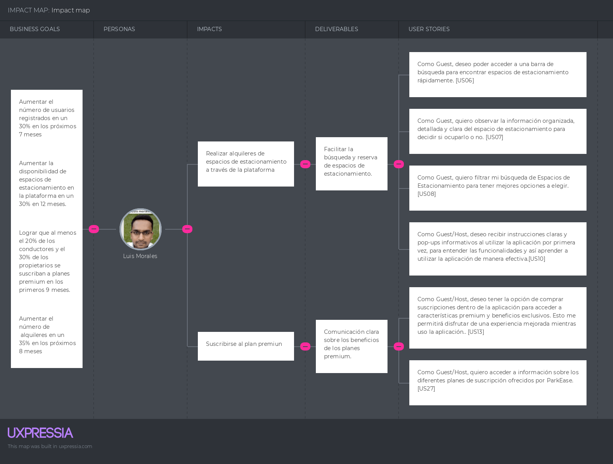
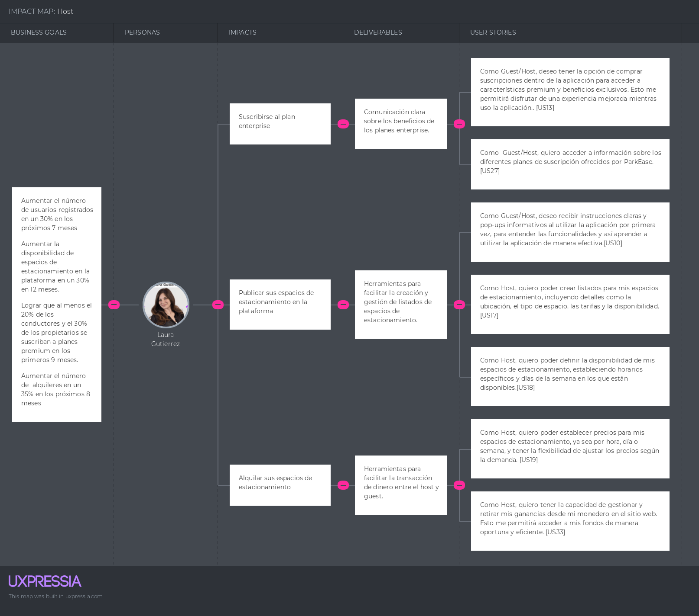

**3.4. Impact Mapping**

Con el fin de mejorar nuestra comprensión de los grupos a los que nos dirigimos, en esta sección emplearemos la herramienta Impact Map. Esta herramienta nos permite establecer una conexión entre las necesidades de nuestros usuarios y los objetivos de nuestro proyecto mediante la identificación de impactos y entregables. Los impactos nos muestran las acciones que nuestros usuarios deben llevar a cabo para acercarnos a nuestros objetivos, mientras que los entregables nos indican de qué manera podemos apoyarlos para alcanzar dichos objetivos. A continuación, presentamos los mapas de impacto de los usuarios.

