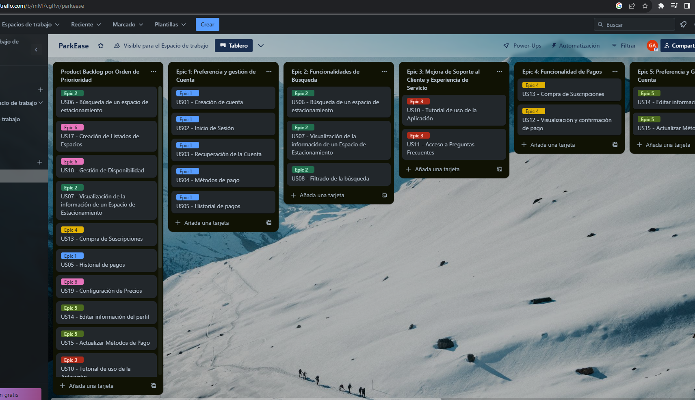

**3.4. Product Backlog**

|**#Orden**|**User Story ID**|**Título**|**Descripción**|**Story Points**|
| :- | :- | :- | :- | :- |
|**1**|
US06

|Búsqueda de un espacio de estacionamiento|Como Guest, deseo encontrar espacios de estacionamiento para estacionarme de manera eficiente y rápida.|5|
|**2**|US17|Creación de Listados de Espacios|Como Host, deseo crear listados de mis espacios de estacionamiento, detallando ubicación, tipo, tarifas y disponibilidad, para de gestionar eficazmente mis propiedades.|5|
|**3**|US18|Gestión de Disponibilidad|Como Host, deseo definir la disponibilidad de mis espacios de estacionamiento por horarios y días de la semana, para una gestión efectiva.|5|
|**4**|US07|Visualización de la información de un Espacio de Estacionamiento|Como Guest, deseo observar la información organizada, detallada y clara del espacio de estacionamiento para decidir si ocuparlo o no.|3|
|5|US13|Compra de Suscripciones|Como Guest/Host, deseo tener la opción de comprar suscripciones dentro de la aplicación para acceder a características premium y beneficios exclusivos.|3|
|6|US05|Historial de pagos|Como usuario, deseo ver el historial de pagos que tengo respecto a los pagos que hice por un sitio de estacionamiento.|3|
|7|US19|Configuración de Precios|Como Host, deseo poder establecer precios para mis espacios de estacionamiento, ya sea por hora, día o semana, y tener la flexibilidad de ajustar los precios según la demanda.|5|
|8|US14|Editar información del perfil|Como Guest/Host, quiero tener la opción de editar la información de mi perfil para mantenerla actualizada.|2|
|9|US15|Actualizar Métodos de Pago|Como Guest/Host, quiero ser capaz de actualizar los medios de pago en mi perfil para poder añadir, actualizar o eliminar distintos métodos de pago que prefiera utilizar en la aplicación.|3|
|10|US10|Tutorial de uso de la Aplicación|Como Guest/Host, deseo recibir instrucciones claras y pop-ups informativos al utilizar la aplicación por primera vez, para entender las funcionalidades y así aprender a utilizar la aplicación de manera efectiva.|5|
|11|US20|Visualización de Reservas|Como Host, quiero poder ver las reservas realizadas para mis espacios de estacionamiento, incluyendo la fecha, hora y detalles del conductor.|5|
|12|US12|Visualización y confirmación de pago|Como Guest, deseo poder visualizar el resumen de mi pago por el espacio de estacionamiento antes de confirmar la transacción, para revisar y confirmar los detalles con facilidad.|3|
|13|US27|Visualización de Planes de Suscripción|Como visitor del segmento Guest/Host, deseo acceder a información detallada sobre los planes de suscripción, para poder comparar y entender las diferencias entre cada uno.|2|
|14|US21|Obtención de Datos a través de la API|Como Developer quiero tener la capacidad de obtener la lista de propietarios, la lista de usuarios y los anuncios publicados en la aplicación para poder utilizar estos datos en aplicaciones o servicios externos.|8|
|15|US22|Obtener Detalles de un Propietario por ID|Como developer, quiero obtener los detalles de un propietario específico a través de su identificación única (ID), para realizar tareas relacionadas con la gestión de propietarios.|8|

A continuación se muestra la elaboración del Product Backlog en la herramienta Trello:

[Link del Trello](https://trello.com/b/mM7cgRvi/parkease)