# Carátula

**Universidad:** Universidad Peruana de Ciencias Aplicadas

**Carrera:** Ingeniería de software

**Curso:** Aplicaciones Web

**Sección:** SW52

**Informe de Trabajo Final**

**Profesor:** Angel Augusto Velasquez Nuñez

**Nombre del Startup:** WebMinds

**Nombre del Producto:** ParkEase

**Integrantes:**
- Orlando Arturo Roca Huapaya - u201919742
- Paolo Sebastian Padilla Advincula- u202117993
- Antonella Frida Gonzales Gomez - U20211C403
- Gustavo Jandroel Aguirre Rodríguez - U202124162
- Piero Mendoza Pimentel - U201923446

**Ciclo:** 2023-02

**Mes:** Setiembre


# Registro de Versiones del Informe

| Versión | Fecha       | Autor   | Descripción de modificación                              |
|---------|-------------|---------|---------------------------------------------------------|
| 1.0     | 19-08-2023  | Orlando  | Se crearon los archivos md del capitulo 1 y 2 en el repositorio|


# Project Report Collaboration Insights 

[Enlace al Repositorio del Informe en GitHub](https://github.com/WebMindsGroup/WebMinds-Report.git)


| Commit ID | Autor       | Fecha        | Descripción del Commit                          |
|-----------|-------------|--------------|-----------------------------------------------|
|d89f9554e799e33861eed85e03da22200a9b17f0| Orlando| 19-08-2023   | chore: Initial repository setup - Setting up the project structure and initializing the repository.|
|10d3877d4b977143574d07d718947be9246b8f2c| Orlando     | 19-08-2023   | chore: Add initial files for team to start working - Included the necessary files for the team to begin working on the report|
|ad5ab6bac117d6aa2bc682f56a41cf35904c9e5e| Orlando     | 19-08-2023   |chore: Add initial files for team to start working - Included the necessary files for the team in the chapter 2 to begin working on the assigned task|

### Actividades:
- fecha: 19-08-2023

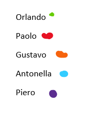  

Durante una reunion de google meet a cada integrante se le asignó un color, para que podamos realizar la reparticion de las partes del informe. Además, se crearon archivos .md con la finalidad de que todos los integrantes del equipo puedan ir desarrollando las partes que les tocó.


# Contenido

- [Capítulo I: Introducción](#capitulo-1)
  - [1.1. Startup Profile](#11-startup-profile)
    - [1.1.1. Descripción de la Startup](#111-descripción-de-la-startup)
    - [1.1.2. Perfiles de integrantes del equipo](#112-perfiles-de-integrantes-del-equipo)
  - [1.2. Solution Profile](#12-solution-profile)
    - [1.2.1. Antecedentes y problemática]()
    - [1.2.2. Lean UX Process]()
      - [1.2.2.1. Lean UX Problem Statements]()
      - [1.2.2.2. Lean UX Assumptions]()
      - [1.2.2.3. Lean UX Hypothesis Statements]()
      - [1.2.2.4. Lean UX Canvas]()
    - [1.3. Segmentos objetivo]()

- [Capítulo II: Requirements Elicitation & Analysis]()
  - [2.1. Competidores]()
    - [2.1.1. Análisis competitivo]()
    - [2.1.2. Estrategias y tácticas frente a competidores]()
  - [2.2. Entrevistas]()
    - [2.2.1. Diseño de entrevistas]()
    - [2.2.2. Registro de entrevistas]()
    - [2.2.3. Análisis de entrevistas]()
  - [2.3. Needfinding]()
    - [2.3.1. User Personas]()
    - [2.3.2. User Task Matrix]()
    - [2.3.3. User Journey Mapping]()
    - [2.3.4. Empathy Mapping]()
    - [2.3.5. As-is Scenario Mapping]()

- [Capítulo III: Requirements Specification]()
  - [3.1. To-Be Scenario Mapping]()
  - [3.2. User Stories]()
  - [3.3. Impact Mapping]()
  - [3.4. Product Backlog]()

- [Capítulo IV: Product Design]()
  - [4.1. Style Guidelines]()
    - [4.1.1. General Style Guidelines]()
    - [4.1.2. Web Style Guidelines]()
  - [4.2. Information Architecture]()
    - [4.2.1. Organization Systems]()
    - [4.2.2. Labeling Systems]()
    - [4.2.3. SEO Tags and Meta Tags]()
    - [4.2.4. Searching Systems]()
    - [4.2.5. Navigation Systems]()
  - [4.3. Landing Page UI Design]()
    - [4.3.1. Landing Page Wireframe]()
    - [4.3.2. Landing Page Mock-up]()
  - [4.4. Web Applications UX/UI Design]()
    - [4.4.1. Web Applications Wireframes]()
    - [4.4.2. Web Applications Wireflow Diagrams]()
    - [4.4.3. Web Applications Mock-ups]()
    - [4.4.4. Web Applications User Flow Diagrams]()
  - [4.5. Web Applications Prototyping]()
  - [4.6. Domain-Driven Software Architecture]()
    - [4.6.1. Software Architecture Context Diagram]()
    - [4.6.2. Software Architecture Container Diagrams]()
    - [4.6.3. Software Architecture Components Diagrams]()
  - [4.7. Software Object-Oriented Design]()
    - [4.7.1. Class Diagrams]()
    - [4.7.2. Class Dictionary]()
  - [4.8. Database Design]()
    - [4.8.1. Database Diagram]()

- [Capítulo V: Product Implementation, Validation & Deployment]()
  - [5.1. Software Configuration Management]()
    - [5.1.1. Software Development Environment Configuration]()
    - [5.1.2. Source Code Management]()
    - [5.1.3. Source Code Style Guide & Conventions]()
    - [5.1.4. Software Deployment Configuration]()
  - [5.2. Landing Page, Services & Applications Implementation]()
    - [5.2.X. Sprint n]()
      - [5.2.X.1. Sprint Planning n]()
      - [5.2.X.2. Sprint Backlog n]()
      - [5.2.X.3. Development Evidence for Sprint Review]()
      - [5.2.X.4. Testing Suite Evidence for Sprint Review]()
      - [5.2.X.5. Execution Evidence for Sprint Review]()
      - [5.2.X.6. Services Documentation Evidence for Sprint Review]()
      - [5.2.X.7. Software Deployment Evidence for Sprint Review]()
      - [5.2.X.8. Team Collaboration Insights during Sprint]()
  - [5.3. Validation Interviews]()
    - [5.3.1. Diseño de Entrevistas]()
    - [5.3.2. Registro de Entrevistas]()
    - [5.3.3. Evaluaciones según heurísticas]()
  - [5.4. Video About-the-Product]()

- [Conclusiones]()
  - [Conclusiones y recomendaciones]()
  - [Video About-the-Team]()

- [Bibliografía]()
- [Anexos]()

# Student Outcome


# Capítulo I: Introducción <a name="capitulo-1"></a>

## 1.1. Startup Profile <a name="11-startup-profile"></a>

### 1.1.1. Descripción de la Startup <a name="111-descripción-de-la-startup"></a>

**ParkEase** surge como una solución ante la creciente preocupación por la escasez de espacios de estacionamiento en entornos urbanos. La agobiante congestión del tráfico y la ineficiente búsqueda de lugares para estacionar generan frustración y retrasos en la experiencia de los conductores a nivel global. A su vez, aquellos que poseen espacios de estacionamiento no utilizados se enfrentan al desafío de encontrar una manera efectiva de aprovechar estos activos.

**ParkEase** se propone revolucionar la forma en que las personas encuentran y utilizan espacios de estacionamiento. Crearemos una aplicación que ofrecerá una interfaz intuitiva que les permitirá buscar, reservar y pagar por estacionamientos de manera rápida y fluida. Los usuarios podrán ubicar fácilmente espacios disponibles cerca de su destino, ahorrando tiempo y evitando la frustración de la búsqueda ineficiente. Por otro lado, los propietarios de espacios de estacionamiento podrán registrarse en la plataforma y ofrecer sus espacios disponibles para alquiler. La aplicación permitirá a los propietarios gestionar sus listados, establecer precios, disponibilidad y recibir pagos de manera segura. Esto les brindará una forma eficaz de aprovechar sus activos, generando ingresos adicionales mientras contribuyen a aliviar la congestión del tráfico.

Ofreceremos planes de suscripción como el Plan Gratuito, el Plan Premium con descuentos y el Plan Empresarial para maximizar la visibilidad de los espacios. Con ParkEase, facilitamos la vida de los conductores y brindamos oportunidades a los propietarios de espacios de estacionamiento.


### 1.1.2. Perfiles de integrantes del equipo <a name="112-perfiles-de-integrantes-del-equipo"></a>


* Nombre: Orlando Arturo Roca Huapaya

  Código: U201919742

  Carrera: Ingeniería de Software

  Como estudiante de ingeniería de software, mi contribución al equipo se centra en mis conocimientos en la planificación y diseño de software. A lo largo de mi formación, he tenido la oportunidad de desarrollar proyectos utilizando Java, lo que me brinda una ventaja significativa con el desarrollo del sistema que estamos trabajando. Estoy entusiasmado por aplicar mis habilidades en el desarrollo y trabajar junto al equipo para alcanzar nuestros objetivos.


* Nombre: Paolo Sebastián Padilla Advincula

  Código: U202117993

  Carrera: Ingeniería de Software

  Como estudiante de la carrera de Ingeniería de Software, apoyaré al equipo con mis conocimientos fuera y dentro de la universidad. Esto  brindará un desarrollo óptimo durante el campo estudiantil.


* Nombre: Antonella Frida Gonzales Gomez
  
  Código: U20211C403
  
  Carrera: Ingeniería de Software 

  Como estudiante de la carrera de Ingeniería de Software, contribuire al equipo mis conocimientos fundamentales en algunos lenguajes de programación. Estos conocimientos me permitirán participar activamente en la creación y desarrollo de proyectos además tengo un enfoque responsable hacia mi trabajo y tareas asignadas. Entiendo la importancia de cumplir con plazos y metas establecidas, lo que contribuye al flujo de trabajo del equipo y al éxito general del proyecto.


* Nombre: Gustavo Jandroel Aguirre Rodríguez
  Código: U202124162
  Carrera: Ingeniería de Software 

  Como estudiante de la carrera de Ingeniería de Software, brindaré mis conocimientos tanto de programación como diseño a mi equipo. Escogí esta carrera porque me encanta la tecnología y me mantiene actualizado en todo momento.


* Nombre: Piero Mendoza Pimentel

  Código: U201923446

  Carrera: Ingeniería de software

  Como estudiante de Ingeniería de Software, aportaré con mis conocimientos y habilidades al desarrollo del trabajo grupal. 


## 1.2. Solution Profile <a name="12-solution-profile"></a>

“ParkEase” es una aplicación diseñada para resolver la escasez de espacios de estacionamiento en entornos urbanos y mejorar la experiencia de los conductores. Nuestra aplicación permitirá a los usuarios buscar, reservar y pagar por los espacios de estacionamiento de manera eficiente además los propietarios de los espacios podrán registrarse y alquilar a través de la plataforma. El cual ayudará al ahorro de tiempo para los conductores, reducción de la congestión del tráfico y oportunidad de ingresos para los propietarios de espacios de estacionamiento. 

### 1.2.1  Antecedentes y problemática 

#### 1. What (Qué)
¿Cuál es el problema?

La problemática que aborda es la escasez de espacios de estacionamiento en entornos urbanos y búsqueda ineficiente de lugares para estacionar.

#### 2. When (Cuando)
¿Cuándo sucede el problema?

Esta preocupación ha estado aumentando a lo largo del tiempo, a medida que las ciudades han experimentado un crecimiento de la población y, por lo tanto, la cantidad de vehículos en circulación, la congestión de tráfico y la búsqueda ineficiente de estacionamiento se ha vuelto más apremiante en los últimos años.

#### 3. Where (Dónde)
¿Dónde ocurre el problema?

Esta problemática es común en áreas urbanas densamente pobladas en todo el mundo, donde el espacio es limitado y la cantidad de vehículos en circulación es alta.

#### 4. Who (Quién)
¿Quiénes están involucrados?

Los afectados por este problema son tanto los conductores que enfrentan las dificultades para encontrar lugares de estacionamiento convenientes como los propietarios de los espacios no utilizados que buscan una forma efectiva de aprovechar esos activos.

#### 5. Why (Por qué)
¿Cuál es la causa del problema?

Esto ocurre debido a la insuficiencia de lugares de estacionamiento disponible en áreas urbanas, a lo que lleva a una congestión de tráfico más intensa y a la dificultad para los conductores de encontrar estacionamientos de manera oportuna

#### 6. How (Cómo)
¿Qué llevó a la persona a llegar a esta situación?

La congestión del tráfico y la falta de espacios de estacionamiento disponibles en entornos urbanos densos llevaron a la persona a la situación de tener dificultades para encontrar estacionamiento de manera conveniente y eficiente

#### 7. How much  (Cuánto)
¿Cuánto afecta el problema?

 El problema de la escasez de espacios de estacionamiento afecta de manera significativa a Lima, la capital, donde de acuerdo con un estudio realizado por la ONG Luz Ámbar en 2016 se ha demostrado que hay una insuficiencia de alrededor de 45,000 estacionamientos vehiculares en cinco distritos. Sin embargo, esta cifra resulta insuficiente en comparación con el tamaño del parque automotor de la ciudad, que consta de aproximadamente 1 millón 800,000 unidades. Esta disparidad entre la cantidad de vehículos y la disponibilidad de estacionamientos contribuye a la congestión del tráfico y al desafío constante para los conductores de encontrar lugares para estacionar de manera eficiente.


### 1.2.2 Lean UX Process.
#### 1.2.2.1 Lean UX Problem Statements. 
Ante esta situación nuestra Startup se plantea las siguientes Problems Statements:

### PS1:

__Objetivos actuales del producto:__  Simplificar la búsqueda y utilización de espacios de estacionamiento en áreas urbanas.
__Problema:__ Escasez de estacionamientos y búsqueda ineficiente generan frustración y retrasos en la experiencia de los conductores.
__Pregunta solicitud de mejora:__ ¿Cómo podemos diseñar una aplicación que permita a los conductores encontrar, reservar y pagar por 
 espacios de estacionamiento de manera ágil, ahorrando tiempo y evitando la frustración?

### PS2:

__Objetivos actuales del producto:__  Facilitar a los propietarios de espacios de estacionamiento la rentabilización de activos no utilizados.
__Problema:__ Los dueños de estacionamientos no aprovechan eficazmente sus activos y se enfrentan al desafío de gestionarlos.
__Pregunta solicitud de mejora:__¿Cómo podemos crear una plataforma que permita a los propietarios ofrecer, administrar y obtener beneficios de sus 
espacios de estacionamiento de manera segura y efectiva?

### PS3:

__Objetivos actuales del producto:__ Transformar la forma en que las personas buscan y utilizan estacionamientos.
__Problema:__ La congestión del tráfico y la búsqueda ineficiente afectan la movilidad y la experiencia de los conductores.
__Pregunta solicitud de mejora:__ ¿Cómo podemos diseñar una interfaz intuitiva que permita a los usuarios encontrar fácilmente
espacios de estacionamiento cercanos, contribuyendo así a mejorar la movilidad urbana?

### PS4:

__Objetivos actuales del producto:__  Ofrecer soluciones de suscripción para maximizar la visibilidad de los espacios disponibles.
__Problema:__ La falta de opciones de estacionamiento eficientes y personalizadas limita la comodidad de los conductores.
__Pregunta solicitud de mejora:__ ¿Cómo podemos desarrollar planes de suscripción que brinden a los conductores opciones 
flexibles y convenientes para encontrar y usar estacionamientos en entornos urbanos?

#### 1.2.2.2. Lean UX Assumptions. 

##### Business Outcomes:


- Aumentar la cantidad de usuarios registrados en la aplicación para establecernos de manera exitosa en el mercado de estacionamientos.

-	Obtener comentarios positivos y referencias de usuarios, generando un crecimiento orgánico de la base de usuarios.

-	Incrementar los ingresos mensuales a través de suscripciones premium.

-	Atraer auspiciadores influyentes que respalden futuras implementaciones y mejoras en el proyecto.


##### User Assumptions:


-	Conductores urbanos que buscan una solución eficaz para la búsqueda y utilización de espacios de estacionamiento.

-	Propietarios de espacios de estacionamiento no utilizados que desean generar ingresos adicionales a través de la plataforma.


##### User Outcomes:


-	Los conductores encuentran y utilizan espacios de estacionamiento de manera eficiente, ahorrando tiempo y reduciendo frustraciones.

-	Los propietarios de estacionamientos generan ingresos adicionales al alquilar sus espacios no utilizados.

-	Los usuarios se sienten confiados al utilizar la plataforma para resolver sus necesidades de estacionamiento.


##### Features Assumptions:


-	Implementación de un sistema de recomendación para sugerir espacios de estacionamiento cercanos según preferencias y disponibilidad.

-	Diseño de una interfaz intuitiva y amigable que permita a los usuarios buscar, reservar y pagar por estacionamientos de manera sencilla.

-	Ofrecer opciones de filtrado por ubicación, precio y disponibilidad para adaptarse a las necesidades individuales de los conductores.

-	Integración de métodos de pago seguros y variados para facilitar transacciones fluidas entre conductores y propietarios.

-	Inclusión de un centro de ayuda y soporte en la aplicación para resolver consultas y problemas de manera rápida y eficiente

-	Ofrecer una variedad de planes de suscripción para adaptarse a las necesidades de conductores y propietarios, incluyendo opciones de suscripción gratuita, premium y empresarial.


#### 1.2.2.3. Lean UX Hypothesis Statements.

* Creemos que al ofrecer a los conductores una plataforma   que les permita encontrar y reservar espacios de estacionamiento de manera eficiente, mejorando su experiencia y ahorrandoles tiempo, lograremos que los conductores valoren la comodidad y estén dispuestos a pagar por nuestro servicio.

    Sabremos que hemos tenido éxito 

    Cuando observemos que más del 75% de los usuarios que se han registrado en la aplicación han realizado reservas de estacionamiento, evidenciando su disposición a invertir en una solución que mejora su experiencia de estacionamiento.


* Creemos que al enfocarnos en la posibilidad de reservar espacios de estacionamiento de antemano, proporcionando a los usuarios la tranquilidad de tener un lugar garantizado, conseguiremos que los usuarios se sientan atraídos y eviten pérdidas de tiempo innecesarias.

    Sabremos que hemos tenido éxito

    Cuando observemos que más del 50% de los usuarios que utilizan la función de reserva anticipada completan una reserva exitosa, lo que indicará que los usuarios valoran la idea de garantizar su espacio de estacionamiento.


* Creemos que al ofrecer a los propietarios una solución sencilla y confiable para monetizar sus espacios de estacionamiento, lograremos que más propietarios se unan a nuestra plataforma y aumentaremos la disponibilidad de espacios para los usuarios.

    Sabremos que hemos tenido éxito

    Cuando veamos un aumento del 40% en la cantidad de propietarios de espacios de estacionamiento que se registran en nuestra plataforma y publican sus espacios disponibles, lo que demostrará que nuestra solución es atractiva para los propietarios.


* Creemos que al garantizar la seguridad y transparencia en el proceso de pagos para los propietarios de espacios de estacionamiento, lograremos ganar su confianza y motivar su participación activa en nuestra plataforma.

    Sabremos que hemos tenido éxito

    Cuando observemos que más del 90% de los propietarios de espacios de estacionamiento pagos de manera exitosa, indicando que confían en nuestro sistema de pagos seguro y transparente.

#### 1.2.2.4. Lean UX Canvas.


## 1.3. Segmentos objetivo. 

### Usuario 1: Individuo que busca soluciones convenientes y accesibles para sus necesidades de estacionamiento en entornos urbanos.
---------------------------------------------------------
- **Geográficas:**

  - **Ubicación:** Perú
  - **Lugar de residencia:** Perú

- **Demográficas:**

  - **Sexo:** Hombres o Mujeres
  - **Edad:** Personas con las edad suficiente para conducir un coche

- **Psicográficas:**

  - **Clase social:** Todas las clases sociales
  - **Estilo de vida:** Persona que usa su propio auto como transporte, y que no encuentre un estacionamiento cercano a su destino fácilmente.

- **Conductuales:**

  - **Conocimientos:** Manejo de dispositivos tecnologicos con conexión a internet.
  - **Actitudes:** Busca un espacio de estacionamiento que se encuentre cerca a su destino, y busca un estacionamiento en donde sepa que su auto estará seguro.


### Usuario 2: Propietario de espacios de estacionamiento que busca una forma efectiva de sacar provecho de sus activos no utilizados.
----------------------------------------------------
- **Geográficas:**

  - **Ubicación:** Perú
  - **Lugar de residencia:** Perú

- **Demográficas:**

  - **Sexo:** Hombres o Mujeres
  - **Edad:** Personas mayores de edad

- **Psicográficas:**

  - **Clase social:** Todas las clases sociales
  - **Estilo de vida:** Personas que cuentan con cochera vacias o espacios libres

- **Conductuales:**

  - **Conocimientos:** Manejo de dispositivos tecnologicos con conexión a internet.
  - **Actitudes:** Buscar alquilar su espacio de estacionamiento, para sacar un beneficio económico.


# Capítulo II: Requirements Elicitation & Analysis 

## 2.1. Competidores. 

### SpotHero:

SpotHero es una plataforma en línea que permite a los conductores encontrar, reservar y pagar por espacios de estacionamiento en áreas urbanas. Ofrece una amplia variedad de opciones de estacionamiento, desde garajes comerciales hasta estacionamiento en la calle. Los usuarios pueden buscar y comparar diferentes lugares de estacionamiento según la ubicación, el precio y las comodidades. SpotHero se consideraría competencia para ParkEase porque ambos se centran en resolver el problema de encontrar estacionamiento en entornos urbanos congestionados, aunque SpotHero se enfoca en la reserva de estacionamiento existente, mientras que ParkEase se orienta hacia la optimización y el uso eficiente de espacios no utilizados.

### JustPark:

JustPark es una plataforma que conecta a propietarios de espacios de estacionamiento con conductores que buscan lugares de estacionamiento en áreas urbanas. Permite a los propietarios listar sus espacios disponibles para alquiler, lo que proporciona una fuente adicional de ingresos. Al igual que ParkEase, JustPark aborda la falta de espacios de estacionamiento disponibles y la necesidad de optimizar el uso de esos espacios. Sin embargo, JustPark se centra en alquileres a corto plazo, mientras que ParkEase también busca la optimización a largo plazo y la conectividad entre los conductores y los propietarios.

### Parkopedia:

Parkopedia es un directorio global de lugares de estacionamiento que permite a los conductores encontrar y comparar opciones de estacionamiento en ciudades de todo el mundo. La plataforma proporciona información sobre la ubicación, disponibilidad, precios y comodidades de los lugares de estacionamiento. Parkopedia sería un competidor para ParkEase debido a su enfoque en proporcionar información detallada sobre lugares de estacionamiento disponibles. Sin embargo, ParkEase busca abordar la optimización y la eficiencia de los espacios no utilizados, lo que lo diferencia de Parkopedia que se centra principalmente en la búsqueda y comparación de lugares existentes.

### 2.1.1. Análisis competitivo.

<table><tr><th colspan="6" valign="top">Competitive Analysis Landscape</th></tr>
<tr><td colspan="2" rowspan="2" valign="top"><p>¿Por qué llevar a cabo</p><p>este análisis?</p></td><td colspan="4" valign="top">Objetivo del análisis</td></tr>
<tr><td colspan="4" valign="top"><p>¿Cómo analiza, produce y enfrenta el mercado mi</p><p>competencia?</p></td></tr>
<tr><td colspan="2" valign="top">Startup</td><td valign="top">ParkEase</td><td valign="top">SpotHero</td><td valign="top">JustPark</td><td valign="top">Parkopedia</td></tr>
<tr><td colspan="2" valign="top">Logo</td><td valign="top"></td><td valign="top"></td><td valign="top"></td><td valign="top"></td></tr>
<tr><td rowspan="2" valign="top">Perfil</td><td valign="top">Overview</td><td valign="top">ParkEase es una solución innovadora que se centra en la optimización y el uso eficiente de espacios de estacionamiento no utilizados en entornos urbanos. Al abordar la falta de estacionamiento y la congestión, ParkEase busca maximizar la utilización de estos espacios, ofreciendo soluciones a largo plazo que mejoran la gestión.</td><td valign="top">SpotHero es una plataforma en línea para reservar y pagar por espacios de estacionamiento en áreas urbanas, enfocándose en la conveniencia de la reserva anticipada. Su competencia se centra en optimizar y utilizar eficientemente espacios no utilizados en entornos urbanos.</td><td valign="top">JustPark es una plataforma que conecta propietarios de espacios de estacionamiento con conductores en busca de lugares en áreas urbanas, permitiendo el alquiler de espacios disponibles para generar ingresos adicionales.</td><td valign="top">Parkopedia opera como un directorio global de lugares de estacionamiento que permite a los conductores buscar y comparar opciones en ciudades de todo el mundo.</td></tr>
<tr><td valign="top">Ventaja competitiva ¿Qué valor ofrece a los clientes?</td><td valign="top">Brinda a los propietarios la oportunidad de rentabilizar sus espacios no utilizados al ofrecerlos en alquiler. Con unenfoque en mejorar la experiencia del conductor y optimizar la utilización de activos.</td><td valign="top">Ofrece a los clientes la ventaja de reservar y pagar por espacios de estacionamiento con antelación, brindando comodidad y eliminando la incertidumbre en la búsqueda de estacionamiento en áreas urbanas.</td><td valign="top">Permite a los clientes generar ingresos al alquilar sus espacios de estacionamiento no utilizados, mientras ofrece a los conductores la facilidad de encontrar estacionamiento a corto plazo en áreas urbanas.</td><td valign="top">Proporciona a los clientes información detallada sobre opciones de estacionamiento en todo el mundo, permitiendo decisiones informadas y una planificación más efectiva al buscar y comparar lugares de estacionamiento.</td></tr>
<tr><td rowspan="2" valign="top">Perfil de Marketing</td><td valign="top">Mercado Objetivo</td><td valign="top">Conductores urbanos que buscan estacionamiento conveniente y seguro a través de la tecnología, y propietarios de espacios no usados interesados en alquilarlos para beneficios económicos. Ambos grupos, hombres y mujeres de diversas edades y clases sociales.</td><td valign="top">Se dirige a conductores que viven en áreas urbanas congestionadas y que buscan soluciones para encontrar estacionamiento de manera más conveniente. Su mercado objetivo incluye personas que prefieren planificar y asegurar su estacionamiento con antelación, lo que puede incluir trabajadores, visitantes y turistas en ciudades.</td><td valign="top">Apunta a propietarios de espacios de estacionamiento no utilizados en áreas urbanas y a conductores que necesitan estacionamiento a corto plazo. Sus clientes son tanto propietarios individuales como empresas que desean alquilar sus espacios disponibles, así como conductores que buscan estacionamiento temporal en ciudades.</td><td valign="top">Se enfoca en conductores en busca de lugares de estacionamiento en ciudades de todo el mundo. Su mercado objetivo incluye una amplia gama de personas, desde conductores locales hasta turistas, que buscan información detallada sobre la ubicación, precios y disponibilidad de espacios de estacionamiento.</td></tr>
<tr><td valign="top">Estrategias de Marketing</td><td valign="top">Utilizan las redes sociales y publicidad online para promocionar su solución de gestión de estacionamiento eficiente, destacando la comodidad y reducción de congestión que ofrece.</td><td valign="top">Utilizan publicidad en línea y redes sociales para resaltar la conveniencia de reservar espacios de estacionamiento con antelación.</td><td valign="top">Utilizan plataformas en línea y asociaciones con empresas para atraer a propietarios de espacios no utilizados.</td><td valign="top">Se enfoca en marketing global para conductores que buscan lugares de estacionamiento. Utilizan estrategias de optimización de motores de búsqueda (SEO) y asociaciones con empresas automotrices para destacar su plataforma.</td></tr>
<tr><td rowspan="3" valign="top">Perfil de Producto</td><td valign="top">Productos & Servicios</td><td valign="top">Plataforma innovadora de gestión de estacionamiento que optimiza y utiliza eficientemente espacios no utilizados en áreas urbanas. Solución integral para aliviar la congestión y mejorar la disponibilidad de estacionamiento a largo plazo.</td><td valign="top"><p>Plataforma de reserva de estacionamiento en línea con opciones en garajes comerciales y calles urbanas.</p><p>Búsqueda y comparación por ubicación, precio y comodidades.</p></td><td valign="top"><p>Plataforma de alquiler de espacios de estacionamiento no utilizados.</p><p>Facilita la búsqueda de estacionamiento a corto plazo.</p><p>Opciones para propietarios individuales y empresas.</p></td><td valign="top"><p>Directorio global de lugares de estacionamiento.</p><p>Proporciona información detallada sobre ubicación, disponibilidad, precios y comodidades para ayudar a los conductores a planificar sus viajes.</p></td></tr>
<tr><td valign="top">Precios & Costos</td><td valign="top">Los precios pueden variar según el modelo de negocio, como planes de suscripción para propietarios de espacios o tarifas por uso para conductores.</td><td valign="top">Los precios varían según la ubicación y el tipo de estacionamiento. Los costos incluyen tarifas de servicio y comisiones para la plataforma.</td><td valign="top">Los precios son determinados por los propietarios y varían según la ubicación y la demanda. JustPark puede aplicar tarifas de servicio y comisiones por transacción.</td><td valign="top"><p>La plataforma puede ser gratuita para los usuarios, pero podrían ofrecer versiones premium con características adicionales.</p><p>Ingresos potenciales de asociaciones con empresas automotrices y anuncios.</p></td></tr>
<tr><td valign="top">Canales de Distribución</td><td valign="top">Plataforma en línea a través de sitio web y aplicación móvil. Colaboración con empresas y propietarios para expandir la red de espacios optimizados.</td><td valign="top">Plataforma en línea a través del sitio web y aplicación móvil. Colaboraciones con empresas locales y eventos para promoción.</td><td valign="top"><p>Plataforma en línea a través del sitio web y aplicación móvil.</p><p>Asociaciones con empresas para integrar servicios de estacionamiento en soluciones más amplias.</p></td><td valign="top">Plataforma en línea a través del sitio web y aplicación móvil. Integración con sistemas de navegación y aplicaciones automotrices.</td></tr>
<tr><td rowspan="4" valign="top">Análisis SWOT</td><td valign="top">Fortalezas</td><td valign="top"><p>Solución para la escasez de estacionamiento.</p><p>Solución a largo plazo para la congestión.</p><p>Optimización de espacios no utilizados.</p></td><td valign="top"><p>Plataforma en línea accesible y fácil de usar.</p><p>Alto reconocimiento de marca en ciudades.</p></td><td valign="top"><p>Oferta de estacionamiento a corto plazo.</p><p>Amplia gama de opciones de estacionamiento.</p></td><td valign="top"><p>Información detallada y planificación de viajes.</p><p>Colaboraciones con fabricantes de automóviles.</p></td></tr>
<tr><td valign="top">Debilidades</td><td valign="top"><p>Posible resistencia de propietarios a alquilar sus espacios.</p><p>Necesidad de educar a los usuarios sobre la propuesta de valor.</p></td><td valign="top"><p>Dependencia de la disponibilidad de estacionamientos para la reserva.</p><p>Tarifas de servicio pueden generar resistencia en algunos usuarios.</p></td><td valign="top"><p>Dependencia de la disponibilidad de espacios para alquilar.</p><p>Tarifas de servicio pueden generar resistencia en usuarios.</p></td><td valign="top"><p>Dependencia de la precisión y actualización de datos.</p><p>Tarifas de servicio pueden generar resistencia en usuarios</p></td></tr>
<tr><td valign="top">Oportunidades</td><td valign="top"><p>Colaboraciones con empresas y/o municipalidades para soluciones urbanas.</p><p>Posibilidad de expansión internacional.</p></td><td valign="top"><p>Colaboración con empresas automotrices.</p><p>Incorporación de características innovadoras.</p></td><td valign="top"><p>Colaboración con empresas para servicios de movilidad.</p><p>Expansión a nuevos mercados urbanos.</p></td><td valign="top"><p>Colaboración con aplicaciones de viajes compartidos.</p><p>Mayor adopción de vehículos autónomos.</p></td></tr>
<tr><td valign="top">Amenazas</td><td valign="top"><p>Cambios en la normativa de estacionamiento y alquiler.</p><p>Competidores emergentes en el mercado de gestión de estacionamiento.</p></td><td valign="top"><p>Cambios en la normativa de estacionamiento urbano.</p><p>Competidores emergentes en el mercado de reserva de estacionamiento.</p></td><td valign="top"><p>Competidores emergentes en el mercado de alquiler de espacios.</p><p>Cambios en la normativa de estacionamiento urbano.</p></td><td valign="top"><p>Vulnerabilidad a eventos externos que afecten la demanda de estacionamiento.</p><p>Cambios en la regulación del estacionamiento urbano.</p></td></tr>
</table>

### 2.1.2. Estrategias y tácticas frente a competidores. 

ParkEase debe centrarse en resaltar su propuesta única de optimización de espacios no utilizados. Esta estrategia no solo alivia la congestión urbana a largo plazo, sino que también beneficia tanto a propietarios como a conductores al maximizar la utilización de activos existentes. Una experiencia de usuario impecable es esencial para el éxito, asegurando una plataforma intuitiva y fácil de usar tanto para propietarios como para conductores.

Para diferenciarse de la competencia, debemos priorizar campañas de marketing personalizadas que aborden las necesidades específicas de ambos grupos. Comunicar cómo la plataforma resuelve problemas y ofrece beneficios adaptados a cada segmento ayudará a atraer y retener a propietarios y conductores por igual. La continua innovación en la plataforma y las colaboraciones estratégicas con autoridades urbanas y empresas locales son esenciales para mantenerse a la vanguardia. Desarrollar nuevas características y trabajar en proyectos de eficiencia urbana consolidará la posición de ParkEase en la industria de la gestión de estacionamiento.

En conclusión, nosotros debemos centrarnos en la diferenciación estratégica a través de la optimización de espacios no utilizados para aliviar la congestión urbana. Garantizar una experiencia de usuario de alta calidad y dirigir el marketing de manera personalizada serán clave para atraer a propietarios y conductores. La innovación continua y las colaboraciones estratégicas fortalecerán su posición competitiva en el mercado.

## 2.2. Entrevistas. 
### 2.2.1. Diseño de entrevistas.

**Usuario 1 - Individuo que busca soluciones convenientes y accesibles para sus necesidades de estacionamiento en entornos urbanos:**

**Introducción y Presentación:**

- Saludo y presentación
- ¿Cuál es tu nombre?
- ¿Cuál es tu edad?
- ¿Cuál es tu ocupación profesional?
- ¿Con qué frecuencia haces uso de aplicaciones móviles?
- Explicación del propósito de la entrevista y cómo se utilizará la información recopilada.

**Experiencia Personal:**

- ¿Puedes contarme sobre una vez en la que tuviste dificultades para encontrar estacionamiento en un área urbana?
- ¿Qué emociones experimentaste durante esa situación? ¿Te resultó frustrante?
- ¿Con qué frecuencia enfrentas problemas para encontrar estacionamiento cerca de tus destinos habituales?

**Uso de Tecnología:**

- ¿Utilizas aplicaciones móviles o servicios en línea para buscar estacionamiento?
- ¿Qué características valoras más en una aplicación de búsqueda de estacionamiento?
- ¿Has tenido experiencias positivas o negativas con aplicaciones similares en el pasado?

**Expectativas y Necesidades:**

- Si pudieras diseñar la aplicación de tus sueños para encontrar estacionamiento, ¿qué características tendría?
- ¿Qué tan importante es para ti la proximidad al destino al buscar estacionamiento?
- ¿Qué medidas de seguridad consideras esenciales para sentirte cómodo al dejar tu auto en un estacionamiento?

**Preferencias de Pago y Suscripción:**

- ¿Estarías dispuesto/a a pagar por una aplicación que facilite la búsqueda y reserva de estacionamiento?
- ¿Qué tipo de planes de suscripción te parecerían atractivos?
- ¿Valorarías algún tipo de programa de recompensas por el uso continuo de la aplicación?

**Cierre y Agradecimiento:**

Agradecimiento al usuario por su participación.

**Usuario 2 - Propietarios de espacios de estacionamiento que buscan una forma efectiva de sacar provecho de sus activos no utilizados:**

**Introducción y Presentación:**

- Saludo y presentación
- ¿Cuál es tu nombre?
- ¿Cuál es tu edad?
- ¿Cuál es tu ocupación profesional?
- ¿Con qué frecuencia haces uso de aplicaciones móviles?
- Explicación del propósito de la entrevista y cómo se utilizará la información recopilada.

**Experiencia Actual:**

- ¿Tienes algún espacio de estacionamiento que no utilizas con regularidad?
- ¿Has considerado alguna vez alquilar tu espacio de estacionamiento a otras personas?
- ¿Qué factores influyen en tu decisión de alquilar o no alquilar tu espacio?

**Percepción sobre Alquiler:**

- ¿Qué preocupaciones tendrías al alquilar tu espacio de estacionamiento a desconocidos?
- ¿Qué medidas de seguridad considerarías esenciales para proteger tanto el espacio como el vehículo del arrendatario?
- ¿Tienes alguna experiencia previa con el alquiler de estacionamientos?

**Beneficios Deseados:**

- ¿Qué tipo de beneficios esperas obtener al alquilar tu espacio de estacionamiento?
- ¿Te interesaría ofrecer descuentos o promociones especiales para atraer a más conductores a alquilar tu espacio?
- ¿Cómo crees que el alquiler de tu espacio podría ayudar a aliviar la congestión del tráfico en tu área?

**Uso de la Plataforma:**

- Si te imaginas utilizando nuestra aplicación ParkEase, ¿qué herramientas te gustaría tener para administrar tu espacio de estacionamiento?
- ¿Qué tipo de control y flexibilidad esperas tener sobre la disponibilidad y los precios de tu espacio?
- ¿Qué métodos de pago te resultarían más convenientes y seguros?

**Cierre y Agradecimiento:**

Agradecimiento al usuario por su participación.

### 2.2.2. Registro de entrevistas.

**Arrendadores**

**Registro de entrevista n.º1:**

**Fecha:** 21/08/23

**Nombre:** Piero Marquez

**Edad:** 22 años

**Duración de la entrevista:** 6:52 minutos

**Link: <https://upcedupe-my.sharepoint.com/:v:/g/personal/u201923446_upc_edu_pe/ETBUjAOZMIdOprFQOfjbZKQBIiL-GoYtqCFcGzBsSPSUmA>**

**Resumen de entrevista:**

Es estudiante universitario. Él comenta que debido a la adquisición de un nuevo vehículo más grande por parte de su familia, la cochera que tienen quedará en desuso. Por ello, ha estado pensando en alquilar la cochera que actualmente posee, ya que en la zona donde vive muchas personas buscan estacionamiento. Nos comenta que el principal problema que vería al alquilar sería la seguridad, porque en su edificio el sistema de seguridad es anticuado, y ve como solución mejorar la entrada para evitar hurtos. Por último, señala que le gustaría una aplicación de estacionamiento en la que pueda obtener un ingreso extra con diferentes formas de recibir el pago, perfiles de usuario que él pueda ver y un administrador de solicitudes de personas interesadas.

**Registro de entrevista n.º2:**

**Fecha:** 21/08/23

**Nombre:** Maryori

**Edad:** 20 años

**Duración de la entrevista:** 6:31 minutos

**Link: <https://upcedupe-my.sharepoint.com/personal/u202117993_upc_edu_pe/_layouts/15/stream.aspx?id=%2Fpersonal%2Fu202117993%5Fupc%5Fedu%5Fpe%2FDocuments%2FEntrevista%20Orlando%2Emp4&nav=eyJyZWZlcnJhbEluZm8iOnsicmVmZXJyYWxBcHAiOiJTdHJlYW1XZWJBcHAiLCJyZWZlcnJhbFZpZXciOiJTaGFyZURpYWxvZyIsInJlZmVycmFsQXBwUGxhdGZvcm0iOiJXZWIiLCJyZWZlcnJhbE1vZGUiOiJ2aWV3In19&nav=eyJyZWZlcnJhbEluZm8iOnsicmVmZXJyYWxBcHAiOiJTdHJlYW1XZWJBcHAiLCJyZWZlcnJhbFZpZXciOiJTaGFyZURpYWxvZyIsInJlZmVycmFsQXBwUGxhdGZvcm0iOiJXZWIiLCJyZWZlcnJhbE1vZGUiOiJ2aWV3In19&ga=1>**

**Resumen de entrevista:**

Es estudiante universitaria y utiliza frecuentemente aplicaciones móviles. Comenta que tiene un estacionamiento en su casa que no utiliza y que, por el momento, no se ha motivado a alquilarlo. El principal factor por el cual no ha alquilado su estacionamiento es el temor a algún accidente o descuido que podría ocurrir por parte de la persona que tenga acceso a la cochera. También menciona que una medida de seguridad importante sería colocar cámaras de seguridad en los lugares donde se pueden alquilar. Su principal objetivo sería obtener un ingreso extra y estaría dispuesta a ofrecer promociones a los usuarios frecuentes. Le gustaría que la aplicación de estacionamiento tuviera la característica de mostrar el perfil y la identidad de la persona a la cual le alquile su estacionamiento, para tener una mayor confianza en ella, así como diferentes formas de pago.

**Registro de entrevista n.º3:**

**Fecha:** 21/08/23

**Nombre:** Mayra Padilla

**Edad:** 23 años

**Duración de la entrevista:** 5:53 minutos

**Link: <https://upcedupe-my.sharepoint.com/personal/u202117993_upc_edu_pe/_layouts/15/stream.aspx?id=%2Fpersonal%2Fu202117993%5Fupc%5Fedu%5Fpe%2FDocuments%2Fvideo1383565187%2Emp4&nav=eyJyZWZlcnJhbEluZm8iOnsicmVmZXJyYWxBcHAiOiJTdHJlYW1XZWJBcHAiLCJyZWZlcnJhbFZpZXciOiJTaGFyZURpYWxvZyIsInJlZmVycmFsQXBwUGxhdGZvcm0iOiJXZWIiLCJyZWZlcnJhbE1vZGUiOiJ2aWV3In19&nav=eyJyZWZlcnJhbEluZm8iOnsicmVmZXJyYWxBcHAiOiJTdHJlYW1XZWJBcHAiLCJyZWZlcnJhbFZpZXciOiJTaGFyZURpYWxvZyIsInJlZmVycmFsQXBwUGxhdGZvcm0iOiJXZWIiLCJyZWZlcnJhbE1vZGUiOiJ2aWV3In19&ga=1>**

**Resumen de entrevista:**

Mayra Padilla tiene 23 años y trabaja como economista. Utiliza aplicaciones móviles frecuentemente a lo largo del día. Comenta que reside con sus padres y poseen un total de 5 estacionamientos que están libres. Ella ya había considerado la idea de alquilar los espacios que tiene su familia con el objetivo de obtener ingresos pasivos, pero factores como la confiabilidad del arrendatario, su capacidad para cumplir con los pagos y la seguridad de sus padres no la han animado a hacerlo. Como medidas de seguridad, considera necesarias cámaras de vigilancia y vigilancia para controlar la entrada y salida de vehículos. Además, ella añade que estaría dispuesta a ofrecer descuentos o promociones para atraer usuarios en un inicio. En cuanto a las características de la aplicación, le gustaría que ofreciera protección de la privacidad e información de las personas interesadas en sus estacionamientos, así como cualquier método digital de pago.

**Arrendatarios**

**Registro de entrevista n.º1:**

**Fecha:** 23/08/23

**Nombre:** Kevin Tumbalobos Cubas

**Edad:** 22 años

**Duración de la entrevista:** 6:52 minutos

**Link: <https://upcedupe-my.sharepoint.com/:v:/g/personal/u201923446_upc_edu_pe/EdH96A_5XlZBsTJuQQUKJSwBF2mAhjkuNH21uVoEP9EQEQ?e=J2OLUb&nav=eyJyZWZlcnJhbEluZm8iOnsicmVmZXJyYWxBcHAiOiJTdHJlYW1XZWJBcHAiLCJyZWZlcnJhbFZpZXciOiJTaGFyZURpYWxvZyIsInJlZmVycmFsQXBwUGxhdGZvcm0iOiJXZWIiLCJyZWZlcnJhbE1vZGUiOiJ2aWV3In0sInBsYXliYWNrT3B0aW9ucyI6eyJzdGFydFRpbWVJblNlY29uZHMiOjEuMDR9fQ%3D%3D>**

**Resumen de entrevista:**

Kevin Tumbalobos Cubas tiene 22 años y vive en el distrito de San Miguel. Es especialista en infraestructura de redes. Él comenta que utiliza con regularidad muchas aplicaciones móviles en su día a día y con frecuencia ha tenido problemas para encontrar estacionamiento, especialmente en zonas alrededor de parques. Siente mucha frustración y estaría dispuesto a utilizar una aplicación de búsqueda de estacionamiento. Le gustaría que la aplicación tenga la característica de mostrar la cantidad de estacionamientos disponibles para alquilar y las zonas en las que están disponibles. Por último, comenta que preferiría que los lugares disponibles estén cerca de serenazgos o comisarías.

**Registro de entrevista n.º2:**

**Fecha:** 23/08/23

**Nombre:** Leonardo

**Edad:** 21 años

**Duración de la entrevista:** 6:37 minutos

**Link: <https://upcedupe-my.sharepoint.com/personal/u202124162_upc_edu_pe/_layouts/15/stream.aspx?id=%2Fpersonal%2Fu202124162%5Fupc%5Fedu%5Fpe%2FDocuments%2FAplicaciones%20Web%2FEntrevista%20Usuario%201%2Emkv&ga=1>**

**Resumen de entrevista:**

Leonardo tiene 21 años y es estudiante universitario. Él utiliza comúnmente aplicaciones sociales como WhatsApp. Comenta que ha tenido problemas para encontrar espacios en áreas urbanas debido a que es un conductor primerizo. Estas experiencias le han causado frustración e incomodidad. Él quisiera como características principales de las aplicaciones de estacionamiento que se actualicen con frecuencia y que sean de fácil y rápido uso para evitar accidentes de tránsito. También añade que, como parte de la seguridad, le gustaría que los estacionamientos estén ubicados en lugares frecuentados y que tengan opiniones previas de su uso. Por último, estaría dispuesto a pagar una suscripción si la aplicación cumple con sus expectativas.

**Registro de entrevista n.º3:**

**Fecha:** 23/08/23

**Nombre:** Jany Aventadaño

**Edad:** 22 años

**Duración de la entrevista:** 7:48 minutos

**Link: <https://upcedupe-my.sharepoint.com/personal/u20211c403_upc_edu_pe/_layouts/15/stream.aspx?id=%2Fpersonal%2Fu20211c403%5Fupc%5Fedu%5Fpe%2FDocuments%2FEntrevista%20usuario%201%2Emp4&nav=eyJyZWZlcnJhbEluZm8iOnsicmVmZXJyYWxBcHAiOiJTdHJlYW1XZWJBcHAiLCJyZWZlcnJhbFZpZXciOiJTaGFyZURpYWxvZyIsInJlZmVycmFsQXBwUGxhdGZvcm0iOiJXZWIiLCJyZWZlcnJhbE1vZGUiOiJ2aWV3In19&nav=eyJyZWZlcnJhbEluZm8iOnsicmVmZXJyYWxBcHAiOiJTdHJlYW1XZWJBcHAiLCJyZWZlcnJhbFZpZXciOiJTaGFyZURpYWxvZyIsInJlZmVycmFsQXBwUGxhdGZvcm0iOiJXZWIiLCJyZWZlcnJhbE1vZGUiOiJ2aWV3In19&ga=1>**

**Resumen de entrevista:**

Jany Avendaño tiene 22 años y es practicante de la carrera de ingeniería de sistemas. Ella utiliza frecuentemente aplicaciones. Comenta que ha tenido dificultades con la búsqueda de estacionamientos en zonas urbanas debido a que es nueva en la ciudad. Siente frustración por estar buscando zonas de aparcamiento debido a que considera la ciudad caótica. Como características principales que ella busca en una aplicación de este tipo están la facilidad de uso, que sea intuitiva, visibilidad e información del estacionamiento, opiniones previas y que esté actualizada. Ella estaría dispuesta a pagar una suscripción o planes en una aplicación para conseguir estacionamiento y valoraría recompensas por su uso continuo.

### 2.2.3. Análisis de entrevistas.

**Arrendadores:**

Los arrendatarios también comparten ciertas opiniones en común. En general, muestran interés en aprovechar el espacio de estacionamiento no utilizado para obtener ingresos adicionales. Sin embargo, todos expresan preocupaciones sobre la seguridad de sus propiedades y la confiabilidad de los arrendatarios. Solicitan medidas de seguridad adicionales, como cámaras de vigilancia y ubicaciones cercanas a servicios de seguridad. Además, desean una plataforma que facilite la administración de los alquileres, con perfiles de usuario visibles y opciones de pago variadas. Todos valoran la privacidad de la información de los usuarios y consideran ofrecer promociones iniciales para atraer a conductores interesados. Estas opiniones en común resaltan la importancia de la seguridad, la facilidad de uso y la flexibilidad en la plataforma de alquiler de estacionamientos.

**Arrendatarios:**

Los tres arrendatarios expresan la frustración y desafíos que enfrentan al encontrar estacionamiento en zonas urbanas, motivados por distintos factores como la falta de experiencia en conducir, la congestión vehicular y la novedad en la ciudad. Todos valoran la idea de una aplicación de búsqueda de estacionamiento que sea intuitiva, actualizada y brinde información detallada sobre los espacios disponibles. Además, subrayan la importancia de la seguridad, mencionando preferencias por ubicaciones cercanas a serenazgos o comisarías, así como la posibilidad de acceder a opiniones y reseñas previas para aumentar su confianza en los estacionamientos ofrecidos. En términos de modelo de pago, están dispuestos a considerar opciones de suscripción y valorarían recompensas por un uso continuo de la aplicación.

## 2.3. Needfinding. 
### 2.3.1. User Personas.

**Segmento host**


**Segmento guest**


### 2.3.2. User Task Matrix. 

|**Tareas / User Persona**|**Laura Gutierrez**|
| :-: | :-: |
|Generar ingresos pasivos|Frecuencia: Alta Importancia: Alta|
|Aprovechar estacionamientos vacíos|Frecuencia: Alta Importancia: Alta|
|Garantizar seguridad de estacionamientos y propiedades|Frecuencia: Alta Importancia: Alta|
|Manejar aspectos administrativos y legales del alquiler|Frecuencia: Media Importancia: Media|
|Contribuir al presupuesto familiar|Frecuencia: Alta Importancia: Alta|
|Aliviar problema de estacionamiento en su área|Frecuencia: Alta Importancia: Alta|

**Tareas con Mayor Frecuencia e Importancia:**


- **Generar ingresos pasivos**: Esta es su principal motivación para aprovechar los estacionamientos no utilizados y contribuir al presupuesto familiar.


- **Aprovechar estacionamientos vacíos**: Dado que tiene dos estacionamientos que rara vez usa, aprovecharlos para beneficio económico es una prioridad.


- **Garantizar la seguridad de estacionamientos y propiedades**: La seguridad es una preocupación constante, lo que hace que esta tarea sea de alta importancia.


|**Tareas / User Persona**|**Luis Morales**|
| :-: | :-: |
|Generar ingresos pasivos|Frecuencia: Baja Importancia: Media|
|Aprovechar estacionamientos vacíos|Frecuencia: Baja Importancia: Media|
|Encontrar lugares de estacionamiento cercanos y asequibles|Frecuencia: Alta Importancia: Alta|
|Evitar perder tiempo buscando estacionamiento|Frecuencia: Alta Importancia: Alta|
|Contribuir al presupuesto familiar|Frecuencia: Media Importancia: Alta|
|Aliviar problema de estacionamiento en su área|Frecuencia: Alta Importancia: Alta|

**Tareas con Mayor Frecuencia e Importancia:**


- **Encontrar lugares de estacionamiento cercanos y asequibles**: Dado que es nuevo en un entorno congestionado y no está acostumbrado al tráfico, encontrar lugares de estacionamiento es una necesidad constante y crucial.


- **Evitar perder tiempo buscando estacionamiento**: Luis quiere evitar llegar tarde a sus compromisos importantes debido a la búsqueda de estacionamiento, por lo que esta tarea es esencial.


- **Aliviar el problema de estacionamiento en su área**: Luis también se preocupa por resolver el problema de estacionamiento en su área, ya que afecta directamente su calidad de vida.

**Principales diferencias:**

Las principales diferencias entre los dos User Personas son sus circunstancias y necesidades específicas:


- **Laura** se centra en generar ingresos pasivos a través del alquiler de sus espacios de estacionamiento y en la seguridad de sus propiedades.
- **Luis**, por otro lado, está más enfocado en encontrar soluciones para los problemas de estacionamiento que enfrenta en su entorno urbano y en evitar la pérdida de tiempo.

**Principales coincidencias:**

A pesar de las diferencias, hay algunas coincidencias entre Laura y Luis:


- Ambos están interesados en **contribuir al presupuesto familiar**. Para Laura, esto implica generar ingresos adicionales, mientras que para Luis, encontrar estacionamientos asequibles también puede impactar positivamente su presupuesto al ahorrar en costos de estacionamiento.
- **Aliviar el problema de estacionamiento** es una preocupación común para ambos. Laura busca resolverlo alquilando sus espacios vacíos, mientras que Luis busca opciones de estacionamiento asequibles y cercanas.


### 2.3.3. User Journey Mapping.

En el contexto de la creación y lanzamiento de la aplicación ParkEase, hemos explorado el journey completo de dos usuarios representativos: Laura Gutierrez y Luis Morales. Ambos enfrentan desafíos relacionados con el estacionamiento en entornos urbanos, pero sus necesidades y experiencias son únicas. Este end-to-end journey ilustra cómo ParkEase aborda las necesidades y preocupaciones de estos usuarios desde el inicio de su problema.


[Enlace de los Journey Map](https://miro.com/app/board/uXjVMotJnis=/?share_link_id=857418194303)


### 2.3.4. Empathy Mapping.

Este Empathy Mapping nos ayuda a comprender las necesidades, frustraciones y expectativas de Luis Morales y Laura Gutierrez en relación con el estacionamiento en Lima. Esto nos permitirá diseñar soluciones que aborden sus preocupaciones y mejoren su experiencia de estacionamiento, convirtiendo a ParkEase en una alternativa atractiva.


[Enlace de los Empathy Map](https://miro.com/app/board/uXjVMozsFEk=/?share_link_id=878207066799)

### 2.3.5. As-is Scenario Mapping. 

El proceso realizado para el As-Is Scenario Mapping implicó mapear la experiencia actual de dos User Personas, Laura Gutierrez y Luis Morales, en relación con sus desafíos de estacionamiento. Esto se logró a través de la identificación de diversas fases, acciones, pensamientos y sentimientos que experimentan durante su búsqueda de estacionamiento


[Enlace de los As-is-Scenario Map](https://miro.com/app/board/uXjVMozsFEk=/?share_link_id=878207066799)

# Capítulo III: Requirements Specification 
## 3.1. To-Be Scenario Mapping.

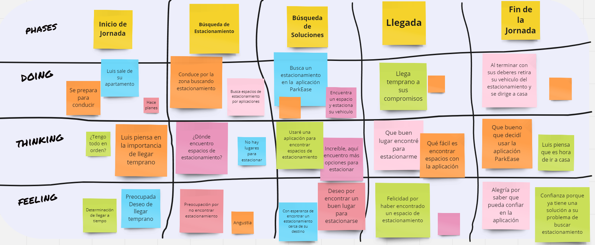
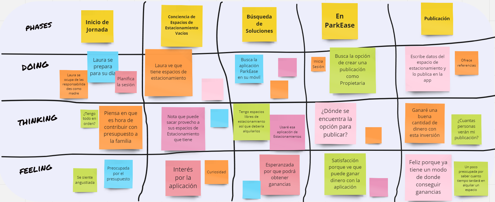

## 3.2. User Stories. 

En esta sección redactamos las historias de User necesarias para el correcto funcionamiento de nuestra aplicación según las necesidades de nuestros segmentos objetivos, considerando con ello un mínimo de un criterio de aceptación para cada historia de User.

|<p>**Epic/User Story**</p><p>**ID**</p>|**Título**|**Descripción**|**Criterios de Aceptación**|**Relacionado con (Epic ID)**|
| :- | :- | :- | :- | :- |
|<p>Preferencia y gestión de Cuenta.</p><p></p><p>US01</p>|Creación de cuenta|Como User quiero crear una cuenta nueva desde el aplicativo para poder acceder a todos los servicios que ofrece.|<p>**Escenario N°1** </p><p>**Crear cuenta**</p><p>Dado que el User desea crear una cuenta<br>Entonces debe seleccionar el botón “Crear cuenta”<br>Cuando lo seleccione podrá llenar los datos pedidos por la aplicación.</p><p></p><p>**Escenario N°2**</p><p>**Verificación de cuenta**</p><p>Dado que el User desea confirmar la cuenta creada<br>Entonces debe seleccionar “confirmar cuenta”</p><p>Entonces se le enviará un código a su correo el cual debe ingresar a la aplicación<br>Cuando ingrese el código podrá verificar su cuenta<br>Entonces tendrá su cuenta creada.</p><p></p>||
|<p></p><p>US02</p>|Inicio de Sesión|Como User quiero iniciar sesión con la cuenta que cree para poder acceder a las funciones de la aplicación.|<p>**Escenario N°1**</p><p>**Inicio de Sesión**</p><p>Dado que el User desea acceder a la aplicación<br>Entonces deberá ingresar su correo y contraseña <br>Cuando los datos sean verificados por la base de datos de la aplicación el User podrá acceder al aplicativo y dispondrá de todas sus funcionalidades.</p><p></p>||
|US03|Recuperación de la Cuenta|Como User quiero recuperar mi cuenta de la cual me olvide la contraseña o el correo, para evitar crearme otra cuenta.|<p>**Escenario N°1** </p><p>**User no recuerda su contraseña**</p><p>Dado que el User no recuerda su contraseña<br>Entonces deberá seleccionar “¿Olvidaste tu contraseña?”<br>Cuando la seleccione deberá ingresar el correo de la cuenta<br>Entonces se le enviará un código a ese correo.</p><p></p><p>**Escenario N°2**</p><p>**User recibe Código de verificación**</p><p>Dado que el User recibió el código de verificación<br>Cuando coloque el código en la aplicación<br>Entonces se habilita la opción de restablecer la contraseña.</p><p></p><p>**Escenario N°3**</p><p>**User restablece su contraseña**</p><p>Dado que el User puede restablecer su contraseña<br>Cuando escriba dos veces su nueva contraseña</p><p>Entonces deberá seleccionar el botón “Confirmar contraseña”</p><p></p>||
|US04|Métodos de pago|Como User, deseo realizar los pagos por estacionamiento con tarjetas de crédito o débito, u otros servicios de pago como Yape, Plin, Paypal, etc., para facilitar el proceso de pago.|<p>**Escenario N°1**</p><p>**Pago de medicamentos**</p><p>Dado que el User quiere completar su pago por estacionamiento</p><p>Cuando se encuentre en la pestaña de pago</p><p>Entonces podrá visualizar las diversas opciones de pago que ofrece la aplicación y seleccionar la que desee.</p>||
|US05|Historial de pagos|Como User, deseo ver el historial de pagos que tengo respecto a los pagos que hice por un sitio de estacionamiento.|<p>**Escenario N°1**</p><p>**Revisar historial de medicamentos**</p><p>Dado que el User desea revisar los sitios de estacionamiento que pagó anteriormente</p><p>Cuando acceda a la sección de “Perfil” </p><p>Entonces podrá visualizar la opción “Historial de pagos” y al acceder a esta podrá verificar sus pagos.</p>||
|<p>Funcionalidades de Búsqueda</p><p></p><p>US06</p>|Búsqueda de un espacio de estacionamiento|Como User, deseo poder acceder a una barra de búsqueda para encontrar espacios de estacionamiento rápidamente.|<p>**Escenario N°1**</p><p>**Buscar Estacionamiento**</p><p>Dado que el User busca un espacio de estacionamiento</p><p>Cuando entre en la sección "Estacionamientos"</p><p>Entonces podrá utilizar una barra de búsqueda para ingresar el nombre del lugar donde necesita estacionarse. Una vez realizado esto, el mapa mostrará la ubicación del estacionamiento requerido más cerca de la zona con información detallada.</p><p></p><p>**Escenario N°2**</p><p>**Buscar en lista de favoritos**</p><p>Dado que el User desea encontrar un espacio de estacionamiento en su lista de favoritos</p><p>Cuando acceda a la sección “Favoritos” podrá visualizar una barra de búsqueda, donde podrá escribir y buscar el espacio de estacionamiento que anteriormente marcó como favorito</p><p>Entonces se mostrará una lista de sus espacios para estacionarse favoritos.</p>||
|US07|Visualización de la información de un Espacio de Estacionamiento|Como User, quiero observar la información organizada, detallada y clara del espacio de estacionamiento para decidir si ocuparlo o no.|<p>**Escenario N°1**</p><p>**Mostrar ubicación del Espacio de Estacionamiento**</p><p>Dado que el User quiere visualizar espacios de estacionamiento cercanos</p><p>Cuando le dé al botón de búsqueda, y seleccione un espacio de estacionamiento de todas las opciones disponibles</p><p>Entonces aparecerá la dirección exacta del espacio de estacionamiento seleccionado, así como su ubicación en el mapa.</p><p></p><p>**Escenario N°2**</p><p>**Mostrar información de contacto del centro de salud**</p><p>Dado que el User requiere contactarse con el dueño del espacio de estacionamiento</p><p>Cuando le da al botón de búsqueda, y seleccione un espacio de estacionamiento en específico</p><p>Entonces aparecerá información de contacto del del dueño.</p>||
|US08|Filtrado de la búsqueda|Como User, quiero filtrar mi búsqueda de Espacios de Estacionamiento para tener mejores opciones a elegir.|<p>**Escenario N°1**</p><p>**Filtrado de la búsqueda en Espacios de Estacionamiento**</p><p>Dado que el User busca un estacionamiento y quiere que sea conveniente y asequible,</p><p>Cuando utiliza la barra de búsqueda en la parte de la aplicación, le da al botón de filtros y aplica estos,</p><p>Entonces obtiene una lista de estacionamientos cercanos con tarifas económicas y buenas calificaciones, lo que le permite tomar una decisión informada y rápida.</p>||
|<p>Mejora de Soporte al Cliente y Experiencia de Servicio</p><p>US09</p>|Contacto Servicio Técnico|Como User, quiero poder comunicarme con algún experto en la aplicación y sus funciones para qué pueda resolver mis dudas y dificultades durante el uso de esta.|<p>**Escenario N°1: Información de Contacto**</p><p>Dado que el User tiene dudas o problemas que no pueden resolverse con la información proporcionada en la aplicación,</p><p>Cuando acceda a la sección de Soporte técnico</p><p>Entonces podrá encontrar detalles de contacto como número de teléfono y dirección de correo electrónico.</p><p></p><p>**Escenario N°2: Contacto con Técnico**</p><p>Dado que el User dispone de información de contacto,</p><p>Cuando llame al número telefónico proporcionado,</p><p>o Cuando envíe un correo electrónico al destinatario,</p><p>Entonces un miembro del equipo de atención al cliente responderá,</p><p>Y proporcionará respuestas a las preguntas planteadas por el User.</p>||
|US10|Tutorial de uso de la Aplicación|Como User, deseo recibir instrucciones claras y pop-ups informativos al utilizar la aplicación por primera vez, para entender las funcionalidades y así aprender a utilizar la aplicación de manera efectiva.|<p>**Escenario N°1**</p><p>**Opción de tutorial**</p><p>Dado que el User ingresa por primera vez a la aplicación</p><p>Cuando vea la página inicial</p><p>Entonces un pop-up le preguntará si quiere seguir una guía tutorial.</p><p></p><p>**Escenario N°2**</p><p>**Acepta tutorial**</p><p>Dado que el User dispone de la opción de seguir un tutorial para aprender a usar la aplicación,</p><p>Cuando haga clic en "Aceptar",</p><p>Entonces se mostrará un pop-up que lo guiará a través de un recorrido del programa, explicando la función de cada componente y cómo usarlo.</p><p></p><p>**Escenario N°3**</p><p>**Rechaza tutorial**</p><p>Dado que el User dispone de la opción de seguir un tutorial para aprender a usar la aplicación,</p><p>Cuando haga clic en "Rechazar",</p><p>Entonces no se mostrará el recorrido interactivo y los pop-ups informativos, permitiendo al User explorar la** aplicación por sí mismo.</p>||
|US11|Acceso a Preguntas Frecuentes|Como User, deseo acceder a la sección de preguntas frecuentes y sus respectivas respuestas. Esto me permitirá resolver cualquier duda que tenga y obtener información adicional sobre la aplicación.|<p>**Escenario N°1**</p><p>**Visualización**</p><p>Dado que el User se encuentra en el menú de opciones,</p><p>Cuando haga clic en "Preguntas frecuentes",</p><p>Entonces podrá ver una lista de preguntas y sus respuestas asociadas.</p><p></p><p>**Escenario 2:**</p><p>**Información Adicional**</p><p>Dado que el User quiere obtener información adicional sobre la aplicación,</p><p>Cuando seleccione una pregunta específica de la lista,</p><p>Entonces se me mostrará la respuesta correspondiente, lo que le permitirá aclarar sus dudas o informarle más sobre el funcionamiento de la aplicación.</p>||
|<p>Funcionalidad de Pagos</p><p>US12</p>|Visualización y confirmación de pago |Como User, quiero poder visualizar el resumen de mi pago por el espacio de estacionamiento antes de confirmar la transacción. Esto me permitirá revisar los detalles y asegurarme de que la información sea correcta antes de realizar el pago.|<p>**Escenario 1:** </p><p>**Visualización del Resumen de Pago**</p><p>Dado que el User ha seleccionado un espacio de estacionamiento y está a punto de realizar el pago,</p><p>Cuando haga clic en "Pagar"</p><p>Entonces se le mostrará un resumen detallado del pago, que incluye el costo total, la duración del estacionamiento y cualquier cargo adicional.</p><p></p><p>**Escenario 2:** </p><p>**Confirmación de Pago**</p><p>Dado que el User ha revisado el resumen de pago,</p><p>Cuando esté satisfecho con los detalles y quiera proceder con la transacción,</p><p>Entonces podrá hacer clic en "Confirmar Pago" para completar la transacción**.**</p><p></p><p>**Escenario 3:** </p><p>**Modificación de Detalles de Pago**</p><p>Dado que el User ha revisado el resumen de pago, pero identifica un error o necesita modificar algún detalle,</p><p>Cuando le dé al botón "Modificar" los detalles de pago,</p><p>Entonces podrá realizar las modificaciones necesarias antes de proceder con la confirmación de pago.</p>||
|US13|Compra de Suscripciones|Como User, deseo tener la opción de comprar suscripciones dentro de la aplicación para acceder a características premium y beneficios exclusivos. Esto me permitirá disfrutar de una experiencia mejorada mientras uso la aplicación.|<p>**Escenario 1:** </p><p>**Exploración de Opciones de Suscripción**</p><p>Dado que el User desea acceder a características premium,</p><p>Cuando acceda a la sección de "Suscripciones" o "Premium" en la aplicación,</p><p>Entonces se le mostrará una lista de las diferentes opciones de suscripción disponibles, incluyendo detalles sobre precios, duración y beneficios asociados.</p><p></p><p>**Escenario 2:** </p><p>**Selección de Suscripción**</p><p>Dado que el User ha explorado las opciones de suscripción,</p><p>Cuando seleccione una suscripción específica que desee adquirir,</p><p>Entonces se le dirigirá a una pantalla de confirmación de compra.</p><p></p><p>**Escenario 3:** </p><p>**Confirmación de Compra**</p><p>Dado que el User ha seleccionado una suscripción,</p><p>Cuando confirme la compra y complete la transacción a través de un método de pago previamente registrado o proporcione los detalles de pago requeridos,</p><p>Entonces se completará la compra y la suscripción se activará inmediatamente, brindando al User acceso a las características premium.</p><p></p><p>**Escenario 4:** </p><p>**Gestión de Suscripciones**</p><p>Dado que el User ha adquirido una suscripción,</p><p>Cuando acceda a la sección de "Gestión de Suscripciones",</p><p>Entonces podrá ver los detalles de su suscripción actual, incluyendo la fecha de vencimiento, y tendrá la opción de cancelar o modificar su suscripción en cualquier momento.</p>||
|<p>Preferencia y Gestión de Cuenta</p><p>US14</p>|Editar información del perfil|Como User, quiero tener la opción de editar la información de mi perfil para mantenerla actualizada.|<p>**Escenario 1:** </p><p>**Acceso a la Edición de Perfil**</p><p>Dado que el User desea editar su información de perfil,</p><p>Cuando acceda a la sección de "Perfil" o "Configuración de Cuenta" en la aplicación,</p><p>Entonces se le proporcionará la opción de "Editar Perfil".</p><p></p><p>**Escenario 2:** </p><p>**Edición de Datos Personales**</p><p>Dado que el User ha seleccionado "Editar Perfil",</p><p>Cuando modifique datos personales como nombre, dirección de correo electrónico, número de teléfono u otros campos relevantes,</p><p>Entonces se guardarán los cambios y se actualizará la información en el perfil.</p><p></p><p>**Escenario 3:** </p><p>**Cambio de Contraseña**</p><p>Dado que el User desea cambiar su contraseña por motivos de seguridad,</p><p>Cuando seleccione la opción para "Cambiar Contraseña",</p><p>Entonces se le solicitará que ingrese su contraseña actual y luego proporcione y confirme la nueva contraseña. Una vez confirmada, se actualizará la contraseña de la cuenta.</p>||
|US15|Actualizar Métodos de Pago|Como User, quiero ser capaz de actualizar los medios de pago en mi perfil para poder añadir, actualizar o eliminar distintos métodos de pago que prefiera utilizar en la aplicación.|<p>**Escenario 1:**</p><p>**Añadir medio de pago**</p><p>Dado que el User desea añadir un medio de pago.</p><p>Cuando el User accede a la sección de medios de pago en su perfil.</p><p>Entonces el sistema muestra una lista de medios de pago disponibles para añadir, el User selecciona uno y proporciona la información necesaria, como número de tarjeta, fecha de vencimiento, etc. El sistema verifica que la información proporcionada sea válida y agrega el nuevo medio de pago a la lista en el perfil del User.</p><p></p><p>**Escenario 2:**</p><p>**Eliminar medio de pago**</p><p>Dado que el User desea eliminar un medio de pago de su perfil</p><p>Cuando el User accede a la sección de medios de pago en su perfil.</p><p>` `Entonces el sistema muestra la lista de medios de pago que tiene el User, el User selecciona el medio que desea eliminar y confirma que desea eliminarlo, el sistema elimina el medio de pago seleccionado de la lista en el perfil del User.</p>||
|US16|Registro de Host|Como Host de un espacio de estacionamiento, quiero poder registrarme en la plataforma ParkEase proporcionando información básica sobre mi espacio y mis datos de contacto.|<p>**Escenario 1:** </p><p>**Registro Exitoso**</p><p>Dado que el Host de espacio de estacionamiento es nuevo en ParkEase,</p><p>Cuando acceda a la opción de registro en la aplicación y proporcione su información de contacto y detalles de su espacio de estacionamiento,</p><p>Entonces recibirá una confirmación de registro exitoso y podrá acceder a su perfil de Host.</p><p></p><p>**Escenario 2:** </p><p>**Registro Incompleto**</p><p>Dado que el Host de espacio de estacionamiento es nuevo,</p><p>Cuando intente registrarse pero deje campos obligatorios en blanco o proporcione información incorrecta,</p><p>Entonces recibirá un mensaje de error que le indicará los campos que debe corregir para completar el registro.</p>||
|<p>Gestión de espacio de estacionamiento</p><p>US17</p>|Creación de Listados de Espacios|Como Host, quiero poder crear listados para mis espacios de estacionamiento, incluyendo detalles como la ubicación, el tipo de espacio, las tarifas y la disponibilidad.|<p>**Escenario 1:** </p><p>**Creación Exitosa de Listado**</p><p>Dado que el Host desea listar un espacio de estacionamiento,</p><p>Cuando complete todos los detalles requeridos, como ubicación, tipo de espacio y tarifas,</p><p>Entonces su espacio se agregará exitosamente a la plataforma y estará disponible para reservas.</p><p></p><p>**Escenario 2:** </p><p>**Actualización de Listado Existente**</p><p>Dado que el Host con espacios de estacionamiento ya listados,</p><p>Cuando desee realizar cambios en la información de un listado existente, como ajustar tarifas o disponibilidad,</p><p>Entonces podrá editar el listado y los cambios se reflejarán en la plataforma.</p>||
|US18|Gestión de Disponibilidad|Como Host, quiero poder definir la disponibilidad de mis espacios de estacionamiento, estableciendo horarios específicos y días de la semana en los que están disponibles.|<p>**Escenario 1:**</p><p>**Establecimiento de Disponibilidad Exitoso**</p><p>Dado que el Host desea establecer la disponibilidad de un espacio de estacionamiento,</p><p>Cuando seleccione los días y horas específicos en los que el espacio estará disponible,</p><p>Entonces la disponibilidad se registrará correctamente y los conductores podrán ver el espacio como disponible durante esos horarios.</p>||
|US19|Configuración de Precios|Como Host, quiero poder establecer precios para mis espacios de estacionamiento, ya sea por hora, día o semana, y tener la flexibilidad de ajustar los precios según la demanda.|<p>**Escenario 1:** </p><p>**Establecimiento de Tarifas** </p><p>Dado que el Host quiere establecer tarifas para su espacio de estacionamiento,</p><p>Cuando ingrese las tarifas por hora, día o semana y las guarde,</p><p>Entonces las tarifas se configurarán correctamente y se mostrarán en la plataforma para los conductores interesados.</p><p></p><p>**Escenario 2:** </p><p>**Tarifas Inválidas**</p><p>Dado que el Host está configurando las tarifas para su espacio de estacionamiento,</p><p>Cuando intente establecer tarifas que no sean válidas o razonables,</p><p>Entonces recibirá un mensaje de error que le indicará que ajuste las tarifas a valores válidos y razonables.</p><p></p><p>**Escenario 3:** </p><p>**Cambio de Tarifas**</p><p>Dado que el Host tiene un espacio de estacionamiento listado,</p><p>Cuando desee cambiar las tarifas en cualquier momento,</p><p>Entonces podrá editar las tarifas en la plataforma y los cambios se reflejarán inmediatamente en mi listado.</p>||
|US20|Visualización de Reservas|Como Host, quiero poder ver las reservas realizadas para mis espacios de estacionamiento, incluyendo la fecha, hora y detalles del conductor.|<p>**Escenario 1:** </p><p>**Visualización de Reservas Activas**</p><p>Dado que el Host tiene espacios de estacionamiento listados,</p><p>Cuando acceda a la sección de "Reservas" en mi perfil,</p><p>Entonces podrá ver una lista de las reservas activas, incluyendo detalles como la fecha, hora y nombre del conductor.</p>||
|US21|Obtención de Datos a través de la API|Como Developer quiero tener la capacidad de obtener la lista de Hosts, la lista de Users y los anuncios publicados en la aplicación para poder utilizar estos datos en aplicaciones o servicios externos.|<p>**Escenario 1:** </p><p>**Obtención de la Lista de Hosts**</p><p>Dado que el Developer utiliza la API de ParkEase,</p><p>Cuando realice una solicitud GET a la ruta "/Hosts" en la API,</p><p>Entonces recibirá una lista de Hosts registrados en la plataforma, incluyendo detalles como nombres, direcciones de correo electrónico y detalles de contacto.</p><p></p><p>**Escenario 2:** </p><p>**Obtención de la Lista de Users**</p><p>Dado que el Developer está trabajando con la API de ParkEase,</p><p>Cuando realice una solicitud GET a la ruta "/Users" en la API,</p><p>Entonces recibirá una lista de Users registrados en la aplicación, con información relevante como nombres, direcciones de correo electrónico y detalles de contacto.</p>||
|US22|Obtener Detalles de un Host por ID|Como developer, quiero obtener los detalles de un Host específico a través de su identificación única (ID).|<p>**Escenario 1:**</p><p>**Obtener Detalles de un Host por ID**</p><p>Dado que el Developertiene el ID de un Host,</p><p>Cuando realice una solicitud GET a la ruta "/Hosts/{ID}" en la API,</p><p>Entonces recibirá los detalles del Host correspondiente.</p><p></p><p>**Escenario 2:**</p><p>` `**Obtención de la Lista de Users por ID**</p><p></p><p>Dado que el Developer tiene el ID de un User,</p><p>Cuando realice una solicitud GET a la ruta "/Users/{ID}" en la API,</p><p>Entonces recibiré los detalles del User correspondiente.</p>||
|US23|Obtener Estadísticas de Uso Detalladas|Como Developer, quiero obtener estadísticas de uso detalladas de la plataforma para evaluar el rendimiento y la eficacia de la aplicación.|<p>**Escenario 1:**</p><p>**Dado que deseo obtener estadísticas de uso detalladas,**</p><p>Dado que el Developer realice una solicitud GET a la ruta "/stadistics/details" en la API,</p><p>Entonces recibirá un informe completo que incluye datos específicos, como el número total de Users registrados, el promedio de tiempo que los Users pasan en la aplicación y otros indicadores clave que le ayudarán a comprender mejor el rendimiento de la plataforma.</p><p></p><p>**Escenario 2:** </p><p>**Obtención de Estadísticas de Uso por Región Geográfica**</p><p>Dado que el Developer quiere entender mejor cómo se utiliza la aplicación en diferentes lugares,</p><p>Cuando realice una solicitud GET a la ruta "/stadistics/places en la API,</p><p>Entonces recibirá datos detallados sobre el uso de la aplicación en lugares específicos, incluyendo información sobre la cantidad de Users, reservas y anuncios en cada área geográfica.</p>||
|<p>Landing Page</p><p></p><p></p><p>US24</p>|Visualizar información para Users cliente|Como visitor del segmento Guest, quiero acceder a una sección que explique cómo ParkEase facilita la búsqueda y reserva de espacios de estacionamiento.|<p>**Escenario 1:** </p><p>**Acceso a la Información de Uso para Clientes**</p><p>Dado que un visitor Guest está interesado en comprender cómo ParkEase simplifica la búsqueda de espacios de estacionamiento,</p><p>Cuando visite la sección "Información para Users" en el sitio web,</p><p>Entonces encontrará detalles sobre cómo la plataforma permite buscar, reservar y pagar por espacios de estacionamiento de manera rápida y sencilla.</p><p></p>||
|US25|Visualizar información para Hosts|Como visitor del segmento Host, quiero acceder a una sección que explique las ventajas de utilizar ParkEase como plataforma para gestionar mis espacios de estacionamiento.|<p>**Escenario 1:** </p><p>**Acceso a la Información de Beneficios**</p><p>Dado que un visitor Host está interesado en conocer los beneficios de utilizar ParkEase como plataforma,</p><p>Cuando visite la sección "Host" en el sitio web,</p><p>Entonces encontrará detalles sobre cómo ParkEase simplifica la gestión de espacios de estacionamiento, aumenta los ingresos y brinda seguridad.</p>||
|US26|Visualizar información de la Startup|Como visitor del segmento Guest/Host, quiero poder acceder a una sección "Sobre Nosotros" para obtener información detallada sobre la empresa ParkEase|<p>**Escenario 1:** </p><p>**Navegación a la Página "Sobre Nosotros"**</p><p>Dado que el visitor está interesado en obtener más información sobre ParkEase,</p><p>Cuando navegue al sitio web y haga clic en la sección "Sobre Nosotros" del menú,</p><p>Entonces será redirigido a una página que proporciona una descripción detallada de la empresa, su historia, misión y visión.</p>||
|US27|Visualización de Planes de Suscripción|Como visitor del segmento Guest/Host, quiero acceder a información sobre los diferentes planes de suscripción ofrecidos por ParkEase.|<p>**Escenario 1:** </p><p>**Exploración de Planes de Suscripción**</p><p>Dado que el visitor  quiere saber más sobre los planes de suscripción de ParkEase,</p><p>Cuando navegue a la sección de "Suscripciones" en el sitio web,</p><p>Entonces encontraré detalles sobre los planes disponibles, sus precios y las características incluidas en cada uno.</p>||
|US28|Cambiar de Idioma a Español/Inglés|Como visitor del segmento Guest/Host, quiero tener la opción de cambiar el idioma del sitio entre español e inglés.|<p>**Escenario 1:** </p><p>**Cambiar idioma a Español**</p><p>Dado que un visitor visita  el sitio web y prefiere ver el contenido en español,</p><p>Cuando busque la opción de cambio de idioma en el sitio,</p><p>Entonces podrá seleccionar "Español" y ver todo el contenido del sitio en español.</p><p></p><p>**Escenario 2:** </p><p>**Cambiar idioma a Inglés**</p><p>Dado que el visitor navega por el sitio web y prefiero ver el contenido en inglés,</p><p>Cuando busque la opción de cambio de idioma en el sitio,</p><p>Entonces podrá seleccionar "Inglés" y ver todo el contenido del sitio en Inglés.</p><p></p>||
|US29|Navegación en la Landing Page|Como visitor del segmento Guest/Host, deseo tener la opción de navegar por la Landing page.|<p>**Escenario 1:**</p><p>**Navegación Principal:**</p><p>Dado que un visitor carga la página de inicio.</p><p>Cuando desliza hacia abajo en la pantalla o utiliza la barra de desplazamiento.</p><p>Entonces la página responde suavemente, mostrando de manera fluida más contenido a medida que el visitante se desplaza hacia abajo.</p><p></p><p>**Escenario 2:** </p><p>**Navegación Eficiente a través del Menú Principal**</p><p>Dado que un visitante se encuentra en la landing page.</p><p>Cuando observa la parte superior de la página.</p><p>Entonces el visitante nota un menú con opciones como "About Us", "Host", "Guest", "Team Designer" y "Subscription", lo que le permite acceder fácilmente a estas secciones con solo un clic en la opción deseada.</p>||
|US30|Acceso Rápido a la Aplicación desde el Logo|Como visitor del segmento Guest/Host, deseo que al hacer clic en el logo de la marca en el sitio web, sea redirigido de manera eficiente a la aplicación correspondiente.|<p>**Escenario 1:**</p><p>` `**Acceso Directo a la Aplicación:**</p><p>Dado un visitor se encuentra en la página web.</p><p>Cuando hace clic en el logo de la marca.</p><p>Entonces se redirige automáticamente a la tienda de aplicaciones de su dispositivo móvil (iOS o Android) donde puede descargar o abrir la aplicación móvil correspondiente. </p>||
|US31|Conocer al Equipo|<p>Como User interesado en conocer más sobre el equipo detrás de ParkEase,</p><p>Deseo poder acceder a una sección "About Team" en el sitio web,</p><p>Para obtener información detallada sobre los miembros del equipo, sus roles y sus antecedentes profesionales.</p>|<p>**Dado que un User quiere conocer más sobre el equipo detrás de ParkEase,**</p><p>Dado que el User del sitio web interesado en conocer al equipo detrás del producto,</p><p>Cuando acceda a la sección "About Team" en la página de inicio,</p><p>Entonces veré un video que muestra a los miembros del equipo y sus roles.</p>||
|US32|Obtener Detalles del Producto|Como User interesado en el producto, quiero ver un video que describa de manera concisa y atractiva las características clave y los beneficios del producto.|<p>**Escenario 1:** </p><p>**Ver las características clave del producto**</p><p>Dado que el User está interesado en el producto,</p><p>Cuando acceda a la sección "About Producto" en la página de inicio,</p><p>Entonces veré un video que destaca de manera visual las características clave del producto**.**</p>||
|US33|Encontrar redes sociales del Producto|Como User visitor del sitio web, quiero acceder fácilmente a las redes sociales del producto y encontrar información adicional en la parte inferior de la página.|<p>**Escenario 1:** </p><p>**Acceder a las redes sociales**</p><p>Dado que el User quiere seguir las redes sociales del producto,</p><p>Cuando se desplace hacia abajo hasta la parte inferior de la página (footer),</p><p>Entonces encontrará enlaces visibles y funcionales a las redes sociales del producto.</p>||

## 3.3. Impact Mapping. 

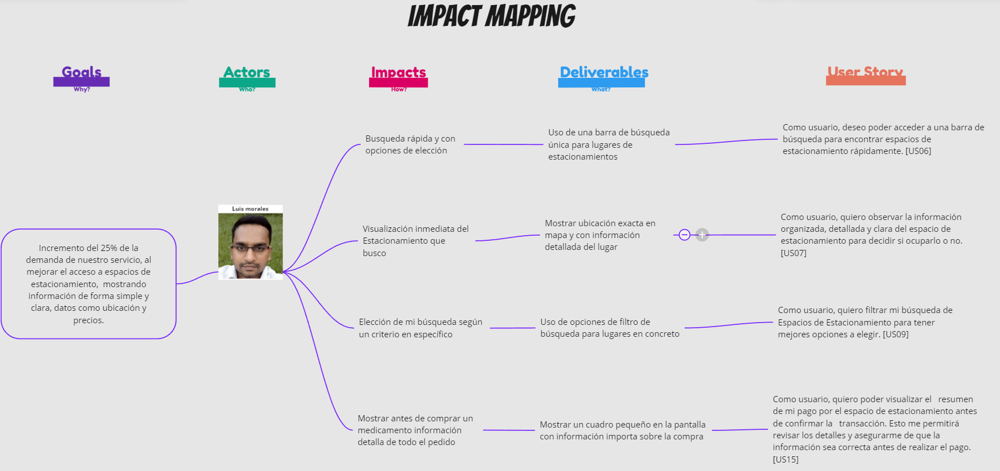
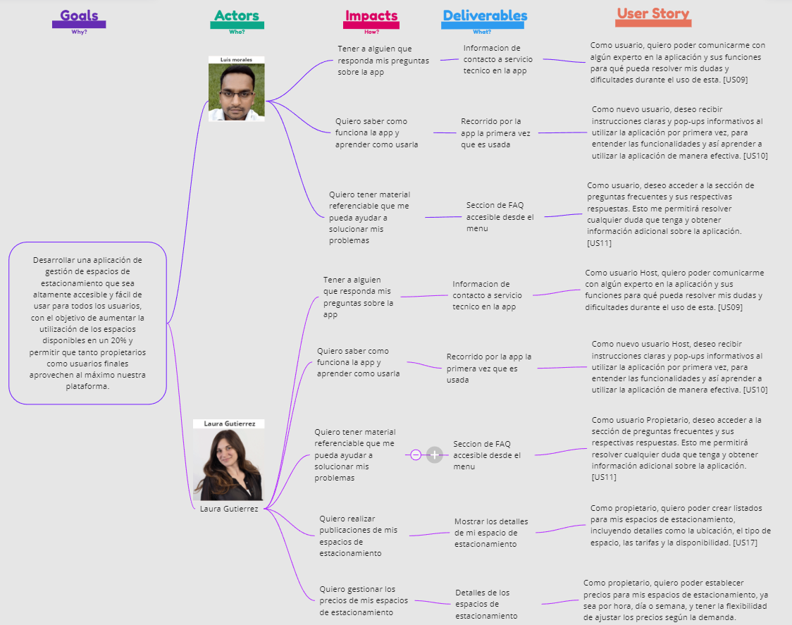

## 3.4. Product Backlog. 

|**#Orden**|**User Story ID**|**Título**|**Descripción**|**Story Points**|
| :- | :- | :- | :- | :- |
|1|US13|Compra de Suscripciones|Como usuario, deseo tener la opción de comprar suscripciones dentro de la aplicación para acceder a características premium y beneficios exclusivos. Esto me permitirá disfrutar de una experiencia mejorada mientras uso la aplicación.|3|
|2|US15|Métodos de pago|Como usuario, deseo realizar los pagos por estacionamiento con tarjetas de crédito o débito, u otros servicios de pago como Yape, Plin, Paypal, etc., para facilitar el proceso de pago.|5|
|3|US07|Visualización de la información de un Espacio de Estacionamiento|Como usuario, quiero observar la información organizada, detallada y clara del espacio de estacionamiento para decidir si ocuparlo o no.|3|
|4|<p>US06</p><p></p>|Búsqueda de un espacio de estacionamiento|Como usuario, deseo poder acceder a una barra de búsqueda para encontrar espacios de estacionamiento rápidamente.|2|
|5|US01|Creación de cuenta|Como usuario quiero crear una cuenta nueva desde el aplicativo para poder acceder a todos los servicios que ofrece.|2|
|6|US02|Inicio de Sesión|Como usuario quiero iniciar sesión con la cuenta que cree para poder acceder a las funciones de la aplicación.|2|
|7|US03|Recuperación de la Cuenta|Como usuario quiero recuperar mi cuenta de la cual me olvide la contraseña o el correo, para evitar crearme otra cuenta.|3|
|8|US05|Historial de pagos|Como usuario, deseo ver el historial de pagos que tengo respecto a los pagos que hice por un sitio de estacionamiento.|3|
|9|US19|Configuración de Precios|Como propietario, quiero poder establecer precios para mis espacios de estacionamiento, ya sea por hora, día o semana, y tener la flexibilidad de ajustar los precios según la demanda.|5|
|10|US19|Gestión de Disponibilidad|Como propietario, quiero poder definir la disponibilidad de mis espacios de estacionamiento, estableciendo horarios específicos y días de la semana en los que están disponibles.|5|
|11|US20|Visualización de Reservas|Como propietario, quiero poder ver las reservas realizadas para mis espacios de estacionamiento, incluyendo la fecha, hora y detalles del conductor.|5|
|12|US21|Obtención de Datos a través de la API|Como Developer quiero tener la capacidad de obtener la lista de propietarios, la lista de usuarios y los anuncios publicados en la aplicación para poder utilizar estos datos en aplicaciones o servicios externos.|8|
|13|US22|Obtener Detalles de un Propietario por ID|Como developer, quiero obtener los detalles de un propietario específico a través de su identificación única (ID).|8|
|14|US15|Actualizar Métodos de Pago|Como usuario, quiero ser capaz de actualizar los medios de pago en mi perfil para poder añadir, actualizar o eliminar distintos métodos de pago que prefiera utilizar en la aplicación.|3|
|15|US14|Editar información del perfil|Como usuario, quiero tener la opción de editar la información de mi perfil para mantenerla actualizada.|2|
|16|US10|Tutorial de uso de la Aplicación|Como nuevo usuario, deseo recibir instrucciones claras y pop-ups informativos al utilizar la aplicación por primera vez, para entender las funcionalidades y así aprender a utilizar la aplicación de manera efectiva.|2|
|17|US11|Acceso a Preguntas Frecuentes|Como usuario, deseo acceder a la sección de preguntas frecuentes y sus respectivas respuestas. Esto me permitirá resolver cualquier duda que tenga y obtener información adicional sobre la aplicación.|2|
|18|US09|Contacto Servicio Técnico|Como usuario, quiero poder comunicarme con algún experto en la aplicación y sus funciones para qué pueda resolver mis dudas y dificultades durante el uso de esta.|3|
|19|US12|Visualización y confirmación de pago|Como usuario, quiero poder visualizar el resumen de mi pago por el espacio de estacionamiento antes de confirmar la transacción. Esto me permitirá revisar los detalles y asegurarme de que la información sea correcta antes de realizar el pago.|3|
|20|US16|Registro de Propietario|Como propietario de un espacio de estacionamiento, quiero poder registrarme en la plataforma ParkEase proporcionando información básica sobre mi espacio y mis datos de contacto.|5|
|21|US17|Creación de Listados de Espacios|Como propietario, quiero poder crear listados para mis espacios de estacionamiento, incluyendo detalles como la ubicación, el tipo de espacio, las tarifas y la disponibilidad.|5|
|22|US24|Visualizar información de la Startup|Como visitante del segmento Guest/Host, quiero poder acceder a una sección "Sobre Nosotros" para obtener información detallada sobre la empresa ParkEase.|1|
|23|US25|Visualizar información para Propietarios|Como visitante del segmento Host, quiero acceder a una sección que explique las ventajas de utilizar ParkEase como plataforma para gestionar mis espacios de estacionamiento.|1|
|24|US26|Visualizar información para Usuarios cliente|Como visitante del segmento Guest, quiero acceder a una sección que explique cómo ParkEase facilita la búsqueda y reserva de espacios de estacionamiento.|1|
|25|US27|Visualización de Planes de Suscripción|Como visitante del segmento Guest/Host, quiero acceder a información sobre los diferentes planes de suscripción ofrecidos por ParkEase.|2|
|26|US28|Cambiar de Idioma a Español/Inglés|Como visitante del segmento Guest/Host, quiero tener la opción de cambiar el idioma del sitio entre español e inglés.|1|


# Capítulo IV: Product Design 

## 4.1. Style Guidelines.
### 4.1.1. General Style Guidelines.

* Branding:

  El branding de Parkease busca transmitir eficiencia, confianza y modernidad. Utilizamos una combinación de colores y elementos visuales que reflejan los valores fundamentales de nuestra plataforma.


* Typography:

  Hemos elegido la fuente tipográfica "Poppins" como nuestra principal elección para el texto. Poppins es una fuente moderna y legible que complementa nuestra imagen de marca al transmitir claridad y accesibilidad.

* Colors:

  Nuestra paleta de colores incluye:

  Amarillo: Representa la energía y la alegría, reflejando la idea de una experiencia de estacionamiento optimizada.

  Azul: Transmite confianza, seguridad y profesionalismo, asegurando a los usuarios que Parkease es una solución confiable.

  Negro: Refleja elegancia, modernidad y seriedad, destacando nuestra calidad y compromiso con la excelencia.

* Tono de Comunicación y Lenguaje:

  El tono de comunicación de Parkease es una mezcla de profesionalismo y amigabilidad. Nuestro lenguaje es claro y conciso, pero también muestra empatía hacia las necesidades de nuestros usuarios. Mantenemos un equilibrio entre lo formal y lo casual, manteniendo un enfoque respetuoso pero accesible.


### 4.1.2. Web Style Guidelines. 

* Colores:

  * Colores Primarios:

    #F6EB0F:El amarillo es un color brillante y alegre que puede reflejar la idea de que Parkease ofrece una solución que mejora la experiencia de estacionamiento, lo que a su vez puede generar una sensación de felicidad y optimismo entre los conductores.


    #001F3F:El azul es ampliamente conocido por transmitir confianza y seguridad. Utilizar el color azul en la plataforma Parkease puede comunicar que la aplicación es confiable y que los usuarios pueden sentirse seguros al utilizarla para encontrar y reservar espacios de estacionamiento.

  * Colores Secundario:

    #000000:El negro se asocia con profesionalismo y seriedad. Puede comunicar que Parkease es una plataforma confiable y comprometida en brindar un servicio de calidad a sus usuarios. 


## 4.2. Information Architecture.
### 4.2.1. Organization Systems.

**Organización Visual del Contenido:**

**Jerarquía Visual:**

Utilizaremos una jerarquía visual clara para destacar elementos cruciales, como la búsqueda de espacios, la reserva y la información del usuario. Esto asegurará que los usuarios puedan identificar rápidamente las funciones clave y sepan dónde dirigirse para lograr sus objetivos.

**Organización Secuencial (Step-by-Step to Accomplish):** Implementaremos un enfoque de organización secuencial en el proceso de reserva de espacios. Guiaremos a los usuarios paso a paso, desde la búsqueda hasta la confirmación, para asegurarnos de que cada etapa sea comprensible y fácil de seguir.

**Organización Matricial:** En casos donde haya múltiples opciones o características, como los planes de suscripción, utilizaremos una organización matricial para presentar de manera clara y comparativa las diferentes opciones. Esto ayudará a los usuarios a tomar decisiones informadas.

**Esquemas de Categorización de Contenido:**

**Cronológico:** Emplearemos la categorización cronológica en secciones como "Historial de Reservas" para que los usuarios puedan rastrear y revisar sus acciones pasadas de manera ordenada.


**Según Audiencia (Grupos de Usuarios):** Utilizaremos la categorización según grupos de usuarios en áreas como "Opciones de Suscripción", donde ofreceremos planes personalizados para diferentes tipos de conductores.

### 4.2.2. Labeling Systems.

Este enfoque utiliza texto claro y conciso para identificar las funciones y secciones en el landing page, manteniendo el estilo minimalista y facilitando la comprensión de los usuarios. Además, se han etiquetado los botones y enlaces de navegación para una experiencia de usuario más clara. Por otro lado se utilizaron íconos de colores para representar características de la aplicación y redes sociales


### 4.2.3. SEO Tags and Meta Tags 

**Landing Page:**
```html
<meta charset="UTF-8">
<meta name="viewport" content="width=device-width, initial-scale=1.0">
<title>ParkEase - Encuentra y Reserva Estacionamiento Fácilmente</title>
<meta name="description" content="ParkEase simplifica tu experiencia de estacionamiento. Encuentra y reserva fácilmente espacios de estacionamiento cerca de ti. Únete a nosotros hoy.">
<meta name="keywords" content="estacionamiento, reserva de estacionamiento, parqueo, estacionamiento cercano, ParkEase">
<meta name="author" content="ParkEase Inc.">
<link rel="stylesheet" href="style.css">

```
**Web application:**
```html
<meta charset="UTF-8">
<meta name="viewport" content="width=device-width, initial-scale=1.0">
<title>Bienvenido a ParkEase - Tu Solución de Estacionamiento en Línea</title>
<meta name="description" content="ParkEase es tu compañero confiable para encontrar y reservar espacios de estacionamiento. Descubre una forma más fácil de estacionar.">
<meta name="keywords" content="reserva de estacionamiento en línea, aplicación de estacionamiento, estacionamiento seguro, encontrar estacionamiento">
<meta name="author" content="ParkEase Inc.">
<link rel="stylesheet" href="app-style.css">
```

### 4.2.4. Searching Systems.

Un sistema de búsqueda efectivo permitirá a los usuarios encontrar rápidamente la información que necesiten y ofrecer opciones de filtro para personalizar sus búsquedas. La presentación de los resultados será clara y concisa, y los usuarios deben poder interactuar con los resultados para obtener más información y realizar reservas si es necesario.

**Opciones de Búsqueda:**

- Búsqueda por Ubicación
- Búsqueda por Fecha y Hora
- Filtros de Precio
- Tipo de Estacionamiento
- Reseñas y Calificaciones

**Aspecto de los Datos Después de la Búsqueda:**

- Lista de Resultados
- Mapa Interactivo
- Filtros Adicionales
- Información Detallada
- Reservas
- Ordenar Resultados

### 4.2.5. Navigation Systems.

**4.2.5. Navigation Systems.**

El sistema de navegación en el Landing Page y las aplicaciones es crucial para guiar a los usuarios de manera efectiva.


- **Menú de Navegación Claro:** Utiliza un menú visible con botones y texto claro para las secciones importantes.


- **Estructura Jerárquica:** Organiza la información de manera jerárquica, destacando lo más importante.


- **Enlaces y Botones Reales:** Utiliza enlaces y botones descriptivos y relevantes.


- **Barra de Búsqueda:** Incluye una barra de búsqueda para facilitar la búsqueda de información.


- **Rutas de Navegación Guiada:** Crea rutas paso a paso para tareas específicas.


- **Mapas Interactivos:** Usa mapas que permitan explorar ubicaciones y detalles.


- **Filtros y Categorías:** Ofrece filtros y categorías para refinar búsquedas.


- **Enlaces de Regreso**: Proporciona enlaces "Volver" para una navegación más fácil.


- **Navegación Responsiva:** Asegura que la navegación sea efectiva en dispositivos móviles.


- **Pruebas de Usuario:** Realiza pruebas y ajusta según el feedback de los usuarios.

Un buen sistema de navegación mejora la experiencia del usuario al facilitar la búsqueda y la interacción. Diseñado pensado en las necesidades de nuestros usuarios para lograr una navegación efectiva.

## 4.3. Landing Page UI Design. 

**4.3. Landing Page UI Design.**

Para el diseño de la UI de nuestro Landing Page, hemos traducido nuestras decisiones de diseño y arquitectura de información en un enfoque visual atractivo y funcional que refleja la esencia de ParkEase. Nuestro objetivo principal es brindar a los usuarios una experiencia elegante, fácil de usar y enfocada en la acción, donde puedan encontrar y reservar espacios de estacionamiento de manera rápida y sencilla. Aquí presentamos los principales aspectos de nuestro diseño UI:


- **Paleta de Colores**
- **Tipografía**
- **Imágenes y Videos**
- **Botones y Enlaces**
- **Navegación**
- **Secciones Destacadas**
- **Formularios y Barra de Búsqueda**
- **Responsive Design**
- **Pruebas de Usuario**

[Enlace Landing Page Web Application](https://www.figma.com/file/Q9B07z1mUm16qGXD2kWfm5/ParkEase-LandingPage-Desktop-(Copy)?type=design&node-id=0-1&mode=design&t=rb36hKP09ZH9lQOQ-0)

[Enlace Landing Page Mobile](https://www.figma.com/file/NuFx225k1dH65JUiF840up/ParkEase-LandingPage-Mobile-(Copy)?type=design&node-id=0-1&mode=design&t=KaswbXPydhsY2oS0-0)


### 4.3.1. Landing Page Wireframe.

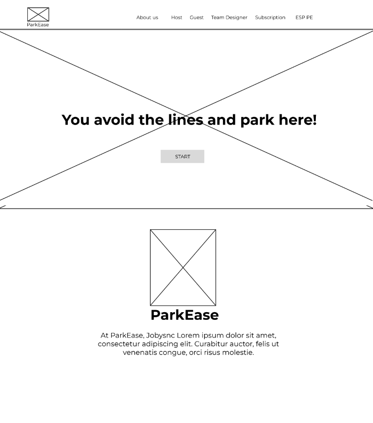


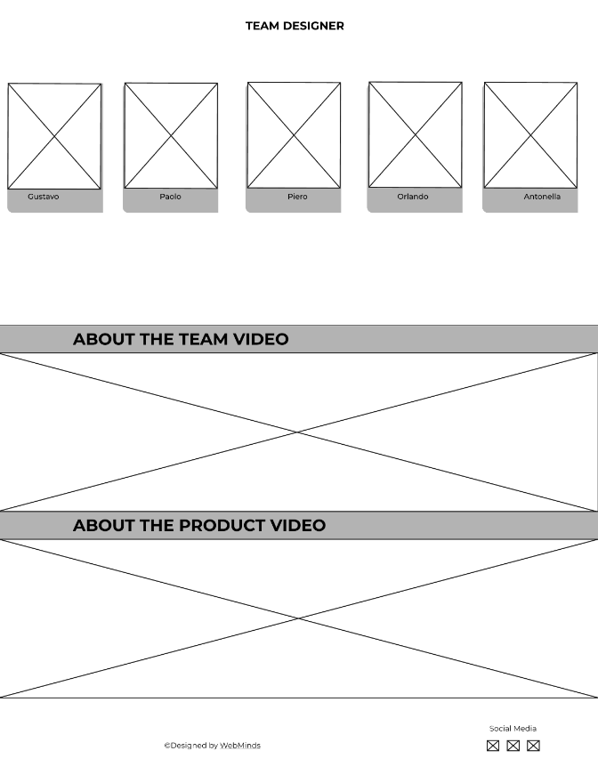

### 4.3.2. Landing Page Mock-up. 


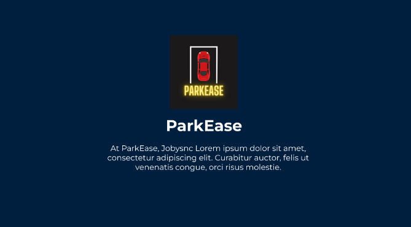

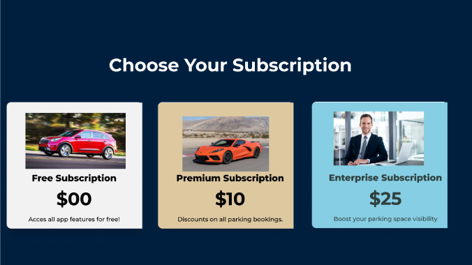
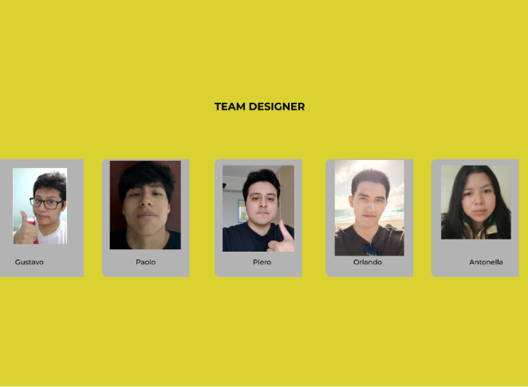
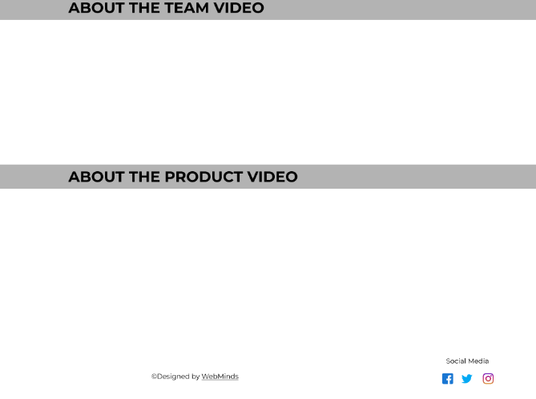

## 4.4. Web Applications UX/UI Design.
### 4.4.1. Web Applications Wireframes. 

User goal: Preferencia y gestión de cuenta de los usuarios.

- Crear cuenta
- Inicio de sesión
- Recuperación de contraseña
- Métodos de pago
- Historial de pagos

User goal: Funcionalidades de búsqueda de los usuarios.

- Búsqueda de un espacio de estacionamientos y filtrado de búsqueda.
- Búsqueda de un espacio en la lista de favoritos.


User goal: Mejora de soporte al cliente y experiencia de servicio

- Acceso a las preguntas frecuentes y contacto con servicio técnico.


User goal: Funcionalidad de pagos

- Visualización y confirmación de pago.
- Compra de suscripciones.

User goal: Preferencia y gestión de cuenta

- Editar información del perfil del usuario y actualizar métodos de pago.
- Creación de listado de espacios de estacionamientos.
- Visualización, gestión y configuración de espacios de estacionamiento.

### 4.4.2. Web Applications Wireflow Diagrams.

**User goal:Usuario se registra, recupera la contraseña o inicia sesión en la aplicación web.**

**Descripción:**

Al estar en la pestaña de bienvenida, el usuario tiene dos opciones: registrarse de manera gratuita rellenando el formulario con sus datos personales e iniciar sesión rellenando el formulario con su correo y contraseña. Además, en la pestaña iniciar sesión puede darle a la opción de recuperar contraseña para recibir un correo con las instrucciones de recuperación.

**User goal: Seleccionar las preguntas frecuentes y soporte técnico**

**Descripción:**

Al entrar en la pestaña de inicio, el usuario puede seleccionar la opción de preguntas frecuentes. El usuario puede seleccionar entre las preguntas frecuentes de arrendatarios y arrendadores. Si no consigue resolver sus dudas, en la pestaña de preguntas frecuentes y soporte puede contactar con una persona de servicio técnico.

**User goal:Ver perfil y cambiar método de pago**

**Descripción:**

Al entrar en la pestaña de inicio, el usuario puede seleccionar la pestaña con el nombre del usuario y entrar a su perfil. Dentro de la pestaña de perfil de usuario, puede cambiar sus datos como su nombre, apellidos, número de celular, DNI, correo electrónico y además cambiar el método de pago.

**User goal: Visualización y búsqueda de estacionamientos favoritos**

**Descripción:**

Al entrar en la pestaña de inicio, el usuario puede seleccionar la pestaña con el nombre del usuario y entrar a mis favoritos. Dentro de la pestaña de espacios de estacionamientos favoritos, el usuario puede visualizar los estacionamientos que ha seleccionado como favoritos y además puede filtrar la búsqueda por nombre de arrendador.

**User goal: Visualización de historial de pagos de estacionamientos**

**Descripción:**

Al entrar en la pestaña de inicio, el usuario puede seleccionar la pestaña con el nombre del usuario y entrar a historial de pagos. Dentro de la pestaña historial de pagos, el usuario puede visualizar los pagos que ha hecho con su respectiva fecha, método de pago, importe, nombre de arrendador y estado.

**User goal:Información y pagos de las suscripciones**

**Descripción:**

Al entrar en la pestaña de inicio, el usuario puede seleccionar la pestaña con el nombre del usuario y entrar a mi suscripción. Dentro de la pestaña tipos de suscripción, el usuario puede seleccionar el tipo de suscripción que desea tener y proceder al pago de esta.

**User goal: Creación y visualización de espacio de estacionamiento**

**Descripción:**

Al entrar en la pestaña de inicio, el usuario puede seleccionar la pestaña con el nombre del usuario y entrar crear espacio. Dentro de la pestaña creación de espacio de estacionamiento, el usuario puede llenar el formulario con los datos de nombre, teléfono, precio por hora y día, información adicional y dirección. Al crear el nuevo estacionamiento, el usuario puede dirigirse a la pestaña de espacio de estacionamiento para visualizar y gestionar el nuevo espacio.

**User goal: Búsqueda y pago de espacio de estacionamiento**

**Descripción:**

Al entrar en la pestaña de inicio, el usuario puede buscar los espacios de estacionamientos más cercanos a la ubicación de interés. Luego el usuario podrá seleccionar el resultado de su agrado y visualizar a detalle la información del arrendador y del espacio para así poder proceder al pago. Dentro del pago podrá modificar los detalles y visualizar un resumen del pago.

### 4.4.2. Web Applications Mock-ups 

User goal: Preferencia y gestión de cuenta de los usuarios.

- Crear cuenta
- Inicio de sesión
- Recuperación de contraseña
- Métodos de pago
- Historial de pagos

User goal: Funcionalidades de búsqueda de los usuarios.

- Búsqueda de un espacio de estacionamientos y filtrado de búsqueda.
- Búsqueda de un espacio en la lista de favoritos.

User goal: Mejora de soporte al cliente y experiencia de servicio

- Acceso a las preguntas frecuentes y contacto con servicio técnico.


User goal: Funcionalidad de pagos

- Visualización y confirmación de pago.
- Compra de suscripciones.

User goal: Preferencia y gestión de cuenta

- Editar información del perfil del usuario y actualizar métodos de pago.
- Creación de listado de espacios de estacionamientos.
- Visualización, gestión y configuración de espacios de estacionamiento.

### 4.4.3. Web Applications User Flow Diagrams.
## 4.5. Web Applications Prototyping.
En esta sección se compartirá el prototipo relacionado a la aplicación web, donde se presentan el alcance de los user goals en los usuarios objetivos. A continuación, se adjunta el link al video completo de Web Applications Prototyping.

Link del prototipo de aplicación web: 

<https://www.figma.com/proto/hskkxmfjjSNjqYkdBIoUlg/Mock-up?type=design&node-id=838-801&t=56PFpOeL9u0Q1qER-0&scaling=scale-down&page-id=0%3A1&starting-point-node-id=838%3A801>

Link del video:

<https://upcedupe-my.sharepoint.com/:v:/g/personal/u201923446_upc_edu_pe/EcEuPGWuCGdPsPl8sIY6SFIBdo3C39AfcYRA3U7P58k6hw?e=Rm0x1b&nav=eyJyZWZlcnJhbEluZm8iOnsicmVmZXJyYWxBcHAiOiJTdHJlYW1XZWJBcHAiLCJyZWZlcnJhbFZpZXciOiJTaGFyZURpYWxvZyIsInJlZmVycmFsQXBwUGxhdGZvcm0iOiJXZWIiLCJyZWZlcnJhbE1vZGUiOiJ2aWV3In19>
## 4.6. Domain-Driven Software Architecture.
### 4.6.1. Software Architecture Context Diagram.
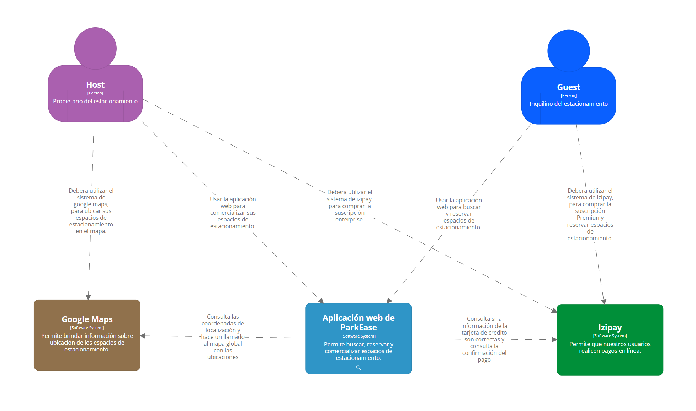
### 4.6.2. Software Architecture Container Diagrams.
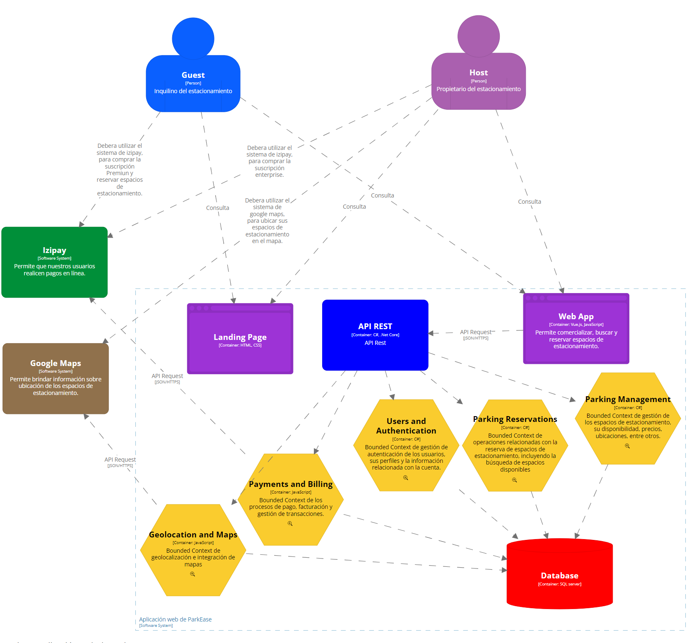
### 4.6.3. Software Architecture Components Diagrams.
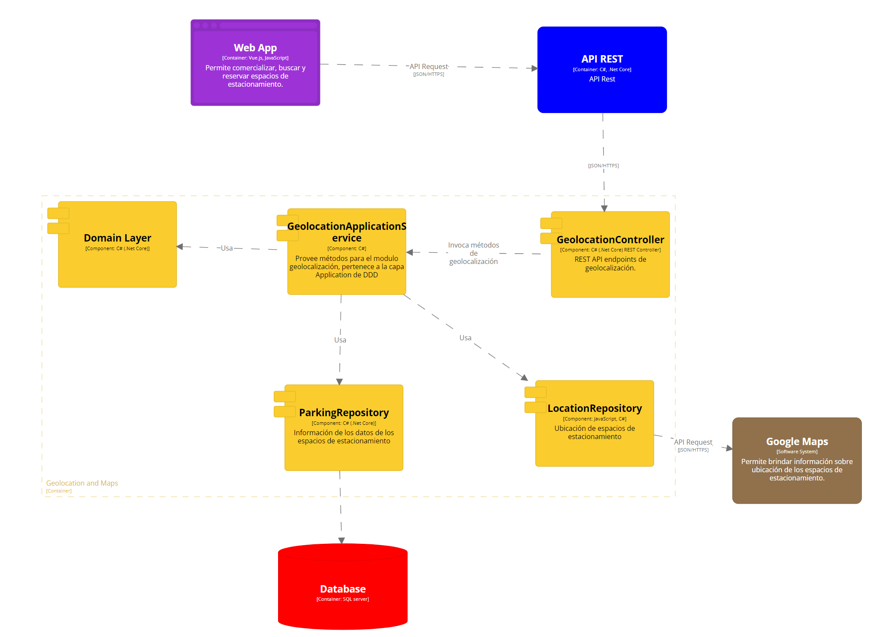
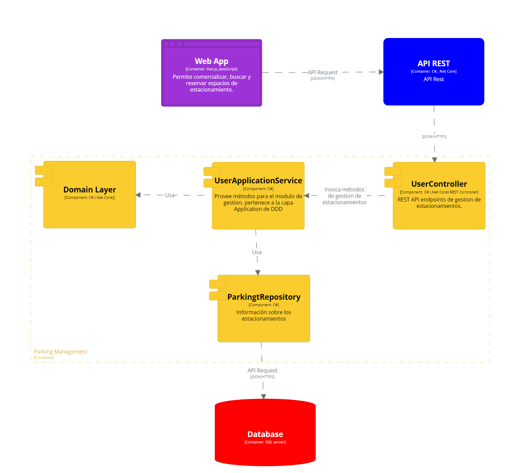
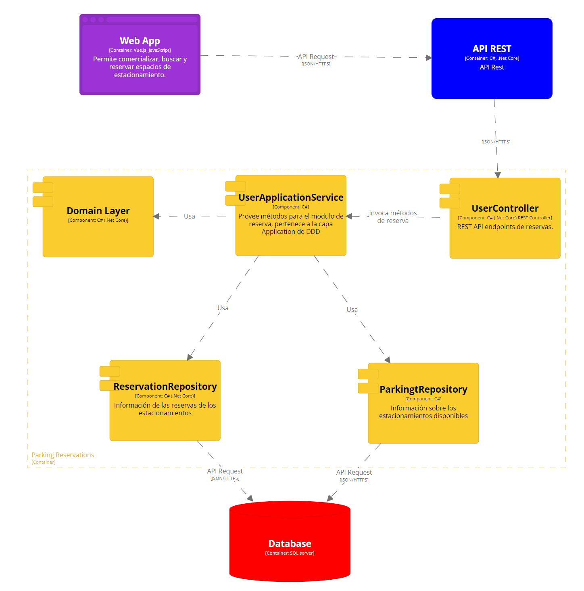
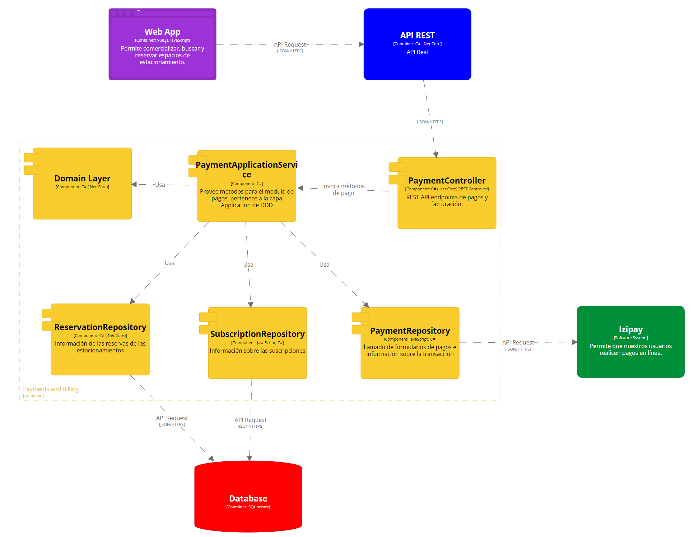
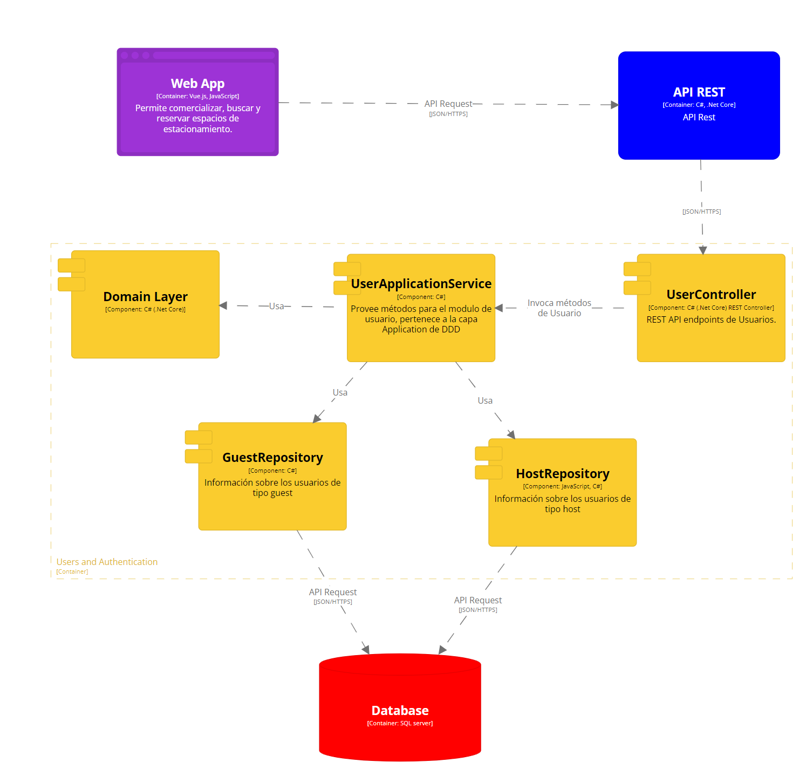
## 4.7. Software Object-Oriented Design.
### 4.7.1. Class Diagrams.

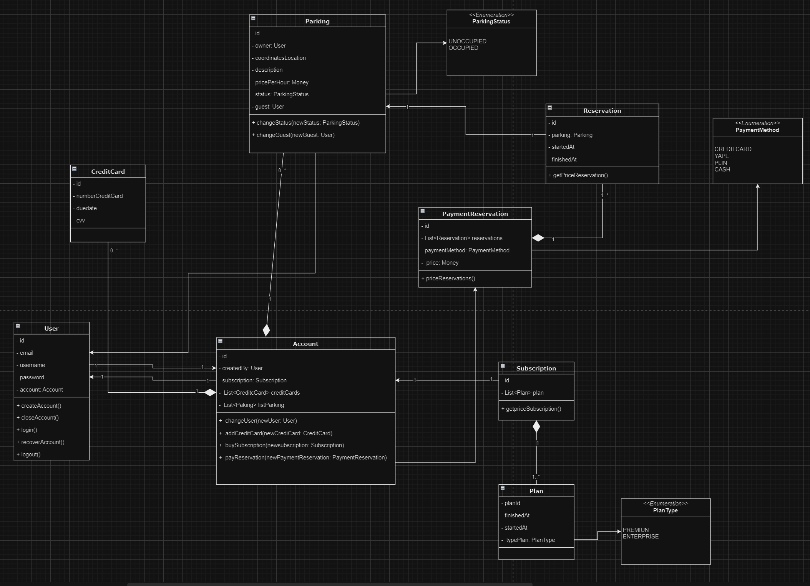

### 4.7.2. Class Dictionary. 
## 4.8. Database Design.
### 4.8.1. Database Diagram. 
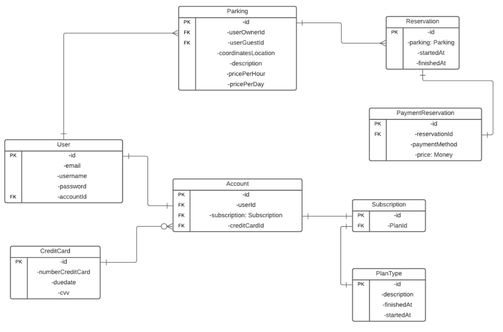


