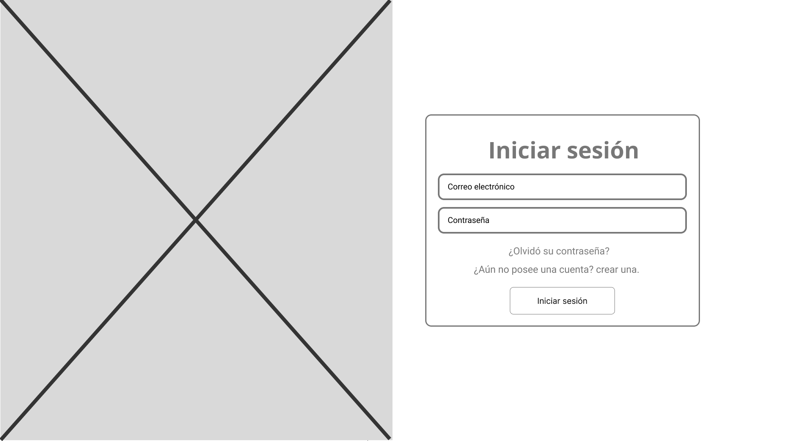
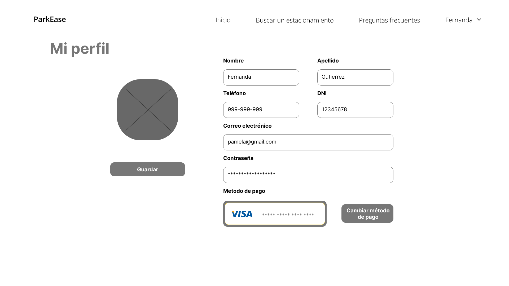
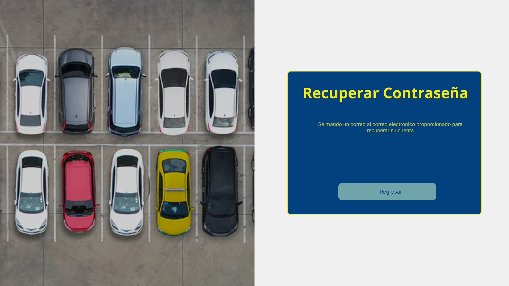
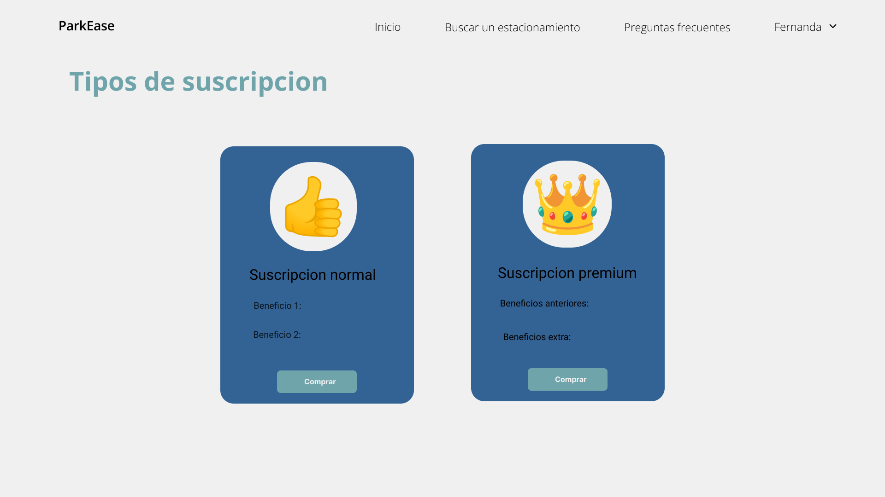

<tr>
    <td style="border: 1px solid #dddddd; padding: 8px;">
      <center></center>
    </td>
  </tr>
<br>

**Universidad:** Universidad Peruana de Ciencias Aplicadas

**Carrera:** Ingeniería de software

**Curso:** Aplicaciones Web

**Sección:** SW52

**Informe de Trabajo Final**

**Profesor:** Angel Augusto Velasquez Nuñez

**Nombre del Startup:** WebMinds

**Nombre del Producto:** ParkEase

**Integrantes:**
- Orlando Arturo Roca Huapaya - u201919742
- Paolo Sebastian Padilla Advincula- u202117993
- [Nombre del Integrante 3]

**Ciclo:** 2023-02

**Mes:** Setiembre


# Registro de Versiones del Informe

| Versión | Fecha       | Autor   | Descripción de modificación                              |
|---------|-------------|---------|---------------------------------------------------------|
| TB1     | 20-08-2023  | Orlando  | Descripción de la startup, segmento objetivo, competidores |
| TB1     | 23-08-2023  | Gustavo  | Interviews & Competitor strategies|
| TB1     | 23-08-2023  | Gustavo  | Competitor Analysis information|
| TB1     | 30-08-2023  | Orlando  | Lean UX Canvas|
| TB1     | 01-09-2023  | Antonella  |Lean-UX-Problem-Statements|
| TB1     | 02-09-2023  | Paolo  | Needfinding|
| TB1     | 04-09-2023  | Gustavo  | User Story|
| TB1     | 05-09-2023  | Paolo  | Information Architecture|
| TB1     | 05-09-2023  | Paolo  | Landing Page Wireframe|
| TP      | 06-09-2023  |Antonella | chapter 5|
| TP      | 06-09-2023  | Gustavo  | Product Backlog|
| TP      | 25-08-2023  | Piero    | Se añadieron los resumenes y analisis de las entrevistas de los segmentos objetivos |
| TP      | 06-09-2023  | Piero    | Se añadieron los wireframes y mock ups del web application y arreglos en el landing page |
| TP      | 07-09-2023  | Piero    | Se corrigieron algunos errores en los user persona y añadieron links |
| TP      | 20-09-2023  | Piero    | Se corrigieron errores en los nombres de los archivos de analisis de entrevista y se añadieron sus imagenes |
| TP      | 20-09-2023  | Piero    | Se corrigieron errores en los nombres de los archivos de analisis de entrevista y se añadieron sus imagenes |
| TP      | 20-09-2023  | Orlando  | Se corrigió lean ux canvas |
| TP      | 21-09-2023  | Orlando  | Se corrigió los diagramas C4 de Domain Driven Design |
| TP      | 24-09-2023  | Orlando y Gustavo | Se corrigió nuestro impact mapping|
| TP      | 25-09-2023  | Orlando | Se mejoró el orden de la documentación |
|TP       |20-09-2023   |Gustavo  |Se corrigieron las User Stories|
|TP       |22-09-2023   |Gustavo  |Se corrigió el Product Backlog|
|TP       |24-09-2023   |Gustavo  |Se corrigieron los Impact Mapping |
| TP     | 06-09-2023  |Antonella | chapter 5 was corrected|
| TP     | 06-09-2023  |Antonella | Sprint Backlog 2 was developed |

# Project Report Collaboration Insights 

WebMinds-Report (Repositorio): https://github.com/WebMindsGroup/WebMinds-Report.git

| Commit ID | Autor       | Fecha        | Descripción del Commit                          |
|-----------|-------------|--------------|-------------------------------------------------|
|e697dc70ad35bd254c8ac004750057e65f851d83| Orlando| 20-08-2023   | doc: Advance startup description and target segment in chapter 1 - Added more details to the startup description and expanded on the target segment information in the first chapter.|
|c2e95ee1bdb3bceda88301a0e164233a0e81fb4f| Orlando| 20-08-2023   |doc: Progress competitors section in chapter 2 - Expanded and updated the competitors section in the second chapter.|
|aa30cb351b27bc16160b36c73a942e3d62fb3e29|Gustavo|23-08-2023|doc: Updated interviews and competitor strategies|
|a7876ac610147ba80f70ea98d34e456eccb16eb9|Gustavo|23-08-2023|doc: Changes in Competitor Analysis information|
|45f3f8cb8df5c5461a45ae0ab23d413fb3594dbe| Orlando| 30-08-2023   |doc: Canvas and Hypothesis Statement added|
|d0fadf606272fd3a9a188c153843642969a3de9f| Antonella    | 01-09-2023   |chore: add initial files of chapter 1: the themes of chapter 1 were developed|
|83321a4b955c28758f941dd6c4dbd201989fefc5|Gustavo|04-09-2023|doc: User Story development|
|c54e380486f2383f998ba76a7f00bc3ede6ee0e0|Gustavo|04-09-2023|doc: Product Backlog Development|
|a0f586e2d0bfee386ae0c3ca3b6e076ff10579ac| Antonella    | 06-09-2023   |chore: correction of chapter 1: the modifications of chapter 1 were made|
|369a92199b966f03cf151a3ba78201aa2027c682| Piero    | 25-08-2023   |doc: Summary and analysis of interviews added|
|5c8de82dd325b6febd5b62caf01d9c5c92d9ae7a| Piero    | 06-09-2023   |doc: Wireframes, Mock-ups and prototype added|
|fbebf398cec1cc3612377a7dbf330a2d0e67afe5| Piero    | 06-09-2023   |feat: About us added|
|e45db51b321758933fb6a26910a583758dc6a095| Piero    | 06-09-2023   |fix: Change content in About Us|
|20bd9614ca847b192ad81ca13e3761b492935508| Piero    | 06-09-2023   |feat: host information Added|
|7fd4420c5e81bf8018d4eb76ff1c15735897ac82| Piero    | 06-09-2023   |feat: hero added|
|11e7f0905d6496e8dd595d2b7266dafc73df5fe8| Piero    | 07-09-2023   |doc: User personas update|
|5c8de82dd325b6febd5b62caf01d9c5c92d9ae7a| Piero    | 07-09-2023   |doc: Web applications prototype links fixed|
|b82d6e603462d999794351d7be04c069c6036bd2| Gustavo    | 07-09-2023   |doc: Images chapter III added|
|730bbd887b052f730d4fde3c6c3d2d87970d1d15| Gustavo    | 07-09-2023   |doc: To-be Scenario Mapping added|
|f4f83f9bea1cc43a6a0e7df19b00defb7fb5e170| Gustavo    | 07-09-2023   |doc: Impact Mapping added|
|fb664ec38bb84070b51dd887ab9493f6bbcb65c2| Piero    | 20-09-2023   |doc: incorrect information fixed and interview images added|
|ad49237e12dcdc52783d208d40cd8fa11effdf39| Antonella    | 21-09-2023   |chore: correction of chapter 5: Fixed source code management|
|7ff059b2537260de5eda0c11ae56747b0837f286| Antonella    | 21-09-2023   |chore: correction of chapter 5: Fixed Code Style Guide & Conventions|
|b9ca2a9313d49992430d4dc597e089589d334e30| Antonella    | 21-09-2023   |chore: correction of chapter 5: Fixed Team Collaboration Insights during Sprint|
|7155ee23bc559086c0d45d752b6cf3402adfc13e| Antonella    | 22-09-2023   |chore: correction of chapter 5: Fixed Sprint Backlog 1|
|b976a6c951c220c2f215d5fd9a8cd1ba277a35f6| Antonella    | 22-09-2023   |chore: correction of chapter 5: Fixed Sprint Backlog 2|
|940f59163f33974e84121620a117aba47f262304| Orlando    | 20-09-2023   |doc: Lean UX Canvas updated - Each hypothesis focus on each feature.|
|f325d3e2a359bcba80bfef8b42531c7109f60840| Orlando    | 21-09-2023   |doc: Domain Driven Design updated - Single Page Application added in the container diagram|
|33aa044f69e0f792e0a323129206dd1945f2b443| Gustavo    | 24-09-2023   |doc: Lean UX Canvas updated - Each hypothesis focus on each feature.|
|ad49237e12dcdc52783d208d40cd8fa11effdf39| Antonella    | 21-09-2023   |chore: correction of chapter 5: Fixed source code management|
|7ff059b2537260de5eda0c11ae56747b0837f286| Antonella    | 21-09-2023   |chore: correction of chapter 5: Fixed Code Style Guide & Conventions|
|b9ca2a9313d49992430d4dc597e089589d334e30| Antonella    | 21-09-2023   |chore: correction of chapter 5: Fixed Team Collaboration Insights during Sprint|
|7155ee23bc559086c0d45d752b6cf3402adfc13e| Antonella    | 22-09-2023   |chore: correction of chapter 5: Fixed Sprint Backlog 1|
|b976a6c951c220c2f215d5fd9a8cd1ba277a35f6| Antonella    | 22-09-2023   |chore: correction of chapter 5: Fixed Sprint Backlog 2|


# Contenido

- [Capítulo I: Introducción](#capitulo-1)
  - [1.1. Startup Profile](#11-startup-profile)
    - [1.1.1. Descripción de la Startup](#111-descripción-de-la-startup)
    - [1.1.2. Perfiles de integrantes del equipo](#112-perfiles-de-integrantes-del-equipo)
  - [1.2. Solution Profile](#12-solution-profile)
    - [1.2.1. Antecedentes y problemática](#121-antecedentes-y-problemática)
    - [1.2.2. Lean UX Process](#122-lean-ux-process)
      - [1.2.2.1. Lean UX Problem Statements](#1221-lean-ux-problem-statements)
      - [1.2.2.2. Lean UX Assumptions](#1222-lean-ux-assumptions)
      - [1.2.2.3. Lean UX Hypothesis Statements](#1223-lean-ux-hypothesis-statements)
      - [1.2.2.4. Lean UX Canvas](#1224-lean-ux-canvas)
    - [1.3. Segmentos objetivo](#13-segmentos-objetivo)

- [Capítulo II: Requirements Elicitation & Analysis](#capítulo-ii-requirements-elicitation--analysis)
  - [2.1. Competidores](#21-competidores)
    - [2.1.1. Análisis competitivo](#211-análisis-competitivo)
    - [2.1.2. Estrategias y tácticas frente a competidores](#212-estrategias-y-tácticas-frente-a-competidores)
  - [2.2. Entrevistas](#22-entrevistas)
    - [2.2.1. Diseño de entrevistas](#221-diseño-de-entrevistas)
    - [2.2.2. Registro de entrevistas](#222-registro-de-entrevistas)
    - [2.2.3. Análisis de entrevistas](#223-análisis-de-entrevistas)
  - [2.3. Needfinding](#23-needfinding)
    - [2.3.1. User Personas](#231-user-personas)
    - [2.3.2. User Task Matrix](#232-user-task-matrix)
    - [2.3.3. User Journey Mapping](#233-user-journey-mapping)
    - [2.3.4. Empathy Mapping](#234-empathy-mapping)
    - [2.3.5. As-is Scenario Mapping](#235-as-is-scenario-mapping)

- [Capítulo III: Requirements Specification](#capítulo-ii-requirements-specification)
  - [3.1. To-Be Scenario Mapping](#31-to-be-scenario-mapping)
  - [3.2. User Stories](#32-user-stories)
  - [3.3. Impact Mapping](#33-impact-mapping)
  - [3.4. Product Backlog](#34-product-backlog)

- [Capítulo IV: Product Design](#capítulo-iv-product-design)
  - [4.1. Style Guidelines](#41-style-guidelines)
    - [4.1.1. General Style Guidelines](#411-general-style-guidelines)
    - [4.1.2. Web Style Guidelines](#412-web-style-guidelines)
  - [4.2. Information Architecture](#42-information-architecture)
    - [4.2.1. Organization Systems](#421-organization-systems)
    - [4.2.2. Labeling Systems](#422-labeling-systems)
    - [4.2.3. SEO Tags and Meta Tags](#423-seo-tags-and-meta-tags)
    - [4.2.4. Searching Systems](#424-searching-systems)
    - [4.2.5. Navigation Systems](#425-navigation-systems)
  - [4.3. Landing Page UI Design](#43-landing-page-ui-design)
    - [4.3.1. Landing Page Wireframe](#431-landing-page-wireframe)
    - [4.3.2. Landing Page Mock-up](#432-landing-page-mock-up)
  - [4.4. Web Applications UX/UI Design](#44-web-applications-uxui-design)
    - [4.4.1. Web Applications Wireframes](#441-web-applications-wireframes)
    - [4.4.2. Web Applications Wireflow Diagrams](#442-web-applications-wireflow-diagrams)
    - [4.4.3. Web Applications Mock-ups](#443-web-applications-mock-ups)
    - [4.4.4. Web Applications User Flow Diagrams](#444web-applications-user-flow-diagrams)
  - [4.5. Web Applications Prototyping](#45-web-applications-prototyping)
  - [4.6. Domain-Driven Software Architecture](#46-domain-driven-software-architecture)
    - [4.6.1. Software Architecture Context Diagram](#461-software-architecture-context-diagram)
    - [4.6.2. Software Architecture Container Diagrams](#462-software-architecture-container-diagrams)
    - [4.6.3. Software Architecture Components Diagrams](#463-software-architecture-components-diagrams)
  - [4.7. Software Object-Oriented Design](#47-software-object-oriented-design)
    - [4.7.1. Class Diagrams](#471-class-diagrams)
    - [4.7.2. Class Dictionary](#472-class-dictionary)
  - [4.8. Database Design](#48-database-design)
    - [4.8.1. Database Diagram](#481-database-diagram)

- [Capítulo V: Product Implementation, Validation & Deployment](#1)
  - [5.1. Software Configuration Management](#2)
    - [5.1.1. Software Development Environment Configuration](#3)
    - [5.1.2. Source Code Management](#4)
    - [5.1.3. Source Code Style Guide & Conventions](#5)
    - [5.1.4. Software Deployment Configuration](#6)
  - [5.2. Landing Page, Services & Applications Implementation](#7)
    - [5.2.X. Sprint n](#8)
      - [5.2.X.1. Sprint Planning n](#9)
      - [5.2.X.2. Sprint Backlog n](#10)
      - [5.2.X.3. Development Evidence for Sprint Review](#11)
      - [5.2.X.4. Testing Suite Evidence for Sprint Review](#12)
      - [5.2.X.5. Execution Evidence for Sprint Review](#13)
      - [5.2.X.6. Services Documentation Evidence for Sprint Review](#14)
      - [5.2.X.7. Software Deployment Evidence for Sprint Review](#15)
      - [5.2.X.8. Team Collaboration Insights during Sprint](#16)
  - [5.3. Validation Interviews](#17)
    - [5.3.1. Diseño de Entrevistas](#18)
    - [5.3.2. Registro de Entrevistas](#19)
    - [5.3.3. Evaluaciones según heurísticas](#20)
  - [5.4. Video About-the-Product](#21)

- [Conclusiones](#22)
  - [Conclusiones y recomendaciones](#23)
  - [Video About-the-Team](#24)

- [Bibliografía](#25)
- [Anexos](#26)

# Student Outcome

# Capítulo I: Introducción <a name="capitulo-1"></a>

## 1.1. Startup Profile <a name="11-startup-profile"></a>

### 1.1.1. Descripción de la Startup <a name="111-descripción-de-la-startup"></a>

ParkEase surge como una solución ante la creciente preocupación por la escasez de espacios de estacionamiento en entornos urbanos. La agobiante congestión del tráfico y la ineficiente búsqueda de lugares para estacionar generan frustración y retrasos en la experiencia de los conductores a nivel global. A su vez, aquellos que poseen espacios de estacionamiento no utilizados se enfrentan al desafío de encontrar una manera efectiva de aprovechar estos activos.

ParkEase se propone revolucionar la forma en que las personas encuentran y utilizan espacios de estacionamiento. Crearemos una aplicación que ofrecerá una interfaz intuitiva que les permitirá buscar, reservar y pagar por estacionamientos de manera rápida y fluida. Los usuarios podrán ubicar fácilmente espacios disponibles cerca de su destino, ahorrando tiempo y evitando la frustración de la búsqueda ineficiente. Por otro lado, los propietarios de espacios de estacionamiento podrán registrarse en la plataforma y ofrecer sus espacios disponibles para alquiler. La aplicación permitirá a los propietarios gestionar sus listados, establecer precios, disponibilidad y recibir pagos de manera segura. Esto les brindará una forma eficaz de aprovechar sus activos, generando ingresos adicionales mientras contribuyen a aliviar la congestión del tráfico.

### 1.1.2. Perfiles de integrantes del equipo <a name="112-perfiles-de-integrantes-del-equipo"></a>

<tr>
    <td style="border: 1px solid #dddddd; padding: 8px;">
      <center></center>
    </td>
  </tr>
<br>

Nombre: Orlando Arturo Roca Huapaya

Código: U201919742

Carrera: Ingeniería de Software

Como estudiante de ingeniería de software, mi contribución al equipo se centra en mis conocimientos en la planificación y diseño de software. A lo largo de mi formación, he tenido la oportunidad de desarrollar proyectos utilizando Java, lo que me brinda una ventaja significativa con el desarrollo del sistema que estamos trabajando. Estoy entusiasmado por aplicar mis habilidades en el desarrollo y trabajar junto al equipo para alcanzar nuestros objetivos.


<tr>
    <td style="border: 1px solid #dddddd; padding: 8px;">
      <center></center>
    </td>
  </tr>
<br>

Nombre:Antonella Frida Gonzales Gomez

Código: U20211C403

Carrera: Ingeniería de Software

Como estudiante de la carrera de Ingeniería de Software, contribuire al equipo mis conocimientos fundamentales en algunos lenguajes de programación. Estos conocimientos me permitirán participar activamente en la creación y desarrollo de proyectos además tengo un enfoque responsable hacia mi trabajo y tareas asignadas. Entiendo la importancia de cumplir con plazos y metas establecidas, lo que contribuye al flujo de trabajo del equipo y al éxito general del proyecto.


<tr>
    <td style="border: 1px solid #dddddd; padding: 8px;">
      <center></center>
    </td>
  </tr>
<br>

Nombre: Piero Mendoza Pimentel

Código: U201923446

Carrera: Ingeniería de Software

Como estudiante de ingeniería de software, mi contribución al equipo será el cumplimiento y aportación de los proyectos. A lo largo de mi aprendizaje como estudiante universitario, me he enfocado en aportar activamente en los trabajos y proyectos grupales que se ha presentado. Espero cumplir con las expectativas de mis compañeros y ayudarlos en lo que más necesitan en el transcurso del ciclo.


<tr>
    <td style="border: 1px solid #dddddd; padding: 8px;">
      <center></center>
    </td>
  </tr>
<br>

Nombre: Gustavo Jandroel Aguirre Rodríguez

Código: U202124162

Carrera: Ingeniería de Software

Como estudiante de la carrera de Ingeniería de Software, mi aporte al equipo se será garantizar el cumplimiento y realizar contribuciones significativas a nuestro proyecto. A lo largo de mi formación, he tenido la oportunidad de desarrollar habilidades utilizando una variedad de programas para la elaboración de proyectos. Estos conocimientos serán de utilidad para el equipo al llevar a cabo tareas y alcanzar nuestros objetivos


## 1.2. Solution Profile <a name="12-solution-profile"></a>

### 1.2.1  Antecedentes y problemática <a name="121-antecedentes-y-problemática"></a>

##### Antecedentes:
En la actualidad, las áreas urbanas experimentan un aumento constante en la congestión del tráfico debido al crecimiento de la población y al incremento de la cantidad de vehículos en circulación. Este problema de tráfico, agravado por la ineficiente búsqueda de espacios de estacionamiento, ha generado una experiencia frustrante para los conductores en todo el mundo. Además, esta situación también representa un desafío para quienes poseen espacios de estacionamiento no utilizados en áreas urbanas, ya que no cuentan con una plataforma efectiva para aprovechar estos activos.

#### problemática:

##### 1. What (Qué)
¿Cuál es el problema?

La problemática que aborda es la escasez de espacios de estacionamiento en entornos urbanos y búsqueda ineficiente de lugares para estacionar.

##### 2. When (Cuando)
¿Cuándo sucede el problema?

Esta preocupación ha estado aumentando a lo largo del tiempo, a medida que las ciudades han experimentado un crecimiento de la población y, por lo tanto, la cantidad de vehículos en circulación, la congestión de tráfico y la búsqueda ineficiente de estacionamiento se ha vuelto más apremiante en los últimos años.

##### 3. Where (Dónde)
¿Dónde ocurre el problema?

Esta problemática es común en áreas urbanas densamente pobladas en todo el mundo, donde el espacio es limitado y la cantidad de vehículos en circulación es alta.

##### 4. Who (Quién)
¿Quiénes están involucrados?

Los afectados por este problema son tanto los conductores que enfrentan las dificultades para encontrar lugares de estacionamiento convenientes como los propietarios de los espacios no utilizados que buscan una forma efectiva de aprovechar esos activos.

##### 5. Why (Por qué)
¿Cuál es la causa del problema?

Esto ocurre debido a la insuficiencia de lugares de estacionamiento disponible en áreas urbanas, a lo que lleva a una congestión de tráfico más intensa y a la dificultad para los conductores de encontrar estacionamientos de manera oportuna

##### 6. How (Cómo)
¿Qué llevó a la persona a llegar a esta situación?

La congestión del tráfico y la falta de espacios de estacionamiento disponibles en entornos urbanos densos llevaron a la persona a la situación de tener dificultades para encontrar estacionamiento de manera conveniente y eficiente

##### 7. How much  (Cuánto)
¿Cuánto afecta el problema?

 El problema de la escasez de espacios de estacionamiento afecta de manera significativa a Lima, la capital, donde de acuerdo con un estudio realizado por la ONG Luz Ámbar en 2016 se ha demostrado que hay una insuficiencia de alrededor de 45,000 estacionamientos vehiculares en cinco distritos. Sin embargo, esta cifra resulta insuficiente en comparación con el tamaño del parque automotor de la ciudad, que consta de aproximadamente 1 millón 800,000 unidades. Esta disparidad entre la cantidad de vehículos y la disponibilidad de estacionamientos contribuye a la congestión del tráfico y al desafío constante para los conductores de encontrar lugares para estacionar de manera eficiente.

### 1.2.2 Lean UX Process. <a name="122-lean-ux-process"></a>

#### 1.2.2.1. Lean UX Problem Statements. <a name="1221-lean-ux-problem-statements"></a>

Ante esta situación nuestra Startup se plantea las siguientes Problems Statements:

### PS1:

__Objetivos actuales del producto:__  Facilitar la búsqueda y utilización de espacios de estacionamiento en entornos urbanos, aliviando la congestión del tráfico.

__Problema:__ La escasez de espacios de estacionamiento y la ineficiente búsqueda de lugares para estacionar causan frustración y retrasos a  los conductores urbanos. Estos conductores enfrentan el desafío constante de encontrar lugares de estacionamiento de manera rápida y eficiente, lo que impacta negativamente su experiencia de movilidad y calidad de vida.

__Pregunta solicitud de mejora:__ ¿Cómo podemos diseñar una aplicación intuitiva que permita a los conductores ubicar, reservar y pagar por espacios de estacionamiento de manera rápida, mejorando así su experiencia de movilidad urbana y aliviando la congestión del tráfico?

### PS2:

__Objetivos actuales del producto:__  Ofrecer a los propietarios una plataforma efectiva para gestionar y rentabilizar sus espacios de estacionamiento no utilizados.

__Problema:__ Los propietarios de espacios de estacionamiento no utilizados enfrentan dificultades para encontrar una forma efectiva de aprovechar sus activos. La falta de una solución adecuada para rentabilizar sus espacios limita sus oportunidades de ingresos y subutiliza valiosos recursos.

__Pregunta solicitud de mejora:__¿Cómo podemos diseñar una plataforma que permita a los propietarios de espacios de estacionamiento gestionar sus activos de manera eficiente, establecer precios, disponibilidad y recibir pagos de manera segura, brindándoles así una forma efectiva de aprovechar sus activos y generar ingresos adicionales?

#### 1.2.2.2. Lean UX Assumptions. <a name="1222-lean-ux-assumptions"></a>

### Business Outcomes:

- Aumentar la cantidad de usuarios registrados en la aplicación para establecernos de manera exitosa en el mercado de estacionamientos.

-	Obtener comentarios positivos y referencias de usuarios, generando un crecimiento orgánico de la base de usuarios.

-	Incrementar los ingresos mensuales a través de suscripciones premium.

-	Atraer auspiciadores influyentes que respalden futuras implementaciones y mejoras en el proyecto.

### User Assumptions:

-	Conductores urbanos que buscan una solución eficaz para la búsqueda y utilización de espacios de estacionamiento.

-	Propietarios de espacios de estacionamiento no utilizados que desean generar ingresos adicionales a través de la plataforma.

### User Outcomes:

-	Los conductores encuentran y utilizan espacios de estacionamiento de manera eficiente, ahorrando tiempo y reduciendo frustraciones.

-	Los propietarios de estacionamientos generan ingresos adicionales al alquilar sus espacios no utilizados.

-	Los usuarios se sienten confiados al utilizar la plataforma para resolver sus necesidades de estacionamiento.

### Features Assumptions:

-	Implementación de un sistema de recomendación para sugerir espacios de estacionamiento cercanos según preferencias y disponibilidad.

-	Diseño de una interfaz intuitiva y amigable que permita a los usuarios buscar, reservar y pagar por estacionamientos de manera sencilla.

-	Ofrecer opciones de filtrado por ubicación, precio y disponibilidad para adaptarse a las necesidades individuales de los conductores.

-	Integración de métodos de pago seguros y variados para facilitar transacciones fluidas entre conductores y propietarios.

-	Inclusión de un centro de ayuda y soporte en la aplicación para resolver consultas y problemas de manera rápida y eficiente

-	Ofrecer una variedad de planes de suscripción para adaptarse a las necesidades de conductores y propietarios, incluyendo opciones de suscripción gratuita, premium y empresarial.

-	Conductores urbanos que buscan una solución eficaz para la búsqueda y utilización de espacios de estacionamiento.

-	Propietarios de espacios de estacionamiento no utilizados que desean generar ingresos adicionales a través de la plataforma.


#### 1.2.2.3. Lean UX Hypothesis Statements. <a name="1223-lean-ux-hypothesis-statements"></a>

* Creemos que aumentaremos el número de usuarios registrados en la aplicación (business outcomes). Si los usuarios guest (user), pueden encontrar y utilizar espacios de estacionamiento de manera eficiente (benefit), con la implementación de un sistema de recomendación que sugiere espacios cercanos y disponibles (feature).

    Sabremos que hemos tenido éxito 

    Cuando observemos que más del 75% de los usuarios que se han registrado en la aplicación han realizado reservas de estacionamiento, evidenciando su disposición a invertir en una solución que mejora su experiencia de estacionamiento.

* Creemos que incrementaremos los ingresos mensuales a través de suscripciones y comisiones. (business outcomes) Si los usuarios host (user), generan ingresos adicionales al alquilar sus espacios no utilizados (benefit), con la integración de métodos de pago seguros y variados para facilitar transacciones fluidas entre conductores y propietarios (feature).

    Sabremos que hemos tenido éxito

    Cuando más del 60% de los propietarios de espacios de estacionamiento no utilizados registrados en la plataforma hayan realizado al menos una transacción de alquiler de estacionamiento en un período de tres meses desde su registro.

* Creemos que obtendremos comentarios positivos y referencias de usuarios (business outcomes).  Si los usuarios guest y host (user), se sienten confiados al utilizar la plataforma para resolver sus necesidades de estacionamiento y alquiler (benefit), con la inclusión de un centro de ayuda y soporte en la aplicación para resolver consultas y problemas de manera rápida y eficiente (feature).

    Sabremos que hemos tenido éxito

    Cuando al menos el 80% de los usuarios que han utilizado el centro de ayuda y soporte de la aplicación hayan calificado su experiencia como "satisfactoria" o "muy satisfactoria" en una encuesta de satisfacción del usuario. Además, cuando al menos el 50% de los usuarios hayan referido la plataforma a otros usuarios.

* Creemos que atraeremos auspiciadores influyentes que respalden futuras implementaciones y mejoras en el proyecto. (business outcomes) Si los usuarios guest (user), encuentran y utilizan espacios de estacionamiento de manera eficiente, ahorrando tiempo y reduciendo frustraciones(benefit), con la implementación de una interfaz intuitiva y amigable que permita a los usuarios buscar, reservar y pagar por estacionamientos de manera sencilla (feature).

    Sabremos que hemos tenido éxito 

    Cuando al menos tres auspiciadores influyentes en la industria de estacionamientos o movilidad urbana hayan acordado asociarse con nuestra plataforma para respaldar futuras implementaciones y mejoras en el proyecto en un período de seis meses desde el lanzamiento de la interfaz intuitiva y amigable.

* Creemos que obtendremos comentarios positivos y referencias de usuarios (business outcomes). Si los usuarios guest (user) encuentran y utilizan espacios de estacionamiento de manera eficiente, ahorrando tiempo y reduciendo frustraciones (benefit), ofreciendo opciones de filtrado por ubicación, precio y disponibilidad para adaptarse a las necesidades individuales de los conductores (feature).

    Sabremos que hemos tenido éxito

    Cuando al menos el 90% de los usuarios que han utilizado las opciones de filtrado en la plataforma califiquen su experiencia como "positiva" o "muy positiva" en una encuesta de satisfacción del usuario. Además, cuando al menos el 60% de los usuarios haya recomendado la plataforma a otros conductores.


* Creemos que incrementaremos los ingresos mensuales a través de suscripciones y comisiones. (business outcomes).  Si los usuarios guest y host (user), se sienten confiados al utilizar la plataforma para resolver sus necesidades de estacionamiento y alquiler (benefit) con la inclusión de una variedad de planes de suscripción para adaptarse a las necesidades de conductores y propietarios, incluyendo opciones de suscripción gratuita, premium y empresarial (feature).

    Sabremos que hemos tenido éxito

    Cuando el ingreso mensual generado a través de suscripciones y comisiones haya aumentado en un 30% en comparación con el mes anterior a la implementación de los nuevos planes de suscripción. Además, cuando al menos el 50% de los usuarios registrados en la plataforma haya elegido un plan de suscripción (cualquier tipo) en un plazo de tres meses desde la implementación.

#### 1.2.2.4. Lean UX Canvas. <a name="1224-lean-ux-canvas"></a>


## 1.3. Segmentos objetivo. <a name="13-segmentos-objetivo"></a>

### Usuario 1: Individuo que busca soluciones convenientes y accesibles para sus necesidades de estacionamiento en entornos urbanos.
---------------------------------------------------------
- **Geográficas:**

  - **Ubicación:** Perú
  - **Lugar de residencia:** Perú

- **Demográficas:**

  - **Sexo:** Hombres o Mujeres
  - **Edad:** Personas con las edad suficiente para conducir un coche

- **Psicográficas:**

  - **Clase social:** Todas las clases sociales
  - **Estilo de vida:** Persona que usa su propio auto como transporte, y que no encuentre un estacionamiento cercano a su destino fácilmente.

- **Conductuales:**

  - **Conocimientos:** Manejo de dispositivos tecnologicos con conexión a internet.
  - **Actitudes:** Busca un espacio de estacionamiento que se encuentre cerca a su destino, y busca un estacionamiento en donde sepa que su auto estará seguro.


### Usuario 2: Propietario de espacios de estacionamiento que busca una forma efectiva de sacar provecho de sus activos no utilizados.
----------------------------------------------------
- **Geográficas:**

  - **Ubicación:** Perú
  - **Lugar de residencia:** Perú

- **Demográficas:**

  - **Sexo:** Hombres o Mujeres
  - **Edad:** Personas mayores de edad

- **Psicográficas:**

  - **Clase social:** Todas las clases sociales
  - **Estilo de vida:** Personas que cuentan con cochera vacias o espacios libres

- **Conductuales:**

  - **Conocimientos:** Manejo de dispositivos tecnologicos con conexión a internet.
  - **Actitudes:** Buscar alquilar su espacio de estacionamiento, para sacar un beneficio económico.

# Capítulo II: Requirements Elicitation & Analysis <a name="capítulo-ii-requirements-elicitation--analysis"></a>

## 2.1. Competidores. <a name="21-competidores"></a>

### SpotHero:

SpotHero es una plataforma en línea que permite a los conductores encontrar, reservar y pagar por espacios de estacionamiento en áreas urbanas. Ofrece una amplia variedad de opciones de estacionamiento, desde garajes comerciales hasta estacionamiento en la calle. Los usuarios pueden buscar y comparar diferentes lugares de estacionamiento según la ubicación, el precio y las comodidades. SpotHero se consideraría competencia para ParkEase porque ambos se centran en resolver el problema de encontrar estacionamiento en entornos urbanos congestionados, aunque SpotHero se enfoca en la reserva de estacionamiento existente, mientras que ParkEase se orienta hacia la optimización y el uso eficiente de espacios no utilizados.

### JustPark:

JustPark es una plataforma que conecta a propietarios de espacios de estacionamiento con conductores que buscan lugares de estacionamiento en áreas urbanas. Permite a los propietarios listar sus espacios disponibles para alquiler, lo que proporciona una fuente adicional de ingresos. Al igual que ParkEase, JustPark aborda la falta de espacios de estacionamiento disponibles y la necesidad de optimizar el uso de esos espacios. Sin embargo, JustPark se centra en alquileres a corto plazo, mientras que ParkEase también busca la optimización a largo plazo y la conectividad entre los conductores y los propietarios.

### Parkopedia:

Parkopedia es un directorio global de lugares de estacionamiento que permite a los conductores encontrar y comparar opciones de estacionamiento en ciudades de todo el mundo. La plataforma proporciona información sobre la ubicación, disponibilidad, precios y comodidades de los lugares de estacionamiento. Parkopedia sería un competidor para ParkEase debido a su enfoque en proporcionar información detallada sobre lugares de estacionamiento disponibles. Sin embargo, ParkEase busca abordar la optimización y la eficiencia de los espacios no utilizados, lo que lo diferencia de Parkopedia que se centra principalmente en la búsqueda y comparación de lugares existentes.

### 2.1.1. Análisis competitivo. <a name="211-análisis-competitivo"></a>

<table><tr><th colspan="6" valign="top">Competitive Analysis Landscape</th></tr>
<tr><td colspan="2" rowspan="2" valign="top"><p>¿Por qué llevar a cabo</p><p>este análisis?</p></td><td colspan="4" valign="top">Objetivo del análisis</td></tr>
<tr><td colspan="4" valign="top"><p>¿Cómo analiza, produce y enfrenta el mercado mi</p><p>competencia?</p></td></tr>
<tr><td colspan="2" valign="top">Startup</td><td valign="top">ParkEase</td><td valign="top">SpotHero</td><td valign="top">JustPark</td><td valign="top">Parkopedia</td></tr>
<tr><td colspan="2" valign="top">Logo</td><td valign="top"></td><td valign="top"></td><td valign="top"></td><td valign="top"></td></tr>
<tr><td rowspan="2" valign="top">Perfil</td><td valign="top">Overview</td><td valign="top">ParkEase es una solución innovadora que se centra en la optimización y el uso eficiente de espacios de estacionamiento no utilizados en entornos urbanos. Al abordar la falta de estacionamiento y la congestión, ParkEase busca maximizar la utilización de estos espacios, ofreciendo soluciones a largo plazo que mejoran la gestión.</td><td valign="top">SpotHero es una plataforma en línea para reservar y pagar por espacios de estacionamiento en áreas urbanas, enfocándose en la conveniencia de la reserva anticipada. Su competencia se centra en optimizar y utilizar eficientemente espacios no utilizados en entornos urbanos.</td><td valign="top">JustPark es una plataforma que conecta propietarios de espacios de estacionamiento con conductores en busca de lugares en áreas urbanas, permitiendo el alquiler de espacios disponibles para generar ingresos adicionales.</td><td valign="top">Parkopedia opera como un directorio global de lugares de estacionamiento que permite a los conductores buscar y comparar opciones en ciudades de todo el mundo.</td></tr>
<tr><td valign="top">Ventaja competitiva ¿Qué valor ofrece a los clientes?</td><td valign="top">Brinda a los propietarios la oportunidad de rentabilizar sus espacios no utilizados al ofrecerlos en alquiler. Con unenfoque en mejorar la experiencia del conductor y optimizar la utilización de activos.</td><td valign="top">Ofrece a los clientes la ventaja de reservar y pagar por espacios de estacionamiento con antelación, brindando comodidad y eliminando la incertidumbre en la búsqueda de estacionamiento en áreas urbanas.</td><td valign="top">Permite a los clientes generar ingresos al alquilar sus espacios de estacionamiento no utilizados, mientras ofrece a los conductores la facilidad de encontrar estacionamiento a corto plazo en áreas urbanas.</td><td valign="top">Proporciona a los clientes información detallada sobre opciones de estacionamiento en todo el mundo, permitiendo decisiones informadas y una planificación más efectiva al buscar y comparar lugares de estacionamiento.</td></tr>
<tr><td rowspan="2" valign="top">Perfil de Marketing</td><td valign="top">Mercado Objetivo</td><td valign="top">Conductores urbanos que buscan estacionamiento conveniente y seguro a través de la tecnología, y propietarios de espacios no usados interesados en alquilarlos para beneficios económicos. Ambos grupos, hombres y mujeres de diversas edades y clases sociales.</td><td valign="top">Se dirige a conductores que viven en áreas urbanas congestionadas y que buscan soluciones para encontrar estacionamiento de manera más conveniente. Su mercado objetivo incluye personas que prefieren planificar y asegurar su estacionamiento con antelación, lo que puede incluir trabajadores, visitantes y turistas en ciudades.</td><td valign="top">Apunta a propietarios de espacios de estacionamiento no utilizados en áreas urbanas y a conductores que necesitan estacionamiento a corto plazo. Sus clientes son tanto propietarios individuales como empresas que desean alquilar sus espacios disponibles, así como conductores que buscan estacionamiento temporal en ciudades.</td><td valign="top">Se enfoca en conductores en busca de lugares de estacionamiento en ciudades de todo el mundo. Su mercado objetivo incluye una amplia gama de personas, desde conductores locales hasta turistas, que buscan información detallada sobre la ubicación, precios y disponibilidad de espacios de estacionamiento.</td></tr>
<tr><td valign="top">Estrategias de Marketing</td><td valign="top">Utilizan las redes sociales y publicidad online para promocionar su solución de gestión de estacionamiento eficiente, destacando la comodidad y reducción de congestión que ofrece.</td><td valign="top">Utilizan publicidad en línea y redes sociales para resaltar la conveniencia de reservar espacios de estacionamiento con antelación.</td><td valign="top">Utilizan plataformas en línea y asociaciones con empresas para atraer a propietarios de espacios no utilizados.</td><td valign="top">Se enfoca en marketing global para conductores que buscan lugares de estacionamiento. Utilizan estrategias de optimización de motores de búsqueda (SEO) y asociaciones con empresas automotrices para destacar su plataforma.</td></tr>
<tr><td rowspan="3" valign="top">Perfil de Producto</td><td valign="top">Productos & Servicios</td><td valign="top">Plataforma innovadora de gestión de estacionamiento que optimiza y utiliza eficientemente espacios no utilizados en áreas urbanas. Solución integral para aliviar la congestión y mejorar la disponibilidad de estacionamiento a largo plazo.</td><td valign="top"><p>Plataforma de reserva de estacionamiento en línea con opciones en garajes comerciales y calles urbanas.</p><p>Búsqueda y comparación por ubicación, precio y comodidades.</p></td><td valign="top"><p>Plataforma de alquiler de espacios de estacionamiento no utilizados.</p><p>Facilita la búsqueda de estacionamiento a corto plazo.</p><p>Opciones para propietarios individuales y empresas.</p></td><td valign="top"><p>Directorio global de lugares de estacionamiento.</p><p>Proporciona información detallada sobre ubicación, disponibilidad, precios y comodidades para ayudar a los conductores a planificar sus viajes.</p></td></tr>
<tr><td valign="top">Precios & Costos</td><td valign="top">Los precios pueden variar según el modelo de negocio, como planes de suscripción para propietarios de espacios o tarifas por uso para conductores.</td><td valign="top">Los precios varían según la ubicación y el tipo de estacionamiento. Los costos incluyen tarifas de servicio y comisiones para la plataforma.</td><td valign="top">Los precios son determinados por los propietarios y varían según la ubicación y la demanda. JustPark puede aplicar tarifas de servicio y comisiones por transacción.</td><td valign="top"><p>La plataforma puede ser gratuita para los usuarios, pero podrían ofrecer versiones premium con características adicionales.</p><p>Ingresos potenciales de asociaciones con empresas automotrices y anuncios.</p></td></tr>
<tr><td valign="top">Canales de Distribución</td><td valign="top">Plataforma en línea a través de sitio web y aplicación móvil. Colaboración con empresas y propietarios para expandir la red de espacios optimizados.</td><td valign="top">Plataforma en línea a través del sitio web y aplicación móvil. Colaboraciones con empresas locales y eventos para promoción.</td><td valign="top"><p>Plataforma en línea a través del sitio web y aplicación móvil.</p><p>Asociaciones con empresas para integrar servicios de estacionamiento en soluciones más amplias.</p></td><td valign="top">Plataforma en línea a través del sitio web y aplicación móvil. Integración con sistemas de navegación y aplicaciones automotrices.</td></tr>
<tr><td rowspan="4" valign="top">Análisis SWOT</td><td valign="top">Fortalezas</td><td valign="top"><p>Solución para la escasez de estacionamiento.</p><p>Solución a largo plazo para la congestión.</p><p>Optimización de espacios no utilizados.</p></td><td valign="top"><p>Plataforma en línea accesible y fácil de usar.</p><p>Alto reconocimiento de marca en ciudades.</p></td><td valign="top"><p>Oferta de estacionamiento a corto plazo.</p><p>Amplia gama de opciones de estacionamiento.</p></td><td valign="top"><p>Información detallada y planificación de viajes.</p><p>Colaboraciones con fabricantes de automóviles.</p></td></tr>
<tr><td valign="top">Debilidades</td><td valign="top"><p>Posible resistencia de propietarios a alquilar sus espacios.</p><p>Necesidad de educar a los usuarios sobre la propuesta de valor.</p></td><td valign="top"><p>Dependencia de la disponibilidad de estacionamientos para la reserva.</p><p>Tarifas de servicio pueden generar resistencia en algunos usuarios.</p></td><td valign="top"><p>Dependencia de la disponibilidad de espacios para alquilar.</p><p>Tarifas de servicio pueden generar resistencia en usuarios.</p></td><td valign="top"><p>Dependencia de la precisión y actualización de datos.</p><p>Tarifas de servicio pueden generar resistencia en usuarios</p></td></tr>
<tr><td valign="top">Oportunidades</td><td valign="top"><p>Colaboraciones con empresas y/o municipalidades para soluciones urbanas.</p><p>Posibilidad de expansión internacional.</p></td><td valign="top"><p>Colaboración con empresas automotrices.</p><p>Incorporación de características innovadoras.</p></td><td valign="top"><p>Colaboración con empresas para servicios de movilidad.</p><p>Expansión a nuevos mercados urbanos.</p></td><td valign="top"><p>Colaboración con aplicaciones de viajes compartidos.</p><p>Mayor adopción de vehículos autónomos.</p></td></tr>
<tr><td valign="top">Amenazas</td><td valign="top"><p>Cambios en la normativa de estacionamiento y alquiler.</p><p>Competidores emergentes en el mercado de gestión de estacionamiento.</p></td><td valign="top"><p>Cambios en la normativa de estacionamiento urbano.</p><p>Competidores emergentes en el mercado de reserva de estacionamiento.</p></td><td valign="top"><p>Competidores emergentes en el mercado de alquiler de espacios.</p><p>Cambios en la normativa de estacionamiento urbano.</p></td><td valign="top"><p>Vulnerabilidad a eventos externos que afecten la demanda de estacionamiento.</p><p>Cambios en la regulación del estacionamiento urbano.</p></td></tr>
</table>

### 2.1.2. Estrategias y tácticas frente a competidores. <a name="212-estrategias-y-tácticas-frente-a-competidores"></a>

ParkEase debe centrarse en resaltar su propuesta única de optimización de espacios no utilizados. Esta estrategia no solo alivia la congestión urbana a largo plazo, sino que también beneficia tanto a propietarios como a conductores al maximizar la utilización de activos existentes. Una experiencia de usuario impecable es esencial para el éxito, asegurando una plataforma intuitiva y fácil de usar tanto para propietarios como para conductores.

Para diferenciarse de la competencia, debemos priorizar campañas de marketing personalizadas que aborden las necesidades específicas de ambos grupos. Comunicar cómo la plataforma resuelve problemas y ofrece beneficios adaptados a cada segmento ayudará a atraer y retener a propietarios y conductores por igual. La continua innovación en la plataforma y las colaboraciones estratégicas con autoridades urbanas y empresas locales son esenciales para mantenerse a la vanguardia. Desarrollar nuevas características y trabajar en proyectos de eficiencia urbana consolidará la posición de ParkEase en la industria de la gestión de estacionamiento.

En conclusión, nosotros debemos centrarnos en la diferenciación estratégica a través de la optimización de espacios no utilizados para aliviar la congestión urbana. Garantizar una experiencia de usuario de alta calidad y dirigir el marketing de manera personalizada serán clave para atraer a propietarios y conductores. La innovación continua y las colaboraciones estratégicas fortalecerán su posición competitiva en el mercado.

## 2.2. Entrevistas. <a name="22-entrevistas"></a>

### 2.2.1. Diseño de entrevistas. <a name="221-diseño-de-entrevistas"></a>

**Usuario 1 - Individuo que busca soluciones convenientes y accesibles para sus necesidades de estacionamiento en entornos urbanos:**

**Introducción y Presentación:**

- Saludo y presentación
- ¿Cuál es tu nombre?
- ¿Cuál es tu edad?
- ¿Cuál es tu ocupación profesional?
- ¿Con qué frecuencia haces uso de aplicaciones móviles?
- Explicación del propósito de la entrevista y cómo se utilizará la información recopilada.

**Experiencia Personal:**

- ¿Puedes contarme sobre una vez en la que tuviste dificultades para encontrar estacionamiento en un área urbana?
- ¿Qué emociones experimentaste durante esa situación? ¿Te resultó frustrante?
- ¿Con qué frecuencia enfrentas problemas para encontrar estacionamiento cerca de tus destinos habituales?

**Uso de Tecnología:**

- ¿Utilizas aplicaciones móviles o servicios en línea para buscar estacionamiento?
- ¿Qué características valoras más en una aplicación de búsqueda de estacionamiento?
- ¿Has tenido experiencias positivas o negativas con aplicaciones similares en el pasado?

**Expectativas y Necesidades:**

- Si pudieras diseñar la aplicación de tus sueños para encontrar estacionamiento, ¿qué características tendría?
- ¿Qué tan importante es para ti la proximidad al destino al buscar estacionamiento?
- ¿Qué medidas de seguridad consideras esenciales para sentirte cómodo al dejar tu auto en un estacionamiento?

**Preferencias de Pago y Suscripción:**

- ¿Estarías dispuesto/a a pagar por una aplicación que facilite la búsqueda y reserva de estacionamiento?
- ¿Qué tipo de planes de suscripción te parecerían atractivos?
- ¿Valorarías algún tipo de programa de recompensas por el uso continuo de la aplicación?

**Cierre y Agradecimiento:**

Agradecimiento al usuario por su participación.

**Usuario 2 - Propietarios de espacios de estacionamiento que buscan una forma efectiva de sacar provecho de sus activos no utilizados:**

**Introducción y Presentación:**

- Saludo y presentación
- ¿Cuál es tu nombre?
- ¿Cuál es tu edad?
- ¿Cuál es tu ocupación profesional?
- ¿Con qué frecuencia haces uso de aplicaciones móviles?
- Explicación del propósito de la entrevista y cómo se utilizará la información recopilada.

**Experiencia Actual:**

- ¿Tienes algún espacio de estacionamiento que no utilizas con regularidad?
- ¿Has considerado alguna vez alquilar tu espacio de estacionamiento a otras personas?
- ¿Qué factores influyen en tu decisión de alquilar o no alquilar tu espacio?

**Percepción sobre Alquiler:**

- ¿Qué preocupaciones tendrías al alquilar tu espacio de estacionamiento a desconocidos?
- ¿Qué medidas de seguridad considerarías esenciales para proteger tanto el espacio como el vehículo del arrendatario?
- ¿Tienes alguna experiencia previa con el alquiler de estacionamientos?

**Beneficios Deseados:**

- ¿Qué tipo de beneficios esperas obtener al alquilar tu espacio de estacionamiento?
- ¿Te interesaría ofrecer descuentos o promociones especiales para atraer a más conductores a alquilar tu espacio?
- ¿Cómo crees que el alquiler de tu espacio podría ayudar a aliviar la congestión del tráfico en tu área?

**Uso de la Plataforma:**

- Si te imaginas utilizando nuestra aplicación ParkEase, ¿qué herramientas te gustaría tener para administrar tu espacio de estacionamiento?
- ¿Qué tipo de control y flexibilidad esperas tener sobre la disponibilidad y los precios de tu espacio?
- ¿Qué métodos de pago te resultarían más convenientes y seguros?

**Cierre y Agradecimiento:**

Agradecimiento al usuario por su participación.

### 2.2.2. Registro de entrevistas. <a name="222-registro-de-entrevistas"></a>

**Segmento de Host**

**Registro de entrevista n.º1:** Piero Marquez (22 años - San Miguel) - 21/08/23

**Inicio y final de la entrevista:**  (00:00-06:52) 


**Link: <https://upcedupe-my.sharepoint.com/:v:/g/personal/u201923446_upc_edu_pe/ETBUjAOZMIdOprFQOfjbZKQBIiL-GoYtqCFcGzBsSPSUmA>**

**Resumen de entrevista:**

Piero, un estudiante universitario dedicado e interesado en buscar prácticas, nos habla sobre su interés en alquilar en un futuro su espacio de estacionamiento en su departamento debido a la adquisición de otro vehículo. Piero siente que, si no alquila ese espacio, sería una pérdida de dinero, ya que en la zona donde vive mucha gente busca dónde guardar su vehículo. La mayor preocupación de Piero al pensar en alquilar es la seguridad, debido a que su edificio no cuenta con los sistemas de seguridad suficientes para evitar un robo, y cree que lo mejor sería mejorarla. Lo que más motiva a Piero sobre alquilar su cochera es tener ingresos extras y estaría más que dispuesto a acceder a hacer promociones para atraer clientes. Lo que más le entusiasma de nuestra idea es poder visualizar la información de la persona a la cual alquilaría para sentirse más seguro y tener diferentes medios de pago para que no tenga miedo de ser estafado. Estamos emocionados por el interés de Piero en nuestra aplicación web y esperamos poder solucionar sus preocupaciones al alquilar su estacionamiento.

**Registro de entrevista n.º2:** Maryori Espinoza Espinoza (20 años - Santa Anita) - 21/08/23

**Inicio y final de la entrevista:** (00:00-06:31) 


**Link: <https://upcedupe-my.sharepoint.com/personal/u202117993_upc_edu_pe/_layouts/15/stream.aspx?id=%2Fpersonal%2Fu202117993%5Fupc%5Fedu%5Fpe%2FDocuments%2FEntrevista%20Orlando%2Emp4&nav=eyJyZWZlcnJhbEluZm8iOnsicmVmZXJyYWxBcHAiOiJTdHJlYW1XZWJBcHAiLCJyZWZlcnJhbFZpZXciOiJTaGFyZURpYWxvZyIsInJlZmVycmFsQXBwUGxhdGZvcm0iOiJXZWIiLCJyZWZlcnJhbE1vZGUiOiJ2aWV3In19&nav=eyJyZWZlcnJhbEluZm8iOnsicmVmZXJyYWxBcHAiOiJTdHJlYW1XZWJBcHAiLCJyZWZlcnJhbFZpZXciOiJTaGFyZURpYWxvZyIsInJlZmVycmFsQXBwUGxhdGZvcm0iOiJXZWIiLCJyZWZlcnJhbE1vZGUiOiJ2aWV3In19&ga=1>**

**Resumen de entrevista:**

Maryori, una estudiante universitaria capaz e interesada en alquilar el espacio de estacionamiento de su casa, nos comenta que ha pensado en hacerlo, pero no se ha decidido aún. Lo que influye en la decisión de Maryori es el sentimiento de miedo y preocupación por el posible mal uso de su espacio y su deterioro por parte de los arrendatarios. A Maryori le gusta la idea de que su cochera esté cuidada e implementar cámaras de seguridad para sentirse más segura. Su mayor motivación para alquilar es generar un ingreso extra, y estaría interesada en ofrecer descuentos para influir en los usuarios frecuentes. Maryori siente que lo que la motivaría a utilizar nuestra aplicación web es ver la identidad de la persona interesada y poder administrar las reservas de su espacio. Estamos emocionados de contar con el interés de Maryori y esperamos cumplir con sus expectativas respecto a nuestra aplicación web.

**Registro de entrevista n.º3:** Mayra (23 años - Santiago de Surco) - 21/08/23

**Inicio y final de la entrevista:** (00:00-05:53) 


**Link: <https://upcedupe-my.sharepoint.com/personal/u202117993_upc_edu_pe/_layouts/15/stream.aspx?id=%2Fpersonal%2Fu202117993%5Fupc%5Fedu%5Fpe%2FDocuments%2Fvideo1383565187%2Emp4&nav=eyJyZWZlcnJhbEluZm8iOnsicmVmZXJyYWxBcHAiOiJTdHJlYW1XZWJBcHAiLCJyZWZlcnJhbFZpZXciOiJTaGFyZURpYWxvZyIsInJlZmVycmFsQXBwUGxhdGZvcm0iOiJXZWIiLCJyZWZlcnJhbE1vZGUiOiJ2aWV3In19&nav=eyJyZWZlcnJhbEluZm8iOnsicmVmZXJyYWxBcHAiOiJTdHJlYW1XZWJBcHAiLCJyZWZlcnJhbFZpZXciOiJTaGFyZURpYWxvZyIsInJlZmVycmFsQXBwUGxhdGZvcm0iOiJXZWIiLCJyZWZlcnJhbE1vZGUiOiJ2aWV3In19&ga=1>**

**Resumen de entrevista:**

Mayra, una economista profesional, ha estado considerando alquilar uno de los espacios de estacionamiento de su casa. Su principal preocupación, que es el factor principal para no haber tomado la decisión, es la confiabilidad de las personas que entrarían a su cochera y la exposición que tendría su familia a estas. En ese sentido, siente que sería necesario instalar cámaras de seguridad y vigilancia para sentirse más segura. La mayor motivación de Mayra al pensar en alquilar es recibir ingresos pasivos y reducir el tráfico en su zona. Además, le parece una buena idea ofrecer descuentos a sus clientes más confiables. Su mayor interés al considerar utilizar nuestra aplicación es la protección de su privacidad y la posibilidad de verificar la información completa del arrendatario. Estamos agradecidos por el interés que tiene Mayra en nuestra aplicación y esperamos satisfacer sus necesidades al alquilar un estacionamiento.

**Segmento Guest**

**Registro de entrevista n.º1:** Kevin Tumbalobos Cubas (22 años – San Miguel) - 23/08/23

**Inicio y final de la entrevista:** (00:00-06:52) 


**Link: <https://upcedupe-my.sharepoint.com/:v:/g/personal/u201923446_upc_edu_pe/EdH96A_5XlZBsTJuQQUKJSwBF2mAhjkuNH21uVoEP9EQEQ?e=J2OLUb&nav=eyJyZWZlcnJhbEluZm8iOnsicmVmZXJyYWxBcHAiOiJTdHJlYW1XZWJBcHAiLCJyZWZlcnJhbFZpZXciOiJTaGFyZURpYWxvZyIsInJlZmVycmFsQXBwUGxhdGZvcm0iOiJXZWIiLCJyZWZlcnJhbE1vZGUiOiJ2aWV3In0sInBsYXliYWNrT3B0aW9ucyI6eyJzdGFydFRpbWVJblNlY29uZHMiOjEuMDR9fQ%3D%3D>**

**Resumen de entrevista:**

Kevin, un especialista junior de Cloud Services, ha tenido dificultades al buscar estacionamientos. Durante la entrevista, nos comentó que experimenta frecuentemente el sentimiento de frustración al no encontrar estacionamientos disponibles en los lugares que visita con su vehículo. Él nos expresó que encuentra nuestra idea novedosa, ya que no había utilizado una aplicación web similar. Lo que más le atrae a Kevin de la aplicación es encontrar estacionamientos seguros y disponibles cerca de los lugares que frecuenta. Reconoce el valor de este servicio, por lo que estaría dispuesto a pagar la reserva del espacio de estacionamiento. Por último, Kevin ve como una motivación el poder ofrecer descuentos a los usuarios frecuentes y estaría dispuesto a serlo.

**Registro de entrevista n.º2:** Leonardo (21 años - Los olivos) - 23/08/23

**Inicio y final de la entrevista:** (00:00-06:37) 


**Link: <https://upcedupe-my.sharepoint.com/personal/u202124162_upc_edu_pe/_layouts/15/stream.aspx?id=%2Fpersonal%2Fu202124162%5Fupc%5Fedu%5Fpe%2FDocuments%2FAplicaciones%20Web%2FEntrevista%20Usuario%201%2Emkv&ga=1>**

**Resumen de entrevista:**

Leonardo, un estudiante universitario serio y franco, nos transmitió su experiencia temprana al encontrar estacionamiento. Siendo un novato en la conducción, solo conoce un lugar en donde tiene la confianza de estacionarse en la calle, y las pocas veces que ha conducido ha sentido incomodidad, nerviosismo y frustración al ver ese espacio ocupado. También nos comentó que no ha escuchado una idea similar a nuestra aplicación web y que lo que más valoraría es que sea de fácil manejo, esté actualizada para que no tenga errores y que ofrezca estacionamientos en lugares frecuentados. Leonardo reconoce el potencial de la aplicación y estaría interesado en ser un posible usuario si cumple con sus necesidades y ofrece motivaciones de uso, como descuentos o promociones.

**Registro de entrevista n.º3:** Jany Aventadaño (22 años – San Miguel) - 23/08/23

**Inicio y final de la entrevista:** (00:00-07:48) 


**Link: <https://upcedupe-my.sharepoint.com/personal/u20211c403_upc_edu_pe/_layouts/15/stream.aspx?id=%2Fpersonal%2Fu20211c403%5Fupc%5Fedu%5Fpe%2FDocuments%2FEntrevista%20usuario%201%2Emp4&nav=eyJyZWZlcnJhbEluZm8iOnsicmVmZXJyYWxBcHAiOiJTdHJlYW1XZWJBcHAiLCJyZWZlcnJhbFZpZXciOiJTaGFyZURpYWxvZyIsInJlZmVycmFsQXBwUGxhdGZvcm0iOiJXZWIiLCJyZWZlcnJhbE1vZGUiOiJ2aWV3In19&nav=eyJyZWZlcnJhbEluZm8iOnsicmVmZXJyYWxBcHAiOiJTdHJlYW1XZWJBcHAiLCJyZWZlcnJhbFZpZXciOiJTaGFyZURpYWxvZyIsInJlZmVycmFsQXBwUGxhdGZvcm0iOiJXZWIiLCJyZWZlcnJhbE1vZGUiOiJ2aWV3In19&ga=1>**

**Resumen de entrevista:**

Jany, una estudiante universitaria y practicante en una empresa, compartió su experiencia al buscar estacionamiento en zonas urbanas. Debido a que se ha mudado recientemente a la ciudad y no está familiarizada con ella, Jany ha experimentado frustración al buscar estacionamiento debido a la pérdida de tiempo y el cansancio. Estos sentimientos los experimenta cada semana y está considerando utilizar alguna herramienta que resuelva este problema. Jany percibe como características importantes que la aplicación sea fácil de usar, intuitiva y muestre información clara sobre los espacios de estacionamiento más cercanos a los lugares que frecuenta. Se muestra interesada en el alquiler y en el pago para reservar un estacionamiento, y ve como un gran incentivo un programa de recompensas por el uso continuo de la aplicación.

### 2.2.3. Análisis de entrevistas. <a name="223-análisis-de-entrevistas"></a>

**Segmento objetivo host:**

- El 66% de los hosts son estudiantes universitarios y el 33% tiene un trabajo profesional.
- El 66% de los hosts viven en un apartamento y pagan un estacionamiento como parte de su contrato.
- El 100% de los hosts están interesado en alquilar su espacio de estacionamiento.
- El 100% de los hosts tienen como principal motivación el generar ingresos extra con el alquiler de su estacionamiento.
- El 66% de los hosts no han tomado la decisión de alquilar debido a la seguridad de su espacio de estacionamiento.
- El 100% de los hosts quieren instalar cámaras de seguridad para mejorar la seguridad de sus cocheras.
- El 100% de los hosts les interesa poder visualizar la información de la persona interesada en alquilar su espacio de estacionamiento.
- El 66% de los hosts les interesa poder administrar las reservas de sus espacios de estacionamientos.
- El 100% de los hosts le interesa tener disponibles diferentes medios de pago que faciliten la transacción de dinero.
- El 100% estaría dispuesto a hacer descuentos a los usuarios más frecuentes.

Mediante el análisis se destaca que la mayoría de entrevistados son estudiantes universitarios, representando una población joven con interés en generar ingresos adicionales a partir del alquiler de sus espacios de estacionamiento. Aunque algunos tienen empleos profesionales, la mayoría vive en apartamentos y busca rentabilizar el estacionamiento que ya pagan. La motivación central de todos es clara: generar ingresos extra. No obstante, la preocupación principal, especialmente para los estudiantes, es la seguridad de sus espacios de estacionamiento. La transparencia en la visualización de información sobre los arrendatarios y flexibilidad en la administración y pagos son aspectos críticos para estos hosts. También, están dispuestos a ofrecer descuentos y promociones para fomentar la frecuencia de uso.

**Segmento objetivo guest:**

- El 66% de los guest son estudiantes universitarios y el 33% tiene un trabajo profesional.
- El 66% de los guest tiene problemas al buscar estacionamiento en los lugares donde más frecuenta.
- El 100% de los guest tiene problemas en encontrar estacionamiento en zonas urbanas o lugares concurridos
- El 100% de los guest siente frustración al no poder encontrar un espacio de estacionamiento.
- El 100% de los guest no había escuchado o utilizado alguna aplicación de alquilar de estacionamientos.
- El 66% de los guest tienen dificultad al encontrar estacionamientos por su falta de experiencia al manejar en las calles.
- El 66% de los guest le interesa encontrar espacios de estacionamientos cercanos a los lugares donde frecuentan.
- El 100% de los guest ve como un gran incentivo para su uso el ofrecer descuentos a usuarios frecuentes.
- El l00% de los guest le interesa poder visualizar la información del espacio de estacionamiento.
- El 100% de los guest le gustaría que los espacios de estacionamientos disponibles tengan sistemas de seguridad.

El análisis del segmento objetivo revela que la mayoría son estudiantes universitarios y enfrentan consistentemente frustraciones al buscar estacionamiento en zonas urbanas. La falta de familiaridad con los lugares que visitan y la ansiedad por la disponibilidad de espacios subrayan la necesidad de la aplicación propuesta. Valorizan la accesibilidad y la cercanía de estacionamientos seguros, destacando la importancia de una interfaz fácil de usar y actualizada. El atractivo de descuentos y recompensas para usuarios frecuentes se presenta como un fuerte motivador. En resumen, la clave será ofrecer una solución intuitiva y confiable que ofrezca estacionamientos cercanos y seguros, además de incentivos atractivos para asegurar la adopción y retención de este público diverso, en su mayoría compuesto por estudiantes universitarios.

## 2.3. Needfinding. <a name="23-needfinding"></a>

### 2.3.1. User Personas. <a name="231-user-personas"></a>

**Segmento objetivo host:**

Acá podemos observar el User Persona de nuestro segmento Host donde Laura Gutierrez una estudiante universitaria de 25 años residente en Lima, Perú nos cuenta sobre sus metas, motivaciones, frustraciones y las tecnologias que usa en su dia a dia como sus marcas preferidas. Información que nos sirva para realizar nuestro estudio de mercado y poder hacer un servicio que cumpla con sus expectativas.


**Segmento objetivo guest:**

Acá podemos observar el User Persona de nuestro segmento Guest donde Laura Gutierrez una estudiante universitaria de 22 años residente en Lima, Perú nos cuenta sobre sus metas, motivaciones, frustraciones y las tecnologias que usa en su dia a dia como sus marcas preferidas. Información que nos sirva para realizar nuestro estudio de mercado y poder hacer un servicio que cumpla con sus expectativas.


### 2.3.2. User Task Matrix. <a name="232-user-task-matrix"></a> 

|**Tareas / User Persona**|**Laura Gutierrez**|
| :-: | :-: |
|Generar ingresos pasivos|Frecuencia: Alta Importancia: Alta|
|Aprovechar estacionamientos vacíos|Frecuencia: Alta Importancia: Alta|
|Garantizar seguridad de estacionamientos y propiedades|Frecuencia: Alta Importancia: Alta|
|Manejar aspectos administrativos y legales del alquiler|Frecuencia: Media Importancia: Media|
|Contribuir al presupuesto familiar|Frecuencia: Alta Importancia: Alta|
|Aliviar problema de estacionamiento en su área|Frecuencia: Alta Importancia: Alta|

**Tareas con Mayor Frecuencia e Importancia:**


- **Generar ingresos pasivos**: Esta es su principal motivación para aprovechar los estacionamientos no utilizados y contribuir al presupuesto familiar.


- **Aprovechar estacionamientos vacíos**: Dado que tiene dos estacionamientos que rara vez usa, aprovecharlos para beneficio económico es una prioridad.


- **Garantizar la seguridad de estacionamientos y propiedades**: La seguridad es una preocupación constante, lo que hace que esta tarea sea de alta importancia.


|**Tareas / User Persona**|**Luis Morales**|
| :-: | :-: |
|Generar ingresos pasivos|Frecuencia: Baja Importancia: Media|
|Aprovechar estacionamientos vacíos|Frecuencia: Baja Importancia: Media|
|Encontrar lugares de estacionamiento cercanos y asequibles|Frecuencia: Alta Importancia: Alta|
|Evitar perder tiempo buscando estacionamiento|Frecuencia: Alta Importancia: Alta|
|Contribuir al presupuesto familiar|Frecuencia: Media Importancia: Alta|
|Aliviar problema de estacionamiento en su área|Frecuencia: Alta Importancia: Alta|

**Tareas con Mayor Frecuencia e Importancia:**


- **Encontrar lugares de estacionamiento cercanos y asequibles**: Dado que es nuevo en un entorno congestionado y no está acostumbrado al tráfico, encontrar lugares de estacionamiento es una necesidad constante y crucial.


- **Evitar perder tiempo buscando estacionamiento**: Luis quiere evitar llegar tarde a sus compromisos importantes debido a la búsqueda de estacionamiento, por lo que esta tarea es esencial.


- **Aliviar el problema de estacionamiento en su área**: Luis también se preocupa por resolver el problema de estacionamiento en su área, ya que afecta directamente su calidad de vida.

**Principales diferencias:**

Las principales diferencias entre los dos User Personas son sus circunstancias y necesidades específicas:


- **Laura** se centra en generar ingresos pasivos a través del alquiler de sus espacios de estacionamiento y en la seguridad de sus propiedades.
- **Luis**, por otro lado, está más enfocado en encontrar soluciones para los problemas de estacionamiento que enfrenta en su entorno urbano y en evitar la pérdida de tiempo.

**Principales coincidencias:**

A pesar de las diferencias, hay algunas coincidencias entre Laura y Luis:


- Ambos están interesados en **contribuir al presupuesto familiar**. Para Laura, esto implica generar ingresos adicionales, mientras que para Luis, encontrar estacionamientos asequibles también puede impactar positivamente su presupuesto al ahorrar en costos de estacionamiento.
- **Aliviar el problema de estacionamiento** es una preocupación común para ambos. Laura busca resolverlo alquilando sus espacios vacíos, mientras que Luis busca opciones de estacionamiento asequibles y cercanas.

### 2.3.3. User Journey Mapping. <a name="233-user-journey-mapping"></a>

En el contexto de la creación y lanzamiento de la aplicación ParkEase, hemos explorado el journey completo de dos usuarios representativos: Laura Gutierrez y Luis Morales. Ambos enfrentan desafíos relacionados con el estacionamiento en entornos urbanos, pero sus necesidades y experiencias son únicas. Este end-to-end journe
y ilustra cómo ParkEase aborda las necesidades y preocupaciones de estos usuarios desde el inicio de su problema.


[Enlace de los Journey Map](https://miro.com/app/board/uXjVMotJnis=/?share_link_id=857418194303)

### 2.3.4. Empathy Mapping. <a name="234-empathy-mapping"></a>

Este Empathy Mapping nos ayuda a comprender las necesidades, frustraciones y expectativas de Luis Morales y Laura Gutierrez en relación con el estacionamiento en Lima. Esto nos permitirá diseñar soluciones que aborden sus preocupaciones y mejoren su experiencia de estacionamiento, convirtiendo a ParkEase en una alternativa atractiva.


[Enlace de los Empathy Map](https://miro.com/app/board/uXjVMozsFEk=/?share_link_id=878207066799)

### 2.3.5. As-is Scenario Mapping. <a name="235-as-is-scenario-mapping"></a>

El proceso realizado para el As-Is Scenario Mapping implicó mapear la experiencia actual de dos User Personas, Laura Gutierrez y Luis Morales, en relación con sus desafíos de estacionamiento. Esto se logró a través de la identificación de diversas fases, acciones, pensamientos y sentimientos que experimentan durante su búsqueda de estacionamiento


[Enlace de los As-is-Scenario Map](https://miro.com/app/board/uXjVMozsFEk=/?share_link_id=878207066799)

# Capítulo III: Requirements Specification <a name="capítulo-ii-requirements-specification"></a>

## 3.1. To-Be Scenario Mapping. <a name="31-to-be-scenario-mapping"></a>


## 3.2. User Stories. 

En esta sección redactamos las historias de User necesarias para el correcto funcionamiento de nuestra aplicación según las necesidades de nuestros segmentos objetivos, considerando con ello un mínimo de un criterio de aceptación para cada historia de User.

|<p>**Epic/User Story**</p><p>**ID**</p>|**Título**|**Descripción**|**Criterios de Aceptación**|**Relacionado con (Epic ID)**|
| :- | :- | :- | :- | :- |
|E1: Preferencia y gestión de Cuenta.  - US01|Creación de cuenta|Como User deseo crear una cuenta nueva desde la aplicación web para poder acceder a todos los servicios que ofrece.|<p>**Escenario 1: Creación de Cuenta Exitosa**</p><p></p><p>**Dado que** un User intenta registrarse en la aplicación.</p><p>**Cuando** el User proporciona información válida para registrarse.</p><p>**Entonces** el sistema permite que el User complete el proceso de registro con éxito.</p><p></p><p>**Escenario 2: Creación de Cuenta Fallida debido a Información Incorrecta o Faltante**</p><p></p><p>**Dado que** un User intenta registrarse en la aplicación.</p><p>**Cuando** el User intenta registrarse sin proporcionar información válida en uno o más campos requeridos.</p><p>**Entonces** el sistema no permite que el User complete el proceso de registro y el User recibe un mensaje de error que indica los campos que deben corregirse.</p>|1|
|E1: Preferencia y gestión de Cuenta.  -  US02|Inicio de Sesión|Como User deseo iniciar sesión con la cuenta que cree para poder acceder a las funciones de la aplicación.|<p>**Escenario 1: Inicio de Sesión Exitoso**</p><p></p><p>**Dado** **que** un User registrado se encuentra en la pantalla de inicio de sesión.</p><p>**Cuando** el User ingresa sus credenciales (nombre de usuario y contraseña) correctamente.</p><p>**Entonces** el sistema permite que el User inicie sesión con éxito y lo redirige a la página principal.</p><p></p><p>**Escenario 2: Inicio de Sesión Fallido debido a Credenciales Incorrectas**</p><p></p><p>**Dado que** un User registrado se encuentra en la pantalla de inicio de sesión.</p><p>**Cuando** el User ingresa credenciales incorrectas (nombre de usuario o contraseña incorrectos).</p><p>**Entonces** el sistema no permite que el User inicie sesión y muestra un mensaje de error que indica que las credenciales son incorrectas.</p>|1|
|E1: Preferencia y gestión de Cuenta.  - US03|Recuperación de la Cuenta|Como User, deseo poder recuperar mi cuenta en caso de que olvide mi contraseña o dirección de correo electrónico, para evitar tener que crear una nueva cuenta.|<p>**Escenario N°1** </p><p>**User no recuerda su contraseña**</p><p>**Dado que** el User, se encuentra en el sitio web y no recuerda su contraseña.</p><p>**Cuando** en la página de inicio de sesión selecciona la opción "¿Olvidaste tu contraseña?".</p><p>**Entonces** se le redirige a una página donde debe ingresar la dirección de correo electrónico asociada a su cuenta en el sitio web.</p><p>**Escenario N°2**</p><p>**User recibe Código de verificación**</p><p>**Dado que** el User ha recibido el código de verificación en su correo electrónico.</p><p>**Cuando** el User regresa al sitio web e ingresa el código de verificación en la página de recuperación de contraseña.</p><p>**Entonces** se habilita la opción para restablecer la contraseña de la cuenta.</p><p>**Escenario N°3**</p><p>**Restablecimiento de Contraseña**</p><p>**Dado** que el User puede restablecer su contraseña en el sitio web.</p><p>**Cuando** el User escribe su nueva contraseña dos veces en la página de restablecimiento de contraseña.</p><p>**Entonces** después de confirmar la contraseña, se le redirige a la página de inicio de sesión donde puede iniciar sesión con su nueva contraseña.</p>|1|
|E1: Preferencia y gestión de Cuenta.   - US04|Métodos de pago|Como Guest, deseo realizar los pagos por estacionamiento con tarjetas de crédito o débito, u otros servicios de pago como Yape, Plin, Paypal, etc., para facilitar el proceso de pago.|<p>**Escenario 1: Pago de estacionamiento**</p><p>**Dado** que un Guest desea completar el proceso de pago por estacionamiento.</p><p>**Cuando** el Guest se encuentra en la sección de pago.</p><p>**Entonces** puede visualizar diversas opciones de pago y seleccionar una para proceder.</p><p></p><p>**Escenario 2: Registro Exitoso de Nuevo Método de Pago**</p><p>**Dado** que un Guest necesita registrar un nuevo método de pago.</p><p>**Cuando** está en la sección de pago y elige "Agregar Método de Pago".</p><p>**Entonces** el Guest puede ingresar los detalles del nuevo método de pago (tarjeta de crédito, débito, etc.) y el sistema confirma el registro sin errores.</p><p></p><p>**Escenario 3: Registro Fallido de Nuevo Método de Pago**</p><p>**Dado** que un Guest necesita registrar un nuevo método de pago.</p><p>**Cuando** está en la sección de pago y selecciona "Agregar Método de Pago".</p><p>**Entonces** si la información ingresada es incorrecta o incompleta, el sistema muestra un mensaje de error y no permite el registro del nuevo método de pago.</p>|1|
|E1: Preferencia y gestión de Cuenta.  - US05|Historial de pagos|Como Guest, deseo ver el historial de pagos que tengo respecto a los pagos que hice por un sitio de estacionamiento.|<p>**Escenario N°1**</p><p>**Revisar historial de estacionamientos**</p><p>**Dado** que el Guest necesita revisar los sitios de estacionamiento que ha pagado previamente.</p><p>**Cuando** el Guest acceda a la sección "Perfil" en la aplicación.</p><p>**Entonces** encontrará la opción "Historial de Pagos" y al seleccionarla, podrá ver una lista de sus pagos anteriores.</p><p>**Escenario 2: Filtrar Historial de Pagos**</p><p>**Dado** que el Guest necesita revisar y filtrar su historial de pagos relacionados con sitios de estacionamiento.</p><p>**Cuando** acceda a la sección "Historial de Pagos" desde su perfil.</p><p>**Entonces** el Guest podrá utilizar filtros, como fechas específicas o sitios de estacionamiento.</p>|1|
|E2: Funcionalidades de Búsqueda. - US06|Búsqueda de un espacio de estacionamiento|Como Guest, deseo encontrar espacios de estacionamiento para estacionarme de manera eficiente y rápida.|<p>**Escenario N°1**</p><p>**Buscar Estacionamiento**</p><p>**Dado** que el Guest busca un espacio de estacionamiento.</p><p>**Cuando** realice una búsqueda en la aplicación.</p><p>**Entonces** recibirá una lista de resultados que incluye ubicaciones de estacionamiento cercanas y detalles relevantes sobre los espacios disponibles.</p><p></p><p>**Escenario N°2**</p><p>**Buscar en lista de favoritos**</p><p>**Dado** que el Guest necesita encontrar un espacio de estacionamiento previamente marcado como favorito.</p><p>**Cuando** el usuario accede a la sección de "Favoritos".</p><p>**Entonces** podrá utilizar la función de búsqueda para encontrar un espacio de estacionamiento favorito específico.</p>|2|
|E2: Funcionalidades de Búsqueda. - US07|Visualización de la información de un Espacio de Estacionamiento|Como Guest, deseo observar la información organizada, detallada y clara del espacio de estacionamiento para decidir si ocuparlo o no.|<p>**Escenario N°1 Mostrar ubicación del Espacio de Estacionamiento**</p><p></p><p>**Dado** que el Guest necesita información sobre la ubicación de los espacios de estacionamiento.</p><p>**Cuando** solicita la información de ubicación de los espacios de estacionamiento disponibles.</p><p>**Entonces** el sistema debe mostrar la dirección exacta del espacio de estacionamiento seleccionado y su ubicación en el mapa.</p><p></p><p>**Escenario N°2 Mostrar información de contacto del Host**</p><p></p><p>Dado que el Guest requiere debe ponerse información del dueño de un espacio de estacionamiento.</p><p>**Cuando** selecciona un espacio de estacionamiento en específico.</p><p>**Entonces** el sistema debe mostrar la información de contacto del dueño del espacio.</p>|2|
|E2: Funcionalidades de Búsqueda. - US08|Filtrado de la búsqueda|Como User, deseo filtrar mi búsqueda de Espacios de Estacionamiento para tener mejores opciones a elegir.|<p>**Escenario N°1: Filtrado de la Búsqueda en Espacios de Estacionamiento**</p><p></p><p>**Dado** que el Guest busca un estacionamiento conveniente y asequible,</p><p>**Cuando** inicia una búsqueda y aplica filtros específicos,</p><p>**Entonces** recibe una lista de estacionamientos cercanos que cumplen con los filtros seleccionados.</p><p></p><p>**Escenario 2: Filtrado por Precios y Disponibilidad de Espacios**</p><p></p><p>**Dado** que el Guest busca un espacio de estacionamiento que se ajuste a su presupuesto y necesidades de tiempo,</p><p>**Cuando** inicia una búsqueda y ajusta los filtros,</p><p>**Entonces** el usuario tiene la capacidad de ver solo espacios de estacionamiento dentro de su rango de precios definido y que tienen disponibilidad.</p>|2|
|E3: Mejora de Soporte al Cliente y Experiencia de Servicio. - US09|Contacto Servicio Técnico|Como User, deseo poder comunicarme con algún experto en la aplicación y sus funciones para qué pueda resolver mis dudas y dificultades durante el uso de esta.|<p>**Escenario N°1: Información de Contacto**</p><p>Dado que el User tiene dudas o problemas que no pueden resolverse con la información proporcionada en la aplicación,</p><p>Cuando acceda a la sección de Soporte técnico</p><p>Entonces podrá encontrar detalles de contacto como número de teléfono y dirección de correo electrónico.</p><p></p><p>**Escenario N°2: Contacto con Técnico**</p><p>Dado que el User dispone de información de contacto,</p><p>Cuando llame al número telefónico proporcionado,</p><p>o Cuando envíe un correo electrónico al destinatario,</p><p>Entonces un miembro del equipo de atención al cliente responderá,</p><p>Y proporcionará respuestas a las preguntas planteadas por el User.</p>|3|
|E3: Mejora de Soporte al Cliente y Experiencia de Servicio.  - US10|Tutorial de uso de la Aplicación|Como Guest/Host, deseo recibir instrucciones claras y pop-ups informativos al utilizar la aplicación por primera vez, para entender las funcionalidades y así aprender a utilizar la aplicación de manera efectiva.|<p>**Escenario N°1: Opción de Tutorial**</p><p>**Dado** que el Guest/Host ingresa por primera vez a la aplicación,</p><p>**Cuando** acceda a la página inicial,</p><p>**Entonces** se le ofrecerá la opción de seguir una guía tutorial.</p><p></p><p>**Escenario N°2: Acepta Tutorial**</p><p>**Dado** que el Guest/Host tiene la opción de utilizar un tutorial para aprender a usar la aplicación,</p><p>**Cuando** elija "Aceptar",</p><p>**Entonces** se iniciará un proceso que lo guiará a través de la funcionalidad de la aplicación, explicando la función de cada componente y su uso.</p><p></p><p>**Escenario N°3: Rechaza Tutorial**</p><p>**Dado** que el Guest/Host tiene la opción de utilizar un tutorial para aprender a usar la aplicación,</p><p>**Cuando** seleccione "Rechazar",</p><p>**Entonces** la aplicación no mostrará el recorrido interactivo ni los pop-ups informativos.</p>|3|
|E3: Mejora de Soporte al Cliente y Experiencia de Servicio.  - US11|Acceso a Preguntas Frecuentes|Como Guest/Host, deseo acceder a la sección de preguntas frecuentes y sus respectivas respuestas, para resolver cualquier duda que tenga y obtener información adicional sobre la aplicación.|<p>**Escenario N°1: Visualización de Preguntas Frecuentes**</p><p>**Dado** que el Guest/Host se encuentra en el menú de opciones,</p><p>**Cuando** seleccione la opción "Preguntas frecuentes",</p><p>**Entonces** podrá acceder a una lista de preguntas y sus respuestas asociadas**.**</p><p></p><p>**Escenario 2: Obtener Información Adicional**</p><p>**Dado** que el Guest/Host desea obtener información adicional sobre la aplicación,</p><p>**Cuando** elija una pregunta específica de la lista de preguntas frecuentes,</p><p>**Entonces** se le presentará la respuesta correspondiente.</p>|3|
|E4: Funcionalidad de Pagos. - US12|Visualización y confirmación de pago |Como Guest, deseo poder visualizar el resumen de mi pago por el espacio de estacionamiento antes de confirmar la transacción, para revisar y confirmar los detalles con facilidad.|<p>**Escenario 1: Visualización del Resumen de Pago**</p><p>**Dado** que el Guest ha seleccionado un espacio de estacionamiento y está a punto de realizar el pago,</p><p>**Cuando** inicie el proceso de pago,</p><p>**Entonces** se le presentará un resumen detallado del pago por estacionamiento.</p><p></p><p>**Escenario 2: Confirmación de Pago**</p><p>**Dado** que el Guest ha revisado el resumen de pago,</p><p>**Cuando** se encuentre satisfecho con los detalles y desee completar la transacción,</p><p>**Entonces** podrá proceder con la confirmación de pago.</p><p></p><p>**Escenario 3: Modificación de Detalles de Pago**</p><p>**Dado** que el Guest ha revisado el resumen de pago, pero identifica un error o necesita modificar algún detalle,</p><p>**Cuando** desee realizar cambios en los detalles de pago,</p><p>**Entonces** podrá hacer las modificaciones necesarias antes de confirmar el pago.</p>|4|
|E4: Funcionalidad de Pagos - US13|Compra de Suscripciones|Como User, deseo tener la opción de comprar suscripciones dentro de la aplicación para acceder a características premium y beneficios exclusivos. |<p>**Escenario 1:** </p><p>**Exploración de Opciones de Suscripción**</p><p>Dado que el User desea acceder a características premium,</p><p>Cuando acceda a la sección de "Suscripciones" o "Premium" en la aplicación,</p><p>Entonces se le mostrará una lista de las diferentes opciones de suscripción disponibles, incluyendo detalles sobre precios, duración y beneficios asociados.</p><p></p><p>**Escenario 2:** </p><p>**Selección de Suscripción**</p><p>Dado que el User ha explorado las opciones de suscripción,</p><p>Cuando seleccione una suscripción específica que desee adquirir,</p><p>Entonces se le dirigirá a una pantalla de confirmación de compra.</p><p></p><p>**Escenario 3:** </p><p>**Confirmación de Compra**</p><p>Dado que el User ha seleccionado una suscripción,</p><p>Cuando confirme la compra y complete la transacción a través de un método de pago previamente registrado o proporcione los detalles de pago requeridos,</p><p>Entonces se completará la compra y la suscripción se activará inmediatamente, brindando al User acceso a las características premium.</p><p></p><p>**Escenario 4:** </p><p>**Gestión de Suscripciones**</p><p>Dado que el User ha adquirido una suscripción,</p><p>Cuando acceda a la sección de "Gestión de Suscripciones",</p><p>Entonces podrá ver los detalles de su suscripción actual, incluyendo la fecha de vencimiento, y tendrá la opción de cancelar o modificar su suscripción en cualquier momento.</p>|4|
|E5: Preferencia y Gestión de Cuenta. - US14|Editar información del perfil|Como User, deseo tener la opción de editar la información de mi perfil para mantenerla actualizada.|<p>**Escenario 1:** </p><p>**Acceso a la Edición de Perfil**</p><p>Dado que el User desea editar su información de perfil,</p><p>Cuando acceda a la sección de "Perfil" o "Configuración de Cuenta" en la aplicación,</p><p>Entonces se le proporcionará la opción de "Editar Perfil".</p><p></p><p>**Escenario 2:** </p><p>**Edición de Datos Personales**</p><p>Dado que el User ha seleccionado "Editar Perfil",</p><p>Cuando modifique datos personales como nombre, dirección de correo electrónico, número de teléfono u otros campos relevantes,</p><p>Entonces se guardarán los cambios y se actualizará la información en el perfil.</p><p></p><p>**Escenario 3:** </p><p>**Cambio de Contraseña**</p><p>Dado que el User desea cambiar su contraseña por motivos de seguridad,</p><p>Cuando seleccione la opción para "Cambiar Contraseña",</p><p>Entonces se le solicitará que ingrese su contraseña actual y luego proporcione y confirme la nueva contraseña. Una vez confirmada, se actualizará la contraseña de la cuenta.</p>|5|
|E5: Preferencia y Gestión de Cuenta. - US15|Actualizar Métodos de Pago|Como User, deseo ser capaz de actualizar los medios de pago en mi perfil para poder añadir, actualizar o eliminar distintos métodos de pago que prefiera utilizar en la aplicación.|<p>**Escenario 1:**</p><p>**Añadir medio de pago**</p><p>Dado que el User desea añadir un medio de pago.</p><p>Cuando el User accede a la sección de medios de pago en su perfil.</p><p>Entonces el sistema muestra una lista de medios de pago disponibles para añadir, el User selecciona uno y proporciona la información necesaria, como número de tarjeta, fecha de vencimiento, etc. El sistema verifica que la información proporcionada sea válida y agrega el nuevo medio de pago a la lista en el perfil del User.</p><p></p><p>**Escenario 2:**</p><p>**Eliminar medio de pago**</p><p>Dado que el User desea eliminar un medio de pago de su perfil</p><p>Cuando el User accede a la sección de medios de pago en su perfil.</p><p>` `Entonces el sistema muestra la lista de medios de pago que tiene el User, el User selecciona el medio que desea eliminar y confirma que desea eliminarlo, el sistema elimina el medio de pago seleccionado de la lista en el perfil del User.</p>|5|
|E5: Preferencia y Gestión de Cuenta. - US16|Registro de Host|Como Host de un espacio de estacionamiento, deseo poder registrarme en la plataforma ParkEase proporcionando información básica sobre mi espacio y mis datos de contacto.|<p>**Escenario 1:** </p><p>**Registro Exitoso**</p><p>Dado que el Host de espacio de estacionamiento es nuevo en ParkEase,</p><p>Cuando acceda a la opción de registro en la aplicación y proporcione su información de contacto y detalles de su espacio de estacionamiento,</p><p>Entonces recibirá una confirmación de registro exitoso y podrá acceder a su perfil de Host.</p><p></p><p>**Escenario 2:** </p><p>**Registro Incompleto**</p><p>Dado que el Host de espacio de estacionamiento es nuevo,</p><p>Cuando intente registrarse pero deje campos obligatorios en blanco o proporcione información incorrecta,</p><p>Entonces recibirá un mensaje de error que le indicará los campos que debe corregir para completar el registro.</p>|5|
|E6: Gestión de espacio de estacionamiento. - US17|Creación de Listados de Espacios|Como Host, deseo crear listados de mis espacios de estacionamiento, detallando ubicación, tipo, tarifas y disponibilidad, para de gestionar eficazmente mis propiedades.|<p>**Escenario 1:** </p><p>**Creación Exitosa de Listado**</p><p>Dado que el Host desea listar un espacio de estacionamiento,</p><p>Cuando complete todos los detalles requeridos, como ubicación, tipo de espacio y tarifas,</p><p>Entonces su espacio se agregará exitosamente a la plataforma y estará disponible para reservas.</p><p></p><p>**Escenario 2:** </p><p>**Actualización de Listado Existente**</p><p>Dado que el Host con espacios de estacionamiento ya listados,</p><p>Cuando desee realizar cambios en la información de un listado existente, como ajustar tarifas o disponibilidad,</p><p>Entonces podrá editar el listado y los cambios se reflejarán en la plataforma.</p>|6|
|E6: Gestión de espacio de estacionamiento. - US18|Gestión de Disponibilidad|Como Host, deseo definir la disponibilidad de mis espacios de estacionamiento por horarios y días de la semana, para una gestión efectiva.|<p>**Escenario 1:**</p><p>**Establecimiento de Disponibilidad Exitoso**</p><p>Dado que el Host desea establecer la disponibilidad de un espacio de estacionamiento,</p><p>Cuando seleccione los días y horas específicos en los que el espacio estará disponible,</p><p>Entonces la disponibilidad se registrará correctamente y los conductores podrán ver el espacio como disponible durante esos horarios.</p><p></p><p>**Escenario 2: Edición de Disponibilidad de Espacio de Estacionamiento**</p><p>**Dado que** el Host desea realizar cambios en la disponibilidad de un espacio de estacionamiento previamente establecido.</p><p>**Cuando** el Host accede a la configuración de disponibilidad del espacio y modifica los días y horarios en los que estará disponible.</p><p>Entonces los cambios de disponibilidad se guardarán correctamente, reflejando las nuevas fechas y horas.</p>|6|
|E6: Gestión de espacio de estacionamiento. - US19|Configuración de Precios|Como Host, deseo poder establecer precios para mis espacios de estacionamiento, ya sea por hora, día o semana, y tener la flexibilidad de ajustar los precios según la demanda.|<p>**Escenario 1:** </p><p>**Establecimiento de Tarifas** </p><p>Dado que el Host quiere establecer tarifas para su espacio de estacionamiento,</p><p>Cuando ingrese las tarifas por hora, día o semana y las guarde,</p><p>Entonces las tarifas se configurarán correctamente y se mostrarán en la plataforma para los conductores interesados.</p><p></p><p>**Escenario 2:** </p><p>**Tarifas Inválidas**</p><p>Dado que el Host está configurando las tarifas para su espacio de estacionamiento,</p><p>Cuando intente establecer tarifas que no sean válidas o razonables,</p><p>Entonces recibirá un mensaje de error que le indicará que ajuste las tarifas a valores válidos y razonables.</p><p></p><p>**Escenario 3:** </p><p>**Cambio de Tarifas**</p><p>Dado que el Host tiene un espacio de estacionamiento listado,</p><p>Cuando desee cambiar las tarifas en cualquier momento,</p><p>Entonces podrá editar las tarifas en la plataforma y los cambios se reflejarán inmediatamente en mi listado.</p>|6|
|E6: Gestión de espacio de estacionamiento. - US20|Visualización de Reservas|Como Host, deseo poder ver las reservas realizadas para mis espacios de estacionamiento, incluyendo la fecha, hora y detalles del conductor.|<p>**Escenario 1:** </p><p>**Visualización de Reservas Activas**</p><p>Dado que el Host tiene espacios de estacionamiento listados,</p><p>Cuando acceda a la sección de "Reservas" en mi perfil,</p><p>Entonces podrá ver una lista de las reservas activas, incluyendo detalles como la fecha, hora y nombre del conductor.</p><p></p><p>**Escenario 2: Detalles Completos de una Reserva**</p><p>**Dado** que el Host quiere obtener información detallada sobre una reserva específica.</p><p>**Cuando** el Host accede a la sección de "Reservas" en su perfil y selecciona** una reserva activa o pasada.</p><p>**Entonces** podrá ver detalles completos de esa reserva, incluyendo la fecha y hora exactas de la reserva, información de contacto del conductor y detalles adicionales relacionados con el espacio de estacionamiento utilizado en esa reserva.</p>|6|
|E7: Acceso a Datos y Estadísticas de Uso. - US21|Obtención de Datos a través de la API|Como Developer deseo tener la capacidad de obtener la lista de Hosts, la lista de Users y los anuncios publicados en la aplicación para poder utilizar estos datos en aplicaciones o servicios externos.|<p>**Escenario 1: Obtención de la Lista de Hosts**</p><p></p><p>Dado que el Developer utiliza la API de ParkEase,</p><p>Cuando realice una solicitud GET al endpoint "/Hosts" en la API,</p><p>Entonces recibirá una lista de Hosts registrados en la plataforma, incluyendo detalles como nombres, direcciones de correo electrónico y detalles de contacto.</p><p></p><p>**Escenario 2: Obtención de la Lista de Users**</p><p></p><p>Dado que el Developer está trabajando con la API de ParkEase,</p><p>Cuando realice una solicitud GET al endpoint "/Users" en la API,</p><p>Entonces recibirá una lista de Users registrados en la aplicación, con información relevante como nombres, direcciones de correo electrónico y detalles de contacto.</p>|7|
|E7: Acceso a Datos y Estadísticas de Uso. - US22|Obtener Detalles de un Host por ID|Como developer, deseo obtener los detalles de un Host específico a través de su identificación única (ID), para realizar tareas relacionadas con la gestión de propietarios.|<p>**Escenario 1: Obtener Detalles de un Host por ID**</p><p></p><p>Dado que el Developer tiene el ID de un Host,</p><p>Cuando realice una solicitud GET al endpoint "/Hosts/{ID}" en la API,</p><p>Entonces recibirá los detalles del Host correspondiente.</p><p></p><p>**Escenario 2: Obtención de la Lista de Users por ID**</p><p></p><p>Dado que el Developer tiene el ID de un User,</p><p>Cuando realice una solicitud GET al endpoint "/Users/{ID}" en la API,</p><p>Entonces recibirá los detalles del User correspondiente.</p>|7|
|E7: Acceso a Datos y Estadísticas de Uso. -  US23|Obtener Estadísticas de Uso Detalladas|Como Developer, deseo obtener estadísticas de uso detalladas de la plataforma para evaluar el rendimiento y la eficacia de la aplicación.|<p></p><p>**Escenario 1: Obtención de Estadísticas de Uso Generales**</p><p></p><p>Dado que el Developer realice una solicitud GET al endpoint "/statistics/details" en la API,</p><p>Entonces recibirá un informe completo que incluye datos específicos, como el número total de Users registrados, el promedio de tiempo que los Users pasan en la aplicación y otros indicadores clave que le ayudarán a comprender mejor el rendimiento de la plataforma.</p><p></p><p>**Escenario 2: Obtención de Estadísticas de Uso por Región Geográfica**</p><p></p><p>Dado que el Developer quiere entender mejor cómo se utiliza la aplicación en diferentes lugares,</p><p>Cuando realice una solicitud GET al endpoint "/statistics/places" en la API,</p><p>Entonces recibirá datos detallados sobre el uso de la aplicación en lugares específicos, incluyendo información sobre la cantidad de Users, reservas y anuncios en cada área geográfica.</p><p></p>|7|
|E8: Landing Page. - US24|Visualizar información para Users cliente|Como visitor del segmento Guest, deseo acceder a una sección que explique cómo ParkEase facilita la búsqueda y reserva de espacios de estacionamiento.|<p>**Escenario 1:** </p><p>**Acceso a la Información de Uso para Clientes**</p><p>Dado que un visitor Guest está interesado en comprender cómo ParkEase simplifica la búsqueda de espacios de estacionamiento,</p><p>Cuando visite la sección "Información para Users" en el sitio web,</p><p>Entonces encontrará detalles sobre cómo la plataforma permite buscar, reservar y pagar por espacios de estacionamiento de manera rápida y sencilla.</p><p></p><p>**Escenario 2: Visualización de Beneficios para Usuarios Clientes**</p><p>**Dado** que un visitante Guest quiere conocer los beneficios específicos que ofrece ParkEase a los usuarios clientes.</p><p>**Cuando** visite la sección "Beneficios para Usuarios Clientes" en el sitio web.</p><p>**Entonces** encontrará información detallada sobre cómo ParkEase mejora la experiencia de búsqueda de espacios de estacionamiento, tales como tarifas competitivas, opciones de pago convenientes y acceso a una red amplia de ubicaciones de estacionamiento.</p><p></p>|8|
|E8: Landing Page. - US25|Visualizar información para Hosts|Como visitor del segmento Host, deseo acceder a una sección que explique las ventajas de utilizar ParkEase como plataforma para gestionar mis espacios de estacionamiento.|<p>**Escenario 1:** </p><p>**Acceso a la Información de Beneficios**</p><p>Dado que un visitor Host está interesado en conocer los beneficios de utilizar ParkEase como plataforma,</p><p>Cuando visite la sección "Host" en el sitio web,</p><p>Entonces encontrará detalles sobre cómo ParkEase simplifica la gestión de espacios de estacionamiento, aumenta los ingresos y brinda seguridad.</p><p></p><p>**Escenario 2: Visualización de Estadísticas de Rendimiento**</p><p>**Dado que** un visitante Host desea comprender el rendimiento de sus espacios de estacionamiento</p><p>**Cuando** visite la sección "Estadísticas de Rendimiento" en el sitio web.</p><p>**Entonces** encontrará información sobre cómo ParkEase proporciona estadísticas y datos útiles que permiten a los Hosts realizar un seguimiento de la ocupación, los ingresos generados y otros indicadores clave para tomar decisiones** informadas sobre la gestión de sus espacios.</p>|8|
|E8: Landing Page. - US26|Visualizar información de la Startup|Como visitor del segmento Guest/Host, deseo poder acceder a una sección "Sobre Nosotros" para obtener información detallada sobre la empresa ParkEase|<p>**Escenario 1: Navegación a la Página "Sobre Nosotros"**</p><p>**Dado** que el visitor está interesado en obtener más información sobre ParkEase,</p><p>**Cuando** acceda a la sección "Sobre Nosotros" del menú,</p><p>**Entonces** será dirigido a una página que proporciona una descripción detallada de la empresa.</p><p></p><p>**Escenario 2: Exploración de Equipo y Valores de la Empresa**</p><p>**Dado** que el visitor necesita conocer más detalles sobre la empresa,</p><p>**Cuando** visite la sección "Sobre Nosotros" en el sitio web,</p><p>**Entonces** encontrará información adicional sobre los miembros del equipo fundador y los valores.</p>|8|
|E8: Landing Page. - US27|Visualización de Planes de Suscripción|Como visitor del segmento Guest/Host, deseo acceder a información detallada sobre los planes de suscripción, para poder comparar y entender las diferencias entre cada uno.|<p>**Escenario 1:** </p><p>**Exploración de Planes de Suscripción**</p><p>Dado que el visitor  quiere saber más sobre los planes de suscripción de ParkEase,</p><p>Cuando navegue a la sección de "Suscripciones" en el sitio web,</p><p>Entonces encontraré detalles sobre los planes disponibles, sus precios y las características incluidas en cada uno.</p><p></p><p>**Escenario 2: Comparación de Planes de Suscripción**</p><p>Dado que el visitor está interesado en encontrar el plan de suscripción que mejor se adapte a sus necesidades.</p><p>Cuando el visitor visite la sección de "Suscripciones" en el sitio web.</p><p>Entonces encontrará una herramienta de comparación que le permite seleccionar varios planes de suscripción y ver una tabla que muestra las diferencias en términos de precios, características y beneficios, lo que facilita la toma de decisiones informadas sobre la elección de un plan.</p>|8|
|E8: Landing Page. - US28|Cambiar de Idioma a Español/Inglés|Como visitante de Guest/Host, quiero cambiar el idioma del sitio (español e inglés) para mejorar mi experiencia y acceder al contenido en mi idioma preferido.|<p>**Escenario 1:** </p><p>**Cambiar idioma a Español**</p><p>Dado que un visitor visita  el sitio web y prefiere ver el contenido en español,</p><p>Cuando busque la opción de cambio de idioma en el sitio,</p><p>Entonces podrá seleccionar "Español" y ver todo el contenido del sitio en español.</p><p></p><p>**Escenario 2:** </p><p>**Cambiar idioma a Inglés**</p><p>Dado que el visitor navega por el sitio web y prefiero ver el contenido en inglés,</p><p>Cuando busque la opción de cambio de idioma en el sitio,</p><p>Entonces podrá seleccionar "Inglés" y ver todo el contenido del sitio en Inglés.</p><p></p>|8|
|E8: Landing Page. - US29|Navegación en la Landing Page|Como visitor del segmento Guest/Host, deseo tener la opción de navegar por la Landing page, para obtener información sobre el servicio.|<p>**Escenario 1:**</p><p>**Navegación Principal:**</p><p>**Dado** que un visitor carga la página de inicio,</p><p>**Cuando** interactúa con la página,</p><p>**Entonces** la página responde de manera fluida, mostrando contenido adicional a medida que el visitante continúa su navegación.</p><p></p><p>**Escenario 2:** </p><p>**Navegación Eficiente a través del Menú Principal**</p><p>**Dado** que un visitante se encuentra en la Landing page,</p><p>**Cuando** busca información específica,</p><p>**Entonces** el visitante puede acceder fácilmente a diferentes secciones.</p>|8|
|E8: Landing Page. - US30|Acceso Rápido a la Aplicación desde el Logo|Como visitor del segmento Guest/Host, deseo que al acceder al logo de la marca en el sitio web, sea redirigido de manera eficiente a la plataforma correspondiente, para facilitar mi acceso a la aplicación.|<p>**Escenario 1:**</p><p>` `**Acceso Directo a la Aplicación:**</p><p>**Dado** que un visitor se encuentra en la Landing page,</p><p>Cuando acceda al logo de la marca,</p><p>**Entonces** será redirigido automáticamente a la tienda de aplicaciones de su dispositivo donde puede descargar la aplicación.</p><p>**Escenario 3: Redirección a la Aplicación Móvil**</p><p>**Dado** que un visitor se encuentra en la Landing page,</p><p>Cuando acceda al logo de la marca,</p><p>**Entonces** será redirigido de manera eficiente y directa a la aplicación que ya está instalada en su dispositivo.</p>|8|
|E8: Landing Page. - US31|Conocer al Equipo|<p>Como User interesado en conocer más sobre el equipo detrás de ParkEase,</p><p>Deseo poder acceder a una sección "About Team" en el sitio web,</p><p>Para obtener información detallada sobre los miembros del equipo, sus roles y sus antecedentes profesionales.</p>|<p>**Escenario 1: Exploración del Equipo en "About Team"**</p><p>Dado que el User del sitio web interesado en conocer al equipo detrás del producto,</p><p>Cuando acceda a la sección "About Team" en la página de inicio,</p><p>Entonces veré un video que muestra a los miembros del equipo y sus roles.</p><p></p><p>**Escenario 2: Exploración de Perfiles del Equipo**</p><p>Dado que un User quiere obtener información detallada sobre los miembros del equipo de ParkEase**.**</p><p>Cuando el User acceda a la sección "About Team" en el sitio web.</p><p>Entonces encontrará perfiles individuales de cada miembro del equipo, que incluyen información sobre sus roles, antecedentes profesionales, responsabilidades y contribuciones al desarrollo y éxito de ParkEase.</p>|8|
|E8: Landing Page. - US32|Obtener Detalles del Producto|Como User interesado en el producto, deseo ver un video que describa de manera concisa y atractiva las características clave y los beneficios del producto.|<p>**Escenario 1:** </p><p>**Ver las características clave del producto**</p><p>Dado que el User está interesado en el producto,</p><p>Cuando acceda a la sección "About Producto" en la página de inicio,</p><p>Entonces veré un video que destaca de manera visual las características clave del producto**.**</p><p></p><p>**Escenario 2: Información Detallada del Producto**</p><p>Dado que el User está interesado en obtener información detallada sobre el producto ParkEase.</p><p>Cuando acceda a la sección "Sobre el Producto" en la página de inicio.</p><p>Entonces encontrará una descripción completa del producto, que incluye no solo las características clave, sino también los beneficios, casos de uso, y cómo el producto puede satisfacer las necesidades de los usuarios de manera efectiva.</p>|8|
|E8: Landing Page. - US33|Gestión de Ganancias y Retiros|Como Host, deseo tener la capacidad de gestionar y retirar mis ganancias desde mi monedero en el sitio web. Esto me permitirá acceder a mis fondos de manera oportuna y eficiente.|<p>**Escenario 1: Retiro de Ganancias**</p><p>Dado un Host registrado en el sitio web,</p><p>Cuando decide retirar sus ganancias,</p><p>Entonces puede especificar el monto deseado y completar la transacción.</p><p></p><p>**Escenario 2: Visualización de Saldo Disponible**</p><p>Dado un Host registrado en el sitio web,</p><p>Cuando accede a su monedero,</p><p>Entonces puede ver el saldo disponible en su cuenta, que refleja sus ganancias acumuladas.</p><p></p><p>**Escenario 3: Confirmación y Registro de Retiros**</p><p>Dado un Host registrado en el sitio web,</p><p>Cuando realiza un retiro de ganancias desde su monedero,</p><p>Entonces recibe una confirmación de la transacción y se registra la transacción en su historial financiero.</p>|8|

## 3.3. Impact Mapping. <a name="33-impact-mapping"></a>

Con el fin de mejorar nuestra comprensión de los grupos a los que nos dirigimos, en esta sección emplearemos la herramienta Impact Map. Esta herramienta nos permite establecer una conexión entre las necesidades de nuestros usuarios y los objetivos de nuestro proyecto mediante la identificación de impactos y entregables. Los impactos nos muestran las acciones que nuestros usuarios deben llevar a cabo para acercarnos a nuestros objetivos, mientras que los entregables nos indican de qué manera podemos apoyarlos para alcanzar dichos objetivos. A continuación, presentamos los mapas de impacto de los usuarios.


## 3.4. Product Backlog. 

|**#Orden**|**User Story ID**|**Título**|**Descripción**|**Story Points**|
| :- | :- | :- | :- | :- |
|**1**|<p>US06</p><p></p>|Búsqueda de un espacio de estacionamiento|Como Guest, deseo encontrar espacios de estacionamiento para estacionarme de manera eficiente y rápida.|5|
|**2**|US17|Creación de Listados de Espacios|Como Host, deseo crear listados de mis espacios de estacionamiento, detallando ubicación, tipo, tarifas y disponibilidad, para de gestionar eficazmente mis propiedades.|5|
|**3**|US19|Gestión de Disponibilidad|Como Host, deseo definir la disponibilidad de mis espacios de estacionamiento por horarios y días de la semana, para una gestión efectiva.|5|
|**4**|US07|Visualización de la información de un Espacio de Estacionamiento|Como Guest, deseo observar la información organizada, detallada y clara del espacio de estacionamiento para decidir si ocuparlo o no.|3|
|5|US13|Compra de Suscripciones|Como Guest/Host, deseo tener la opción de comprar suscripciones dentro de la aplicación para acceder a características premium y beneficios exclusivos.|3|
|6|US05|Historial de pagos|Como usuario, deseo ver el historial de pagos que tengo respecto a los pagos que hice por un sitio de estacionamiento.|3|
|7|US19|Configuración de Precios|Como Host, deseo poder establecer precios para mis espacios de estacionamiento, ya sea por hora, día o semana, y tener la flexibilidad de ajustar los precios según la demanda.|5|
|8|US14|Editar información del perfil|Como Guest/Host, quiero tener la opción de editar la información de mi perfil para mantenerla actualizada.|2|
|9|US15|Actualizar Métodos de Pago|Como Guest/Host, quiero ser capaz de actualizar los medios de pago en mi perfil para poder añadir, actualizar o eliminar distintos métodos de pago que prefiera utilizar en la aplicación.|3|
|10|US10|Tutorial de uso de la Aplicación|Como Guest/Host, deseo recibir instrucciones claras y pop-ups informativos al utilizar la aplicación por primera vez, para entender las funcionalidades y así aprender a utilizar la aplicación de manera efectiva.|5|
|11|US20|Visualización de Reservas|Como Host, quiero poder ver las reservas realizadas para mis espacios de estacionamiento, incluyendo la fecha, hora y detalles del conductor.|5|
|12|US12|Visualización y confirmación de pago|Como Guest, deseo poder visualizar el resumen de mi pago por el espacio de estacionamiento antes de confirmar la transacción, para revisar y confirmar los detalles con facilidad.|3|
|13|US27|Visualización de Planes de Suscripción|Como visitor del segmento Guest/Host, deseo acceder a información detallada sobre los planes de suscripción, para poder comparar y entender las diferencias entre cada uno.|2|
|14|US21|Obtención de Datos a través de la API|Como Developer quiero tener la capacidad de obtener la lista de propietarios, la lista de usuarios y los anuncios publicados en la aplicación para poder utilizar estos datos en aplicaciones o servicios externos.|8|
|15|US22|Obtener Detalles de un Propietario por ID|Como developer, quiero obtener los detalles de un propietario específico a través de su identificación única (ID), para realizar tareas relacionadas con la gestión de propietarios.|8|

# Capítulo IV: Product Design <a name="capítulo-iv-product-design"></a>

## 4.1. Style Guidelines. <a name="41-style-guidelines"></a>

### 4.1.1. General Style Guidelines. <a name="411-general-style-guidelines"></a>

* Branding:

  El branding de Parkease busca transmitir eficiencia, confianza y modernidad. Utilizamos una combinación de colores y elementos visuales que reflejan los valores fundamentales de nuestra plataforma.


* Typography:

  Hemos elegido la fuente tipográfica "Poppins" como nuestra principal elección para el texto. Poppins es una fuente moderna y legible que complementa nuestra imagen de marca al transmitir claridad y accesibilidad.

* Colors:

  Nuestra paleta de colores incluye:

  Amarillo: Representa la energía y la alegría, reflejando la idea de una experiencia de estacionamiento optimizada.

  Azul: Transmite confianza, seguridad y profesionalismo, asegurando a los usuarios que Parkease es una solución confiable.

  Negro: Refleja elegancia, modernidad y seriedad, destacando nuestra calidad y compromiso con la excelencia.

* Tono de Comunicación y Lenguaje:

  El tono de comunicación de Parkease es una mezcla de profesionalismo y amigabilidad. Nuestro lenguaje es claro y conciso, pero también muestra empatía hacia las necesidades de nuestros usuarios. Mantenemos un equilibrio entre lo formal y lo casual, manteniendo un enfoque respetuoso pero accesible.


### 4.1.2. Web Style Guidelines. <a name="412-web-style-guidelines"></a>

* Colores:

  * Colores Primarios:

    #F6EB0F:El amarillo es un color brillante y alegre que puede reflejar la idea de que Parkease ofrece una solución que mejora la experiencia de estacionamiento, lo que a su vez puede generar una sensación de felicidad y optimismo entre los conductores.


    #001F3F:El azul es ampliamente conocido por transmitir confianza y seguridad. Utilizar el color azul en la plataforma Parkease puede comunicar que la aplicación es confiable y que los usuarios pueden sentirse seguros al utilizarla para encontrar y reservar espacios de estacionamiento.

  * Colores Secundario:

    #000000:El negro se asocia con profesionalismo y seriedad. Puede comunicar que Parkease es una plataforma confiable y comprometida en brindar un servicio de calidad a sus usuarios. 


## 4.2. Information Architecture. <a name="42-information-architecture"></a>

### 4.2.1. Organization Systems. <a name="421-organization-systems"></a>

**Organización Visual del Contenido:**

**Jerarquía Visual:**

Utilizaremos una jerarquía visual clara para destacar elementos cruciales, como la búsqueda de espacios, la reserva y la información del usuario. Esto asegurará que los usuarios puedan identificar rápidamente las funciones clave y sepan dónde dirigirse para lograr sus objetivos.

**Organización Secuencial (Step-by-Step to Accomplish):** Implementaremos un enfoque de organización secuencial en el proceso de reserva de espacios. Guiaremos a los usuarios paso a paso, desde la búsqueda hasta la confirmación, para asegurarnos de que cada etapa sea comprensible y fácil de seguir.

**Organización Matricial:** En casos donde haya múltiples opciones o características, como los planes de suscripción, utilizaremos una organización matricial para presentar de manera clara y comparativa las diferentes opciones. Esto ayudará a los usuarios a tomar decisiones informadas.

**Esquemas de Categorización de Contenido:**

**Cronológico:** Emplearemos la categorización cronológica en secciones como "Historial de Reservas" para que los usuarios puedan rastrear y revisar sus acciones pasadas de manera ordenada.


**Según Audiencia (Grupos de Usuarios):** Utilizaremos la categorización según grupos de usuarios en áreas como "Opciones de Suscripción", donde ofreceremos planes personalizados para diferentes tipos de conductores.

### 4.2.2. Labeling Systems. <a name="422-labeling-systems"></a>

Este enfoque utiliza texto claro y conciso para identificar las funciones y secciones en el landing page, manteniendo el estilo minimalista y facilitando la comprensión de los usuarios. Además, se han etiquetado los botones y enlaces de navegación para una experiencia de usuario más clara. Por otro lado se utilizaron íconos de colores para representar características de la aplicación y redes sociales


### 4.2.3. SEO Tags and Meta Tags <a name="423-seo-tags-and-meta-tags"></a>

**Landing Page:**
```html
<meta charset="UTF-8">
<meta name="viewport" content="width=device-width, initial-scale=1.0">
<title>ParkEase - Encuentra y Reserva Estacionamiento Fácilmente</title>
<meta name="description" content="ParkEase simplifica tu experiencia de estacionamiento. Encuentra y reserva fácilmente espacios de estacionamiento cerca de ti. Únete a nosotros hoy.">
<meta name="keywords" content="estacionamiento, reserva de estacionamiento, parqueo, estacionamiento cercano, ParkEase">
<meta name="author" content="ParkEase Inc.">
<link rel="stylesheet" href="style.css">

```
**Web application:**
```html
<meta charset="UTF-8">
<meta name="viewport" content="width=device-width, initial-scale=1.0">
<title>Bienvenido a ParkEase - Tu Solución de Estacionamiento en Línea</title>
<meta name="description" content="ParkEase es tu compañero confiable para encontrar y reservar espacios de estacionamiento. Descubre una forma más fácil de estacionar.">
<meta name="keywords" content="reserva de estacionamiento en línea, aplicación de estacionamiento, estacionamiento seguro, encontrar estacionamiento">
<meta name="author" content="ParkEase Inc.">
<link rel="stylesheet" href="app-style.css">
```

### 4.2.4. Searching Systems. <a name="424-searching-systems"></a>

**4.2.4. Searching Systems.**

Un sistema de búsqueda efectivo permitirá a los usuarios encontrar rápidamente la información que necesiten y ofrecer opciones de filtro para personalizar sus búsquedas. La presentación de los resultados será clara y concisa, y los usuarios deben poder interactuar con los resultados para obtener más información y realizar reservas si es necesario.

**Opciones de Búsqueda:**

- Búsqueda por Ubicación
- Búsqueda por Fecha y Hora
- Filtros de Precio
- Tipo de Estacionamiento
- Reseñas y Calificaciones

**Aspecto de los Datos Después de la Búsqueda:**

- Lista de Resultados
- Mapa Interactivo
- Filtros Adicionales
- Información Detallada
- Reservas
- Ordenar Resultados

### 4.2.5. Navigation Systems. <a name="425-navigation-systems"></a>

**4.2.5. Navigation Systems.**

El sistema de navegación en el Landing Page y las aplicaciones es crucial para guiar a los usuarios de manera efectiva.


- **Menú de Navegación Claro:** Utiliza un menú visible con botones y texto claro para las secciones importantes.


- **Estructura Jerárquica:** Organiza la información de manera jerárquica, destacando lo más importante.


- **Enlaces y Botones Reales:** Utiliza enlaces y botones descriptivos y relevantes.


- **Barra de Búsqueda:** Incluye una barra de búsqueda para facilitar la búsqueda de información.


- **Rutas de Navegación Guiada:** Crea rutas paso a paso para tareas específicas.


- **Mapas Interactivos:** Usa mapas que permitan explorar ubicaciones y detalles.


- **Filtros y Categorías:** Ofrece filtros y categorías para refinar búsquedas.


- **Enlaces de Regreso**: Proporciona enlaces "Volver" para una navegación más fácil.


- **Navegación Responsiva:** Asegura que la navegación sea efectiva en dispositivos móviles.


- **Pruebas de Usuario:** Realiza pruebas y ajusta según el feedback de los usuarios.

Un buen sistema de navegación mejora la experiencia del usuario al facilitar la búsqueda y la interacción. Diseñado pensado en las necesidades de nuestros usuarios para lograr una navegación efectiva.

## 4.3. Landing Page UI Design. <a name="43-landing-page-ui-design"></a>

### 4.3.1. Landing Page Wireframe. <a name="431-landing-page-wireframe"></a>


### 4.3.2. Landing Page Mock-up. <a name="432-landing-page-mock-up"></a>


## 4.4. Web Applications UX/UI Design. <a name="44-web-applications-uxui-design"></a>

### 4.4.1. Web Applications Wireframes. <a name="441-web-applications-wireframes"></a>

- Crear cuenta


- Inicio de sesión


- Recuperación de contraseña


- Métodos de pago


- Historial de pagos


User goal: Funcionalidades de búsqueda de los usuarios.

- Búsqueda de un espacio de estacionamientos y filtrado de búsqueda.


- Búsqueda de un espacio en la lista de favoritos.


User goal: Mejora de soporte al cliente y experiencia de servicio

- Acceso a las preguntas frecuentes y contacto con servicio técnico.


User goal: Funcionalidad de pagos

- Visualización y confirmación de pago.


- Compra de suscripciones.


User goal: Preferencia y gestión de cuenta

- Editar información del perfil del usuario y actualizar métodos de pago.


- Creación de listado de espacios de estacionamientos.


- Visualización, gestión y configuración de espacios de estacionamiento.


### 4.4.2. Web Applications Wireflow Diagrams. <a name="442-web-applications-wireflow-diagrams"></a>

**User goal:Usuario se registra, recupera la contraseña o inicia sesión en la aplicación web.**


**Descripción:**

Al estar en la pestaña de bienvenida, el usuario tiene dos opciones: registrarse de manera gratuita rellenando el formulario con sus datos personales e iniciar sesión rellenando el formulario con su correo y contraseña. Además, en la pestaña iniciar sesión puede darle a la opción de recuperar contraseña para recibir un correo con las instrucciones de recuperación.

**User goal: Seleccionar las preguntas frecuentes y soporte técnico**


**Descripción:**

Al entrar en la pestaña de inicio, el usuario puede seleccionar la opción de preguntas frecuentes. El usuario puede seleccionar entre las preguntas frecuentes de arrendatarios y arrendadores. Si no consigue resolver sus dudas, en la pestaña de preguntas frecuentes y soporte puede contactar con una persona de servicio técnico.

**User goal:Ver perfil y cambiar método de pago**


**Descripción:**

Al entrar en la pestaña de inicio, el usuario puede seleccionar la pestaña con el nombre del usuario y entrar a su perfil. Dentro de la pestaña de perfil de usuario, puede cambiar sus datos como su nombre, apellidos, número de celular, DNI, correo electrónico y además cambiar el método de pago.

**User goal: Visualización y búsqueda de estacionamientos favoritos**


**Descripción:**

Al entrar en la pestaña de inicio, el usuario puede seleccionar la pestaña con el nombre del usuario y entrar a mis favoritos. Dentro de la pestaña de espacios de estacionamientos favoritos, el usuario puede visualizar los estacionamientos que ha seleccionado como favoritos y además puede filtrar la búsqueda por nombre de arrendador.

**User goal: Visualización de historial de pagos de estacionamientos**


**Descripción:**

Al entrar en la pestaña de inicio, el usuario puede seleccionar la pestaña con el nombre del usuario y entrar a historial de pagos. Dentro de la pestaña historial de pagos, el usuario puede visualizar los pagos que ha hecho con su respectiva fecha, método de pago, importe, nombre de arrendador y estado.

**User goal:Información y pagos de las suscripciones**


**Descripción:**

Al entrar en la pestaña de inicio, el usuario puede seleccionar la pestaña con el nombre del usuario y entrar a mi suscripción. Dentro de la pestaña tipos de suscripción, el usuario puede seleccionar el tipo de suscripción que desea tener y proceder al pago de esta.

**User goal: Creación y visualización de espacio de estacionamiento**


**Descripción:**

Al entrar en la pestaña de inicio, el usuario puede seleccionar la pestaña con el nombre del usuario y entrar crear espacio. Dentro de la pestaña creación de espacio de estacionamiento, el usuario puede llenar el formulario con los datos de nombre, teléfono, precio por hora y día, información adicional y dirección. Al crear el nuevo estacionamiento, el usuario puede dirigirse a la pestaña de espacio de estacionamiento para visualizar y gestionar el nuevo espacio.

**User goal: Búsqueda y pago de espacio de estacionamiento**


**Descripción:**

Al entrar en la pestaña de inicio, el usuario puede buscar los espacios de estacionamientos más cercanos a la ubicación de interés. Luego el usuario podrá seleccionar el resultado de su agrado y visualizar a detalle la información del arrendador y del espacio para así poder proceder al pago. Dentro del pago podrá modificar los detalles y visualizar un resumen del pago.

### 4.4.3. Web Applications Mock-ups. <a name="443-web-applications-mock-ups"></a>

User goal: Preferencia y gestión de cuenta de los usuarios.

- Crear cuenta


- Inicio de sesión


- Recuperación de contraseña


- Métodos de pago


- Historial de pagos


User goal: Funcionalidades de búsqueda de los usuarios.

- Búsqueda de un espacio de estacionamientos y filtrado de búsqueda.


- Búsqueda de un espacio en la lista de favoritos.


User goal: Mejora de soporte al cliente y experiencia de servicio

- Acceso a las preguntas frecuentes y contacto con servicio técnico.


User goal: Funcionalidad de pagos

- Visualización y confirmación de pago.


- Compra de suscripciones.



User goal: Preferencia y gestión de cuenta

- Editar información del perfil del usuario y actualizar métodos de pago.


- Creación de listado de espacios de estacionamientos.


- Visualización, gestión y configuración de espacios de estacionamiento.


### 4.4.4. Web Applications User Flow Diagrams. <a name="444web-applications-user-flow-diagrams"></a>


## 4.5. Web Applications Prototyping. <a name="45-web-applications-prototyping"></a>

En esta sección se compartirá el prototipo relacionado a la aplicación web, donde se presentan el alcance de los user goals en los usuarios objetivos. A continuación, se adjunta el link al video completo de Web Applications Prototyping.

Link del prototipo de aplicación web: 

<https://www.figma.com/proto/hskkxmfjjSNjqYkdBIoUlg/Mock-up?type=design&node-id=838-801&t=56PFpOeL9u0Q1qER-0&scaling=scale-down&page-id=0%3A1&starting-point-node-id=838%3A801>

Link del video:

<https://upcedupe-my.sharepoint.com/:v:/g/personal/u201923446_upc_edu_pe/EcEuPGWuCGdPsPl8sIY6SFIBdo3C39AfcYRA3U7P58k6hw?e=Rm0x1b&nav=eyJyZWZlcnJhbEluZm8iOnsicmVmZXJyYWxBcHAiOiJTdHJlYW1XZWJBcHAiLCJyZWZlcnJhbFZpZXciOiJTaGFyZURpYWxvZyIsInJlZmVycmFsQXBwUGxhdGZvcm0iOiJXZWIiLCJyZWZlcnJhbE1vZGUiOiJ2aWV3In19>

## 4.6. Domain-Driven Software Architecture. <a name="46-domain-driven-software-architecture"></a>

### 4.6.1. Software Architecture Context Diagram. <a name="461-software-architecture-context-diagram"></a>


### 4.6.2. Software Architecture Container Diagrams. <a name="462-software-architecture-container-diagrams"></a>


### 4.6.3. Software Architecture Components Diagrams. <a name="463-software-architecture-components-diagrams"></a>


## 4.7. Software Object-Oriented Design. <a name="47-software-object-oriented-design"></a>

### 4.7.1. Class Diagrams. <a name="471-class-diagrams"></a>


### 4.7.2. Class Dictionary. <a name="472-class-dictionary"></a>


## 4.8. Database Design. <a name="48-database-design"></a>

### 4.8.1. Database Diagram. <a name="481-database-diagram"></a>


# Capítulo V: Product Implementation, Validation & Deployment <a name="1"></a>

## 5.1. Software Configuration Management. <a name="2"></a>

### Project Management
A continuación, se procederá a describir cada uno de los productos de software que han sido empleados en el proyecto. 
Esta sección será beneficiosa para que los desarrolladores actuales y futuros puedan contribuir al desarrollo continuo 
del proyecto en todas sus etapas.

### Project Management 

-	Trello: https://trello.com/ 
Se utilizó para gestionar y mantener un seguimiento de las tareas en diferentes etapas: pendientes, en progreso y completadas. Esto nos permite tener una idea clara del progreso y estado de las actividades pendientes en el equipo. Trello es una herramienta web que funciona en la mayoría de los navegadores y solo necesitas registrarte para tener una cuenta activa.
-	Discord:  https://discord.com/ 
La plataforma de discord se empleo para realizar las reuniones virtuales con los integrantes del equipo y tener un mejor medio para compartir contenido de las diversas formas (compartir pantalla, imágenes, texto, video, etc.). Esta es una aplicación web, móvil y de escritorio que tiene amplia compatibilidad en cada una de sus versiones, se requerirá tener una cuenta activa.

### Requirements Management
- Trello: https://trello.com/ 
Desempeñó un papel fundamental en la gestión de nuestros requisitos. Nos permitió trabajar en equipo en la elaboración de nuestro backlog, brindándonos una vista organizada y cómoda. Además, nos ayudó a establecer prioridades claras y a mantener un enfoque conjunto en nuestros objetivos. Lo mejor de todo es que Trello es una herramienta gratuita, solo requiere que te registres para empezar a utilizarla.

### Product UX/UI Design
-	UXPressia:   https://uxpressia.com/ 
Se empleo esta herramienta para la creación de los User Personas, el Customer Journey Map, Empathy Map e Impact Map. Ya que cuenta con plantillas que facilitan el desarrollo de estos artefactos. Además, es colaborativo y gratuito. Para usar este software hace falta registrarnos y se puede acceder a él desde la gran mayoría de navegadores. 
-	Miro https://miro.com/es/
Miro ha sido empleado en el desarrollo de los escenarios mapping y escenario mapping para ambos segmentos objetivos.
-	Figma: https://www.figma.com/ 
Esta herramienta fue de vital importancia para la creación de los wireframes, mockups y Mobile applications prototyping de manera colaborativa. Asimismo, su acceso es gratuito al contar con una cuanta registrada.

### Software Development
Para el desarrollo del software para este trabajo se hizo uso de las siguientes herramientas:
-	HTML: Lenguaje de uso común para páginas web o aplicaciones web.

-	CSS: Lenguaje para el diseño que trabaja de la mano con HTML para poder generar una página web presentable con colores y de manera más organizada.

-	Webstorm: Es un IDE donde se puede trabajar de manera compartida y multiplataforma, donde se puede programar en varios lenguajes para el desarrollo web como HTML, CSS, JavaScript, TypeScript, Angular, etc.
Link: WebStorm
- Github: Lo utilizamos para almacenar todos los cambios realizados durante el ciclo de vida de la aplicación.
-	Link: https://github.com/
  
### Software Testing

Para hacer las pruebas de funcionamiento de nuestro landing page como de la aplicación web, se emplearon las herramientas de desarrollador de los principales navegadores web como Google Chrome (https://www.google.com/chrome/), Microsoft Edge (https://www.microsoft.com/en-us/edge?form=MA13FJ ). Estos navegadores cuentan con aplicaciones desktop y móviles las cuales son totalmente gratuitas. En el caso de desktop podemos instalarlos desde sus sitios oficiales, en el caso de móvil, desde la tienda de aplicaciones del sistema operativo en cuestión. 
### Software Deployment
Para el despliegue de la landing page, dado que no requería modificaciones frecuentes al ser estática, optamos por no realizar actualizaciones constantes. En su lugar, aprovechamos el sistema de control de versiones de Github para gestionar el despliegue.
### Software Documentation	
- Google Drive (https://www.google.com/intl/es-419_pe/drive/ )
Se ha utilizado Google Drive para subir archivos de documentos y presentaciones. Además se han utilizado herramientas como Google Doccs y Google Slides que permiten el desarrollo colaborativo de los informes a entregar.

-	Lucidchart: (https://www.lucidchart.com/ )
Utilizamos Lucidchart para la creación de wireflows, user flows y diagramas UML. Esta plataforma nos facilitó la elaboración de diversos tipos de diagramas y procesos secuenciales de manera sencilla. Además, es accesible a través del navegador y solo requiere que tengas una cuenta para comenzar a utilizarla.

-	Structurizr:  https://structurizr.com/ 
Esta es una herramienta que nos ha facilitado la creación rápida de diagramas C4. Utiliza una sintaxis similar a la de un lenguaje de programación, lo que simplifica su uso.

-	Vertabelo: https://vertabelo.com/ 
Es una aplicación web colaborativa que facilita el diseño e implementación de base de datos e una amplia variedad de motores.


### 5.1.1. Software Development Environment Configuration. <a name="3"></a>


### 5.1.2. Source Code Management. <a name="4"></a>

El manejo y la organización de las diferentes modificaciones se llevaron a cabo mediante una organización del startup en Github. 

Organization: https://github.com/WebMindsGroup 

Landing Page Repository: https://github.com/WebMindsGroup/WebMinds-LandingPage 

Asimismo, para llevar a cabo un mejor control de cómo crear ramas y realizar cambios en el código fuente, se procedió a utilizar GitFlow.
Ramificaciones principales: Se establecieron dos ramas principales en el control de versiones:

- master: Esta rama contiene las versiones oficiales del proyecto que están listas para ir a producción.
-	develop: Esta rama es donde se integran todas las características nuevas y cambios antes de ser liberados. Es una especie de área de pruebas.
### Ramas auxiliares:
-	Ramas de características (feature): Cada nueva característica o funcionalidad que se está desarrollando se crea en su propia rama llamada "feature". Por ejemplo, si se está trabajando en la función de inicio de sesión, se crearía una rama llamada "feature/login". Una vez que la característica está completa y probada, se une a la rama develop.
-	Rama de lanzamiento (release): Antes de lanzar una nueva versión, se crea una rama de lanzamiento. En esta rama se pueden hacer correcciones finales y preparativos para la versión. Cuando todo esté listo, esta rama se fusiona con master para liberar una nueva versión.
-	Ramas de corrección urgente (hotfix): Si surge un error crítico en la versión actual en producción, se crea una rama de corrección urgente. Esto permite solucionar el error de inmediato sin tener que esperar a la próxima versión planificada.
-	Convenciones de commits: Los mensajes de commit siguen un formato específico llamado "Conventional Commits" en su versión 1.0.0 https://www.conventionalcommits.org/en/v1.0.0/  . Esto facilita la lectura y el seguimiento de los cambios realizados en el código.  Por ello seguimos el siguiente formato:
<type>[optional scope]:<description>
Donde: 

-	type: Describe el tipo de cambio que se realizó. Puede ser algo como una nueva característica (feat), una corrección (fix), una documentación (docs), etc.
-	scope: Indica el alcance o área del proyecto que se vio afectada por este cambio.
-	description: Es un resumen breve de los cambios realizados en el código.
### Convenciones de versionamiento:
Para nombrar las versiones del software, se utiliza el formato de "Semantic Versioning 2.0.0". Esto significa que las versiones se componen de tres números, por ejemplo, X.Y.Z:
-	X (Mayor): Este número representa una versión mayor. Se incrementa cuando se realizan cambios que no son compatibles con las versiones anteriores. Comienza desde 0 para el desarrollo inicial y se cambia a 1 cuando la versión está lista para ser utilizada por el público. Por convención, los números Y y Z se reinician a 0 cada vez que X aumenta.
-	Y (Menor): Este número representa una versión menor. Aquí se incluyen cambios que son compatibles con las versiones anteriores. Los commits realizados desde las ramas de lanzamiento se agregan aquí cada vez que se agregan nuevas características. Por convención, el número Z se reinicia a 0 cada vez que Y aumenta.
-	Z (Parche): Este número representa parches y correcciones de errores menores. Aquí se incluyen los commits realizados desde las ramas de corrección urgente que se fusionan en la rama "master" para corregir errores críticos.

### 5.1.3. Source Code Style Guide & Conventions. <a name="5"></a>

Para el desarrollo de la parte de HTML y CSS se utlizara Google HTML/Css Style Guide, ya que contiene las convenciones que se deben tener en cuenta al trabajar cpnn dichas tecnologías. Para guirarnos de las buenas practicas accederemos mediante este enlace: https://google.github.io/styleguide/htmlcssguide.html. Entre algunas convenciones podemos mencionar:

### HTML y CSS:


- **Declaración del tipo de documento:** Siempre declarar el tipo de documento con `<!DOCTYPE html>`.
- **Nombres de elementos en minúsculas:** Utilizar siempre letras en minúsculas para los nombres de los elementos HTML como `<p>`, `<h1>`, `<section>`, entre otros.
- **Cierre de elementos HTML:** Cerrar siempre los elementos HTML, por ejemplo, `<p></p>`.
- **Comillas en atributos:** Siempre poner entre comillas los atributos dentro de un elemento HTML, como `<p class="name"></p>`.
- **Atributos para imágenes:** Especificar `alt`, `width`, y `height` para imágenes.
- **Espaciado y formato estandarizado:** Mantener un espaciado y un formato de código consistentes.
- **Evitar líneas de código extensas:** Dividir el código en líneas más cortas para facilitar la lectura.
- **Uso de etiquetas meta:** Utilizar meta tags al inicio y asegurarse de incluir el elemento `<title></title>`.


  ### JavaScript:
Para el lenguaje JavaScript, se seguirá la guía de estilo proporcionada por Google en el repositorio de GitHub  [ https://google.github.io/styleguide/jsguide.html ]. Algunas de las convenciones incluyen:

-	Nomenclatura en camelCase: Nombrar variables y funciones utilizando camelCase, por ejemplo, numberArray.
-	Comillas simples: Utilizar comillas simples para strings, como const message = 'This is a string';.
-	Uso de punto y coma: Agregar un punto y coma al final de cada sentencia.
-	Uso de let o const: Evitar declarar variables con var y en su lugar utilizar let o const.
-	Espaciado y formato de código: Mantener un formato de código claro y espaciado adecuado.
-	Manejo de errores: Implementar manejo de errores y excepciones de forma apropiada.
-	Comentarios y documentación: Utilizar comentarios y documentación de código según sea necesario.
### Gherkin (Archivos .feature):

Para el lenguaje Gherkin, se seguirán las convenciones mencionadas en "Make your Gherkin Specifications More Readable" para escribir especificaciones claras y legibles. Se puede conocer más sobre la forma de escribir en el lenguaje de Gerkhin mediante el siguiente enlace: https://specflow.org/gherkin/gherkin-conventions-for-readable-specifications/ .  A continuación, algunas de las convenciones incluyen:

-	Lenguaje simple: Escribir especificaciones en un lenguaje simple y fácil de entender.
-	Palabras clave Given/When/Then/And: Utilizar las palabras clave Given, When, Then, y And para los pasos del escenario.
-	Verbos finitos: Usar verbos finitos para describir acciones en los escenarios.
-	Evitar redundancias: Evitar redundancias en la descripción de los pasos en el escenario.
-	Formato consistente: Mantener un formato y estilo consistentes en toda la especificación.

### Vue.js:
Para el desarrollo con Vue JS se tiene como referencia las convenciones ya definidas por el mismo equipo de Vue con el objetivo de mantener un formato entendible y que ayude en el mantenimiento del sistema. Se puede visualizar las convenciones en el siguiente enlace: https://v2.vuejs.org/v2/style-guide/?redirect=true . a continuación se presentan algunas convenciones en Vue JS:

-	Nombres de componentes deben tener múltiples palabras.
-	El componente data debe ser una función que retorne valores.
-	Detalles de propiedades deben estar definidos.
-	Usar key con v-for.
-	Evitar mezclar v-if con v-for en un mismo scope.


### C#:
Para el uso de C# Microsoft provee una quia de estilos bastante completa cual nos permitirá aplicar estándares aplicados por Microsoft. Se puede conocer mas sobre esto en el siguiente link: https://learn.microsoft.com/en-us/dotnet/csharp/fundamentals/coding-style/coding-conventions  . entre algunas convenciones podemos mencionar:
-	Se utiliza PascalCase para nombrar clases, estructuras o registros.
-	Los parámetros se nombran en camelCase.
-	Los comentarios se escriben en líneas separadas y se evita el exceso de comentarios.
-	Se respeta el espaciado después de comas y operadores.
-	Las llaves deben ir en una línea nueva al declarar una clase, estructura, entre otros

### .NET Framework:
Finalmente, para .NET Framework también Microsoft provee una guía de estilos bastante completa as cuales abarcan varias nociones involucradas en el uso de este framework. Se puede acceder a la guía desde el siguiente enlace: https://github.com/dotnet/aspnetcore/wiki/Engineering-guidelines#coding-guidelines . A continuación, se mencionan algunas convenciones:

-	Se siguen las guías de estilo de Microsoft para .NET Framework.
-	Los archivos deben incluir los comentarios de licencia de .NET.
-	Se evita el uso de this a menos que sea necesario.
-	Se especifica la visibilidad de los miembros (por ejemplo, private).
-	Las llaves se colocan en una nueva línea separada del código.
-	Se emplea espaciado después de comas y operadores.

### 5.1.4. Software Deployment Configuration.  <a name="6"></a>

Para el despliegue de nuestra landing page, en el campo de las configuraciones debemos tener presente lo siguiente: tener un archivo en formato HTML llamado index.HTML con otras carpetas o directorios con los nombres:
- Assets: Contiene el archivo style.css
- Scripts: Contiene el archivo script.js
- Image: Contiene las imágenes utilizadas para la página web.

## 5.2. Landing Page, Services & Applications Implementation. <a name="7"></a>

El Sprint Planning es un encuentro que se lleva a cabo al comienzo de cada Sprint dentro del enfoque de Scrum. En esta reunión, el equipo de Scrum se reúne para establecer la meta del Sprint y debatir sobre los elementos del backlog del producto. Se escogen las tareas que serán abordadas en el próximo Sprint. Además, el equipo de desarrollo define los elementos específicos del backlog del Sprint y crea un plan detallado para su cumplimiento. Esta reunión, que por lo general tiene una duración de unas pocas horas, involucra a todos los miembros del equipo Scrum, incluyendo el Scrum Master y el Product Owner. El propósito fundamental del Sprint Planning es generar una comprensión clara y compartida acerca de los objetivos a alcanzar durante el Sprint y cómo se llevarán a cabo.

|Sprint #|Sprint 1|
| :- | - |
|Sprint Planning Background||
|Date|30 de Agosto del 2023|
|Time|15:00 horas (GMT-5)|
|Location|Reunión virtual (Plataforma Discord)|
|Prepared By|WebMinds|
|Attendees (to planning meeting)|Todos los miembros del grupo|
|Sprint 1 – 1 Review Summary|Dado que se trata del primer sprint, no hay un review summary de un sprint anterior |
|Sprint 1 – 1 Retrospective Summary|En este sprint se planea desarrollar el landing page con el framework de estilos Tailwind, además se converso sobre el contenido del los textos dentro del langing page y el dise;o que se ha implementado anteriormente a través de Figma. Al finalizar este sprint, el landing page debe estar desplegado en Netlyfy y cualquien usuario debería poder acceder y vualizar la página a través del link.|
|Sprint Goal & User Stories||
|Sprint 1 Goal|Implementar y desplegar Landing Page|
|Sprint 1 Velocity|15|
|Sprint of Story Points|8|

### 5.2.1. Sprint 1 <a name="8"></a>

A continuación, se presentará el sprint planning 2 donde se mostrarán las evidencias de planificación para la implementación de la aplicación web.


|Sprint #|Sprint 2|
| :- | - |
|Sprint Planning Background||
|Date|2023-09-22|
|Time|18:19|
|Location|Reunión virtual (Plataforma Discord)|
|Prepared By|Antonella Gonzales|
|Attendees (to planning meeting)|Miembros de webmindsgroup|
|Sprint 1 Review Summary|<p>-Se aplicaron mejoras en los capítulos que necesitaban mejora según la retroalimentación</p><p>-Se inició con el desarrollo de los componentes de la aplicación web</p>|
|Sprint 1-2 Retrospective Summary|Se plantea desarrollar avances del front-end de la aplicación web, donde se incluirán las vistas para la autenticación del usuario y vistas core  del  usuario reclutador. Además, Además se planea implementar la configuración del idioma con la librería de i18n con Vue. Por otro lado, se espera desarrollar la sección de términos de servicio. Al finalizar este sprint, el landing page debe tener una versión actualizada y una demo de la aplicación web front-end deben estar desplegados |
|Sprint Goal & User Stories||
|Sprint 1 Goal|Como Startup el Goal de este Sprint es implementar la mayoría de los componentes planificados en nuestro mockup.|
|Sprint 1 Velocity|50|
|Sprint of Story Points|30|


#### 5.2.1.1. Sprint Planning 1. <a name="9"></a>

El Sprint Planning es un encuentro que se lleva a cabo al comienzo de cada Sprint dentro del enfoque de Scrum. En esta reunión, el equipo de Scrum se reúne para establecer la meta del Sprint y debatir sobre los elementos del backlog del producto. Se escogen las tareas que serán abordadas en el próximo Sprint. Además, el equipo de desarrollo define los elementos específicos del backlog del Sprint y crea un plan detallado para su cumplimiento. Esta reunión, que por lo general tiene una duración de unas pocas horas, involucra a todos los miembros del equipo Scrum, incluyendo el Scrum Master y el Product Owner. El propósito fundamental del Sprint Planning es generar una comprensión clara y compartida acerca de los objetivos a alcanzar durante el Sprint y cómo se llevarán a cabo.

|Sprint #|Sprint 1|
| :- | - |
|Sprint Planning Background||
|Date|30 de Agosto del 2023|
|Time|15:00 horas (GMT-5)|
|Location|Reunión virtual (Plataforma Discord)|
|Prepared By|WebMinds|
|Attendees (to planning meeting)|Todos los miembros del grupo|
|Sprint 1 – 1 Review Summary|Dado que se trata del primer sprint, no hay un review summary de un sprint anterior |
|Sprint 1 – 1 Retrospective Summary|En este sprint se planea desarrollar el landing page con el framework de estilos Tailwind, además se converso sobre el contenido del los textos dentro del langing page y el dise;o que se ha implementado anteriormente a través de Figma. Al finalizar este sprint, el landing page debe estar desplegado en Netlyfy y cualquien usuario debería poder acceder y vualizar la página a través del link.|
|Sprint Goal & User Stories||
|Sprint 1 Goal|Implementar y desplegar Landing Page|
|Sprint 1 Velocity|15|
|Sprint of Story Points|8|

#### 5.2.1.2. Sprint Backlog 1. <a name="10"></a>

En el contexto de las aplicaciones web, el Sprint Backlog puede contener tareas como desarrollar nuevas funcionalidades, corregir errores o mejorar el rendimiento del sitio web. El equipo de desarrollo trabaja en el Sprint Backlog durante el Sprint para completar las tareas y lograr los objetivos del Sprint. Es importante que el equipo tenga en cuenta la prioridad y el valor de las tareas para asegurar que se estén abordando las más 
importantes para el éxito del proyecto.


<table><tr><th colspan="1" valign="top"><a name="_hlk146312110"></a>Sprint #</th><th colspan="7" valign="top">Sprint 1</th></tr>
<tr><td colspan="2" valign="top">User story</td><td colspan="6" valign="top">Work Item/Task</td></tr>
<tr><td colspan="1" valign="top">Id</td><td colspan="1" valign="top">Title</td><td colspan="1" valign="top">Id</td><td colspan="1" valign="top">Title</td><td colspan="1" valign="top">Description</td><td colspan="1" valign="top"><p>Estimation</p><p>(Hours)</p></td><td colspan="1" valign="top">Assigned To</td><td colspan="1" valign="top">Status(To-do InProcess ToReview Done)</td></tr>
<tr><td colspan="1" rowspan="2" valign="top">HU12</td><td colspan="1" rowspan="2" valign="top">Sección inicial del landing page</td><td colspan="1" valign="top">T01</td><td colspan="1" valign="top">Repositorio para el landing page</td><td colspan="1" valign="top">Crear el repositorio de Github para el alnding page</td><td colspan="1" valign="top">3</td><td colspan="1" valign="top">Orlando</td><td colspan="1" valign="top">To-do</td></tr>
<tr><td colspan="1" valign="top">T02</td><td colspan="1" valign="top">Diseño de la sección inicial del landing page</td><td colspan="1" valign="top">Desarrollar la sección inicial del landing page</td><td colspan="1" valign="top">2</td><td colspan="1" valign="top">Orlando</td><td colspan="1" valign="top">To-do</td></tr>
<tr><td colspan="1" rowspan="2" valign="top"><p>HU13</p><p></p></td><td colspan="1" rowspan="2" valign="top"><p>Landing page para-Host y guest</p><p> </p></td><td colspan="1" valign="top">T01</td><td colspan="1" valign="top">Diseñar landing page para visitantes</td><td colspan="1" valign="top">Implementar la información sobre los beneficios de ser un host</td><td colspan="1" valign="top">2</td><td colspan="1" valign="top">Antonella</td><td colspan="1" valign="top">To-do</td></tr>
<tr><td colspan="1" valign="top">T02</td><td colspan="1" valign="top">Diseñar landing page para el guest</td><td colspan="1" valign="top">Implementar la información sobre los veneficios de ser un guest</td><td colspan="1" valign="top">2</td><td colspan="1" valign="top">Antonella</td><td colspan="1" valign="top">To-do</td></tr>
<tr><td colspan="1" valign="top">HU14</td><td colspan="1" valign="top">Landing page sobre nosotros</td><td colspan="1" valign="top">T01</td><td colspan="1" valign="top">Diseñar landing page sobre nosotros</td><td colspan="1" valign="top">Integrar opciones de pago</td><td colspan="1" valign="top">3</td><td colspan="1" valign="top"><p>Piero</p><p></p></td><td colspan="1" valign="top">To-do</td></tr>
<tr><td colspan="1" valign="top">HU12</td><td colspan="1" valign="top">Landig page para team Designer</td><td colspan="1" valign="top">T01</td><td colspan="1" valign="top">Sección de Team Designer</td><td colspan="1" valign="top">Desarrollar la sección team designer.</td><td colspan="1" valign="top">3</td><td colspan="1" valign="top">Paolo </td><td colspan="1" valign="top">To-do</td></tr>
<tr><td colspan="1" valign="top">HU04</td><td colspan="1" valign="top">Landing page para suscripcion </td><td colspan="1" valign="top">T01</td><td colspan="1" valign="top">Sección de subscription</td><td colspan="1" valign="top">Implementar la sección subscription</td><td colspan="1" valign="top">3</td><td colspan="1" valign="top">Gustavo</td><td colspan="1" valign="top">To-do</td></tr>
<tr><td colspan="1" valign="top">HU16</td><td colspan="1" valign="top"><p></p><p>Footer de la landing page</p></td><td colspan="1" valign="top">T01</td><td colspan="1" valign="top">sección de Footer de la landing page</td><td colspan="1" valign="top">Añadir un Footer en el landing page con link de nuestras redes sociales y como pueden contactarnos</td><td colspan="1" valign="top">2</td><td colspan="1" valign="top">Gustavo</td><td colspan="1" valign="top">To-do</td></tr>
</table>


El backlog para este segundo sprint es el que se muestra a continuación:

<table><tr><th colspan="1" valign="top"><a name="_hlk146312129"></a>Sprint #</th><th colspan="7" valign="top">Sprint 2</th></tr>
<tr><td colspan="2" valign="top">User story</td><td colspan="6" valign="top">Work Item/Task</td></tr>
<tr><td colspan="1" valign="top">Id</td><td colspan="1" valign="top">Title</td><td colspan="1" valign="top">Id</td><td colspan="1" valign="top">Title</td><td colspan="1" valign="top">Description</td><td colspan="1" valign="top"><p>Estimation</p><p>(Hours)</p></td><td colspan="1" valign="top">Assigned To</td><td colspan="1" valign="top">Status(To-do InProcess ToReview Done)</td></tr>
<tr><td colspan="1" rowspan="3" valign="top"><p></p><p>HU01</p></td><td colspan="1" rowspan="3" valign="top">Creación de cuenta</td><td colspan="1" valign="top">T01</td><td colspan="1" valign="top">Interfaz de la creación de cuenta  </td><td colspan="1" valign="top">Implementar interfaz de los formularios de cuenta tanto para el host y guest</td><td colspan="1" valign="top">3</td><td colspan="1" valign="top">Antonella</td><td colspan="1" valign="top">To-do</td></tr>
<tr><td colspan="1" valign="top">T02</td><td colspan="1" valign="top">Desarrollo de código front-end </td><td colspan="1" valign="top">Desarrollar la interfaz de usuario </td><td colspan="1" valign="top">3</td><td colspan="1" valign="top">Antonella</td><td colspan="1" valign="top">To-do</td></tr>
<tr><td colspan="1" valign="top">T03</td><td colspan="1" valign="top">Desarrollar mensaje de confirmación de la creación de cuenta </td><td colspan="1" valign="top">Implementar una notificación de éxito para la creación de cuenta</td><td colspan="1" valign="top">3</td><td colspan="1" valign="top">Antonella</td><td colspan="1" valign="top">To-do</td></tr>
<tr><td colspan="1" rowspan="2" valign="top">HU02</td><td colspan="1" rowspan="2" valign="top">Inicio de sección </td><td colspan="1" valign="top">T01</td><td colspan="1" valign="top">Interfaz de usuario del inicio de sesión de cuentas</td><td colspan="1" valign="top">Implementar interfaz de los formularios para inicio de sesión tanto para host y guest </td><td colspan="1" valign="top">2</td><td colspan="1" valign="top">Antonella</td><td colspan="1" valign="top">To-do</td></tr>
<tr><td colspan="1" valign="top">T02</td><td colspan="1" valign="top">Desarrollo de código front-end </td><td colspan="1" valign="top">Desarrollar la página de inicio de sesión </td><td colspan="1" valign="top">3</td><td colspan="1" valign="top">Antonella</td><td colspan="1" valign="top">To-do</td></tr>
<tr><td colspan="1" rowspan="2" valign="top">HU03</td><td colspan="1" rowspan="2" valign="top">Recuperación de cuenta </td><td colspan="1" valign="top">T01</td><td colspan="1" valign="top">Formulario de recuperación de contraseña </td><td colspan="1" valign="top">Implementar interfaz estática para la petición de recuperación de contraseña  </td><td colspan="1" valign="top">2</td><td colspan="1" valign="top">Antonella</td><td colspan="1" valign="top">To-do</td></tr>
<tr><td colspan="1" valign="top">T02</td><td colspan="1" valign="top">Desarrollo de código front-end </td><td colspan="1" valign="top"><p></p><p>Implementar el flujo de recuperación de contraseña </p></td><td colspan="1" valign="top">3</td><td colspan="1" valign="top">Antonella</td><td colspan="1" valign="top">To-do</td></tr>
<tr><td colspan="1" rowspan="3" valign="top">HU05</td><td colspan="1" rowspan="3" valign="top">Edición de perfil</td><td colspan="1" valign="top">T01</td><td colspan="1" valign="top">Interfaz del perfil de usuario </td><td colspan="1" valign="top">Implementar interfaz de usuario con datos de la cuenta.</td><td colspan="1" valign="top">2</td><td colspan="1" valign="top">Orlando</td><td colspan="1" valign="top">Done</td></tr>
<tr><td colspan="1" valign="top">T02</td><td colspan="1" valign="top">Implementación de componentes de entrada de datos</td><td colspan="1" valign="top">`  `Crear componentes de entrada de datos </td><td colspan="1" valign="top">3</td><td colspan="1" valign="top">Orlando</td><td colspan="1" valign="top">Done</td></tr>
<tr><td colspan="1" valign="top">T03</td><td colspan="1" valign="top">Validación de datos </td><td colspan="1" valign="top">Implementar validación de datos en el front-end </td><td colspan="1" valign="top"></td><td colspan="1" valign="top">Orlando</td><td colspan="1" valign="top">Done</td></tr>
<tr><td colspan="1" rowspan="3" valign="top">HU04</td><td colspan="1" rowspan="3" valign="top">Método de pago </td><td colspan="1" valign="top">T01</td><td colspan="1" valign="top">Diseño de la página de métodos de pago</td><td colspan="1" valign="top">Implementar interfaz de usuario </td><td colspan="1" valign="top">3</td><td colspan="1" valign="top"><p>Orlando</p><p></p></td><td colspan="1" valign="top">Done</td></tr>
<tr><td colspan="1" valign="top">T02</td><td colspan="1" valign="top">Integrar opciones de pago </td><td colspan="1" valign="top">Implementar opciones de pago </td><td colspan="1" valign="top">4</td><td colspan="1" valign="top">Orlando</td><td colspan="1" valign="top">Done</td></tr>
<tr><td colspan="1" valign="top">T03</td><td colspan="1" valign="top">Validación de datos de pago </td><td colspan="1" valign="top">Realizar validaciones de los datos ingresados </td><td colspan="1" valign="top">4</td><td colspan="1" valign="top">Orlando</td><td colspan="1" valign="top">Done</td></tr>
<tr><td colspan="1" rowspan="2" valign="top">HU05</td><td colspan="1" rowspan="2" valign="top">Historial de pagos</td><td colspan="1" valign="top">T01</td><td colspan="1" valign="top">Interfaz de historial de pagos</td><td colspan="1" valign="top">Desarrollar la interfaz de historial de pagos</td><td colspan="1" valign="top">3</td><td colspan="1" valign="top">Orlando </td><td colspan="1" valign="top">Done</td></tr>
<tr><td colspan="1" valign="top">T02</td><td colspan="1" valign="top">Opciones de filtro  </td><td colspan="1" valign="top">Implementar opciones de filtrado  </td><td colspan="1" valign="top">3</td><td colspan="1" valign="top">Orlando</td><td colspan="1" valign="top">Done</td></tr>
<tr><td colspan="1" rowspan="3" valign="top">HU06</td><td colspan="1" rowspan="2" valign="top">Búsqueda de espacios de estacionamiento </td><td colspan="1" valign="top">T01</td><td colspan="1" valign="top">Diseño de la página de búsqueda  </td><td colspan="1" valign="top">Diseñar la interfaz de usurario de la página de búsqueda  </td><td colspan="1" valign="top">3</td><td colspan="1" valign="top">Orlando </td><td colspan="1" valign="top">Done</td></tr>
<tr><td colspan="1" valign="top">T02</td><td colspan="1" valign="top">interfaz de usuario de búsqueda  </td><td colspan="1" valign="top">Implementar la interfaz de usuario de búsqueda </td><td colspan="1" valign="top">4</td><td colspan="1" valign="top">Orlando</td><td colspan="1" valign="top">Done</td></tr>
<tr><td colspan="1" valign="top"></td><td colspan="1" valign="top">T03</td><td colspan="1" valign="top">Integración de la funcionalidad de búsqueda </td><td colspan="1" valign="top">Desarrollar funcionalidad de búsquedas en tiempo real </td><td colspan="1" valign="top">3</td><td colspan="1" valign="top">Orlando</td><td colspan="1" valign="top">Done</td></tr>
<tr><td colspan="1" rowspan="3" valign="top">HU07</td><td colspan="1" rowspan="3" valign="top">Visualización de la información de un espacio de estacionamiento </td><td colspan="1" valign="top">T01</td><td colspan="1" valign="top">Diseño de la página de visualización de espacio </td><td colspan="1" valign="top">Diseñar la interfaz de usuario de la página de visualización de información</td><td colspan="1" valign="top">3</td><td colspan="1" valign="top">Piero</td><td colspan="1" valign="top">Done</td></tr>
<tr><td colspan="1" valign="top">T02</td><td colspan="1" valign="top">Interfaz de usuario de visualización </td><td colspan="1" valign="top"><p></p><p>Implementar la interfaz de usuario de visualización</p></td><td colspan="1" valign="top">3</td><td colspan="1" valign="top">Piero</td><td colspan="1" valign="top">Done</td></tr>
<tr><td colspan="1" valign="top">T03</td><td colspan="1" valign="top">Presentación de datos </td><td colspan="1" valign="top">Desarrollar la forma en que se mostraran los detalles del espacio de estacionamiento </td><td colspan="1" valign="top">4</td><td colspan="1" valign="top">Piero</td><td colspan="1" valign="top">Done</td></tr>
<tr><td colspan="1" rowspan="3" valign="top">HU08</td><td colspan="1" rowspan="3" valign="top">Filtrado de búsqueda </td><td colspan="1" valign="top">T01</td><td colspan="1" valign="top">Diseño de la interfaz de usuario </td><td colspan="1" valign="top">Diseñar la interfaz de usuario para permitir aplicar filtro a los resultados de búsqueda </td><td colspan="1" valign="top">3</td><td colspan="1" valign="top">Piero</td><td colspan="1" valign="top">Done</td></tr>
<tr><td colspan="1" valign="top">T02</td><td colspan="1" valign="top">Interacción con datos </td><td colspan="1" valign="top">Implementar la lógica que permita que los filtros interactúen con los datos de búsqueda </td><td colspan="1" valign="top">3</td><td colspan="1" valign="top">Piero</td><td colspan="1" valign="top">Done</td></tr>
<tr><td colspan="1" valign="top">T03</td><td colspan="1" valign="top">Actualización dinámica de resultados </td><td colspan="1" valign="top">Desarrollar la actualización dinámica del resultado</td><td colspan="1" valign="top"></td><td colspan="1" valign="top">Piero</td><td colspan="1" valign="top"></td></tr>
<tr><td colspan="1" rowspan="4" valign="top">HU12</td><td colspan="1" rowspan="4" valign="top">Visualización y Confirmación de Pago</td><td colspan="1" valign="top">T01</td><td colspan="1" valign="top">Diseño de la Página de Confirmación de Pago</td><td colspan="1" valign="top">Crear el diseño de la página que mostrara un resumen de la transacción de pago </td><td colspan="1" valign="top">3</td><td colspan="1" valign="top">Piero</td><td colspan="1" valign="top">Done</td></tr>
<tr><td colspan="1" valign="top"></td><td colspan="1" valign="top"></td><td colspan="1" valign="top"></td><td colspan="1" valign="top">2</td><td colspan="1" valign="top">Piero</td><td colspan="1" valign="top">Done</td></tr>
<tr><td colspan="1" valign="top">T02</td><td colspan="1" valign="top">implementación de la interfaz de usuario </td><td colspan="1" valign="top">Desarrollar la interfaz de usuario que permita mostrar información de pago </td><td colspan="1" valign="top">3</td><td colspan="1" valign="top">Piero</td><td colspan="1" valign="top">Done</td></tr>
<tr><td colspan="1" valign="top">T03</td><td colspan="1" valign="top">Confirmación de pago </td><td colspan="1" valign="top">Desarrollar la lógica que permite la transacción de pago </td><td colspan="1" valign="top">3</td><td colspan="1" valign="top">Piero</td><td colspan="1" valign="top">Done</td></tr>
<tr><td colspan="1" rowspan="4" valign="top">HU13</td><td colspan="1" rowspan="4" valign="top">Compra de Suscripciones</td><td colspan="1" valign="top">T01</td><td colspan="1" valign="top">Interfaz de compra de suscripciones</td><td colspan="1" valign="top">Implementar las opciones de suscripción </td><td colspan="1" valign="top">3</td><td colspan="1" valign="top">Paolo</td><td colspan="1" valign="top">Done</td></tr>
<tr><td colspan="1" valign="top">T02</td><td colspan="1" valign="top">Integración de pasarela de pago </td><td colspan="1" valign="top">Integrar una pasarela de pago </td><td colspan="1" valign="top">2</td><td colspan="1" valign="top">Paolo</td><td colspan="1" valign="top">Done</td></tr>
<tr><td colspan="1" valign="top">T03</td><td colspan="1" valign="top">Validación de datos de usuario </td><td colspan="1" valign="top">Implementar la validación de datos de usuario </td><td colspan="1" valign="top">3</td><td colspan="1" valign="top">Paolo</td><td colspan="1" valign="top">Done</td></tr>
<tr><td colspan="1" valign="top">T04</td><td colspan="1" valign="top">Generaciones de recibos y confirmaciones </td><td colspan="1" valign="top">Desarrollar la lógica para generar recibos y confirmaciones de compra</td><td colspan="1" valign="top">2</td><td colspan="1" valign="top">Paolo</td><td colspan="1" valign="top">Done</td></tr>
<tr><td colspan="1" valign="top">HU27</td><td colspan="1" valign="top">Visualización de planes de suscripción </td><td colspan="1" valign="top">T01</td><td colspan="1" valign="top">Interfaz de visualización de planes de suscripción </td><td colspan="1" valign="top">Implementar interfaz de visualización de planes</td><td colspan="1" valign="top">3</td><td colspan="1" valign="top">Paolo</td><td colspan="1" valign="top">Done</td></tr>
<tr><td colspan="1" rowspan="3" valign="top">HU15</td><td colspan="1" rowspan="3" valign="top">Actualización de Métodos de pago </td><td colspan="1" valign="top">T01</td><td colspan="1" valign="top">Diseño de la página de actualización de pagos </td><td colspan="1" valign="top">Diseñar interfaz de usuario de actualización de pagos </td><td colspan="1" valign="top">3</td><td colspan="1" valign="top">Paolo</td><td colspan="1" valign="top">Done</td></tr>
<tr><td colspan="1" valign="top">T02</td><td colspan="1" valign="top">Formularios interactivos </td><td colspan="1" valign="top">Implementar formularios interactivos </td><td colspan="1" valign="top">2</td><td colspan="1" valign="top">Paolo</td><td colspan="1" valign="top">Done</td></tr>
<tr><td colspan="1" valign="top">T03</td><td colspan="1" valign="top">Validación de datos del usuario </td><td colspan="1" valign="top">Implementar la validación del lado del cliente </td><td colspan="1" valign="top">2</td><td colspan="1" valign="top">Paolo</td><td colspan="1" valign="top">Done</td></tr>
<tr><td colspan="1" rowspan="2" valign="top">HU28</td><td colspan="1" rowspan="2" valign="top">Cambio de idioma</td><td colspan="1" valign="top">T01</td><td colspan="1" valign="top">Diseño de la interfaz de usuario multilingüe </td><td colspan="1" valign="top">Crear interfaz de usuario para mostrar contenido en múltiples idiomas </td><td colspan="1" valign="top">2</td><td colspan="1" valign="top">Gustavo</td><td colspan="1" valign="top">Done</td></tr>
<tr><td colspan="1" valign="top">T02</td><td colspan="1" valign="top">Opción de cambio de idioma</td><td colspan="1" valign="top">Implementar la opción de cambio de idioma</td><td colspan="1" valign="top">3</td><td colspan="1" valign="top">Gustavo</td><td colspan="1" valign="top">Done</td></tr>
<tr><td colspan="1" rowspan="3" valign="top">HU9</td><td colspan="1" rowspan="3" valign="top">Contacto de servicio técnico </td><td colspan="1" valign="top">T01</td><td colspan="1" valign="top">Interfaz de contacto de servicio técnico</td><td colspan="1" valign="top">Implementar la interfaz de servicio técnico </td><td colspan="1" valign="top">3</td><td colspan="1" valign="top">Gustavo</td><td colspan="1" valign="top">Done</td></tr>
<tr><td colspan="1" valign="top">T02</td><td colspan="1" valign="top">Formularios de contacto </td><td colspan="1" valign="top">Implementar el formulario e contacto </td><td colspan="1" valign="top">3</td><td colspan="1" valign="top">Gustavo</td><td colspan="1" valign="top">Done</td></tr>
<tr><td colspan="1" valign="top">T03</td><td colspan="1" valign="top">Validación de datos del formulario </td><td colspan="1" valign="top">Realizar validaciones del lado del cliente </td><td colspan="1" valign="top">2</td><td colspan="1" valign="top">Gustavo</td><td colspan="1" valign="top">Done</td></tr>
<tr><td colspan="1" rowspan="4" valign="top">HU10</td><td colspan="1" rowspan="4" valign="top">Tutoría de uso de la aplicación </td><td colspan="1" valign="top">T01</td><td colspan="1" valign="top">Diseño de la página del tutorial </td><td colspan="1" valign="top">Crear el diseño de la página que mostrar el tutorial interactivo </td><td colspan="1" valign="top">2</td><td colspan="1" valign="top">Gustavo</td><td colspan="1" valign="top">To-do</td></tr>
<tr><td colspan="1" valign="top">T02</td><td colspan="1" valign="top">Interfaz del tutorial </td><td colspan="1" valign="top">Desarrolla la interfaz del tutorial   </td><td colspan="1" valign="top">3</td><td colspan="1" valign="top">Gustavo</td><td colspan="1" valign="top">To-do</td></tr>
<tr><td colspan="1" valign="top">TO3</td><td colspan="1" valign="top">Creación de contenido de tutorial </td><td colspan="1" valign="top">Crear y dar formatos a los contenidos del tutorial </td><td colspan="1" valign="top">2</td><td colspan="1" valign="top">Gustavo</td><td colspan="1" valign="top">To-do</td></tr>
<tr><td colspan="1" valign="top">T04</td><td colspan="1" valign="top">Funcionalidad de activación o desactivación del tutorial </td><td colspan="1" valign="top">Agregar funcionalidades para activar o desactivar tutorial </td><td colspan="1" valign="top">2</td><td colspan="1" valign="top">Gustavo</td><td colspan="1" valign="top">To-do</td></tr>
</table>

#### 5.2.1.3. Development Evidence for Sprint Review. <a name="11"></a>

A continuacion, se presentan los commits realizados en el repositorio del landing page en Github.

|Repository|Branch|Commit Id|Commit Message|Committed on (Date)|
| :- | :- | :- | :- | :- |
|Landing Page|develop |d0d6a49|index-about-us.html|11/09/2023|
|Landing Page|develop|ed5979a|Landing-Page/index.html|11/09/2023|
|Landing Page|develop|2fcab5e|guest-host-image/guest.jpg|11/09/2023|
|Landing Page|develop|e45db51|indexGuest.html|11/09/2023|
|Landing Page|develop|fb042b5|Landing-Page/Assets/style.css|11/09/2023|
|Landing Page|develop|c703de3|Landing-Page/index.html|11/09/2023|
|Landing Page|develop|fbebf39|image-hero/hero-image.jpg|11/09/2023|

#### 5.2.1.4. Testing Suite Evidence for Sprint Review. <a name="12"></a>

Debido a que estamos en la etapa de diseño del prototipo de la aplicación web no podemos realizar los respectivos Tests. No obstante, se está evaluando qué aplicaciones usar para realizar las pruebas y validaciones correspondientes para desarrollar una efectiva aplicación web y que no contenga errores.


#### 5.2.1.5. Execution Evidence for Sprint Review. <a name="13"></a>

A continuación, se muestra screenshots de la landing page desarrollada y desplegada.


#### 5.2.1.6. Services Documentation Evidence for Sprint Review. <a name="14"></a>

Como se mencionó anteriormente, debido a que estamos en la etapa de diseño del prototipo de la aplicación web no podemos documentar la relación de los endpoints.

#### 5.2.1.7. Software Deployment Evidence for Sprint Review. <a name="15"></a>

Para el presente sprint, se ha desarrollado el landing page. Para el despliegue se han utilizado las siguentes herramientas:

- Git: Sistema de control de versiones que nos ayudó a trabajar en equipo durante el desarrollo del landing page.
-	GitHub: Plataforma que nos ayudó al desarrollo colaborativo del equipo para almacenar las versiones de nuestro proyecto 
-	GitFlow: Flujo de trabajo que nos ayudo a controlar el avance de cada integrante del equipo en el desarrollo del landing page.
-	Netlify: Plataforma que automatiza webs estáticas que nos permitió alojar y desplegar el alnding page.

#### 5.2.1.8. Team Collaboration Insights during Sprint. <a name="16"></a>

Team Collaboration Insights hace referencia a una variedad de datos e información que proporciona información sobre cómo un equipo está colaborando y trabajando en conjunto. Esto puede incluir métricas como frecuencia de comunicación, niveles de participación, progreso del proyecto y más.

 
 

## 5.3. Validation Interviews. <a name="17"></a>

### 5.3.1. Diseño de Entrevistas. <a name="18"></a>

### 5.3.2. Registro de Entrevistas. <a name="19"></a>

### 5.3.3. Evaluaciones según heurísticas. <a name="20"></a>

## 5.4. Video About-the-Product. <a name="21"></a>

# Conclusiones<a name="22"></a>

## Conclusiones Conclusiones y recomendaciones. <a name="23"></a>

 - La aplicación ParkEase tiene el potencial de abordar un problema real y común en entornos urbanos, que es la escasez de espacios de estacionamiento y la búsqueda ineficiente de lugares para estacionar. La propuesta de la aplicación para permitir a los usuarios buscar, reservar y pagar por espacios de estacionamiento de manera eficiente, así como permitir a los propietarios de espacios registrarse y alquilar a través de la plataforma, puede tener un impacto significativo en la experiencia de los conductores y en la congestión del tráfico en las áreas urbanas.
  - Después de delimitar las funcionalidades de ParKEase a partir del capítulo cuatro, se ha realizado la planificación para el despliegue del landing page y web applications, partiendo de las especificaciones de estilo, hasta la realización de los wireframes y mockups. Además de completar el despliegue del landing page con HTML, CSS y JavaScript, dando uso a la plataforma de control de versiones, GitHub.
 - Creemos que se han cumplido adecuadamente todos los criterios solicitados para esta primera entrega. Cabe mencionar que el trabajo colaborativo y bien planificado ha sido muy importante para completar las secciones de este informe, como recomendación, sería excelente tener fechas y horarios preestablecidos para cada reunión.

## Video About-the-Team.  <a name="24"></a>

# Bibliografía  <a name="25"></a>

# Anexos <a name="26"></a>

[Enlace 01. Lean UX Canvas](https://miro.com/app/board/uXjVMrjs1Mw=/?share_link_id=727239015565)

[Enlace 02. User Persona - Segmento Host](https://drive.google.com/file/d/1vFNLMJcazFA45j1NGpGZo6T48EKLQX4b/view?usp=sharing)

[Enlace 03. User Persona - Segmento Guest](https://drive.google.com/file/d/1oRy5a5WyUEU2q4oKVxRW7BmJ6tqA8TVl/view?usp=sharing)

[Enlace 04. User Journey Mapping - Segmento Host](https://miro.com/app/board/uXjVMotJnis=/?share_link_id=730883802732)

[Enlace 05. User Journey Mapping - Segmento Guest](https://miro.com/app/board/uXjVMotJnis=/?share_link_id=730883802732)

[Enlace 06. Empathy Mapping - Segmento Host](https://miro.com/app/board/uXjVMozsFEk=/?share_link_id=536369981941)

[Enlace 07. Empathy Mapping - Segmento Guest](https://miro.com/app/board/uXjVMozsFEk=/?share_link_id=536369981941)

[Enlace 08. AS-IS Scenario Mapping - Segmento Host](https://miro.com/app/board/uXjVMozsFEk=/?share_link_id=536369981941)

[Enlace 09. AS-IS Scenario Mapping - Segmento Guest](https://miro.com/app/board/uXjVMozsFEk=/?share_link_id=536369981941)

[Enlace 10. TO-BE Scenario Mapping - Segmento Host](https://miro.com/app/board/uXjVMn1k4DY=/?share_link_id=577753420512)

[Enlace 11. TO-BE Scenario Mapping - Segmento Guest](https://miro.com/app/board/uXjVMn1k4DY=/?share_link_id=577753420512)

[Enlace 12. Impact Mapping N°1](https://miro.com/app/board/uXjVMn1k4DY=/?share_link_id=577753420512)

[Enlace 13. Impact Mapping N°2](https://miro.com/app/board/uXjVMn1k4DY=/?share_link_id=577753420512)

[Enlace 14. Landing Page Wireframe](https://www.figma.com/file/NuFx225k1dH65JUiF840up/ParkEase-LandingPage-Mobile-(Copy)?type=design&node-id=0-1&mode=design&t=YlrHgGZRFeeXqSj7-0)

[Enlace 15. Landing Page Mock-Up](https://www.figma.com/file/Q9B07z1mUm16qGXD2kWfm5/ParkEase-LandingPage-Desktop-(Copy)?type=design&node-id=0%3A1&mode=design&t=zmGk6dg67FruALuG-1)

[Enlace 16. Web Applications Wireframes](https://www.figma.com/file/hskkxmfjjSNjqYkdBIoUlg/Mock-up?type=design&node-id=0%3A1&mode=design&t=8WddEBjaGu6UPNaM-1)

[Enlace 17. Web Applications Wireflow Diagrams](https://miro.com/app/board/uXjVMoKyCnU=/?share_link_id=864615348987)

[Enlace 18. Web Applications Mock-Ups](https://www.figma.com/file/hskkxmfjjSNjqYkdBIoUlg/Mock-up?type=design&node-id=0%3A1&mode=design&t=8WddEBjaGu6UPNaM-1)

[Enlace 19. Web Applications User Flow Diagrams](https://miro.com/app/board/uXjVMoKyCnU=/?share_link_id=864615348987)

[Enlace 20. Explicación del Web Applications Prototyping](https://upcedupe-my.sharepoint.com/:v:/g/personal/u201923446_upc_edu_pe/EcEuPGWuCGdPsPl8sIY6SFIBdo3C39AfcYRA3U7P58k6hw?e=Rm0x1b&nav=eyJyZWZlcnJhbEluZm8iOnsicmVmZXJyYWxBcHAiOiJTdHJlYW1XZWJBcHAiLCJyZWZlcnJhbFZpZXciOiJTaGFyZURpYWxvZyIsInJlZmVycmFsQXBwUGxhdGZvcm0iOiJXZWIiLCJyZWZlcnJhbE1vZGUiOiJ2aWV3In19)

[Enlace 21. Artefacto del Web Applications Prototyping](https://www.figma.com/proto/hskkxmfjjSNjqYkdBIoUlg/Mock-up?type=design&node-id=838-801&t=56PFpOeL9u0Q1qER-0&scaling=scale-down&page-id=0%3A1&starting-point-node-id=838%3A801)

[Enlace 22. Domain-Driven Software Architecture. Diagramas C4](https://structurizr.com/share/85856/063d8459-03b8-4fc9-b984-0ddd4dfde01e)

[Enlace 23. Class Diagrams](https://drive.google.com/file/d/1XGeTqNc6SPzIaoVt85tqq6mQlm2kmzQy/view?usp=sharing)

[Enlace 24. Database Diagram](https://drive.google.com/file/d/1nFUv7BJHsYfSukL7g8pygvNx2cpT8bEM/view)

[Enlace 25. GitHub Organization's](https://github.com/WebMindsGroup)
