**4.4.2. Web Applications Mock-ups.**

User goal: Preferencia y gestión de cuenta de los usuarios.

- Crear cuenta
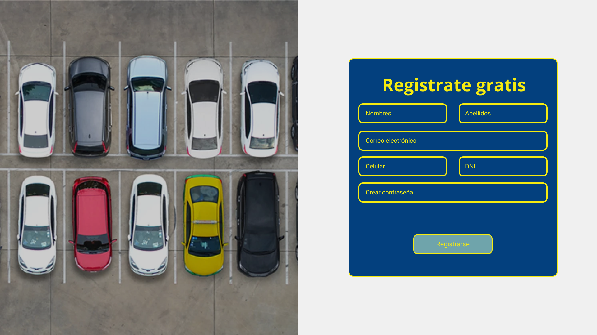

- Inicio de sesión

- Recuperación de contraseña
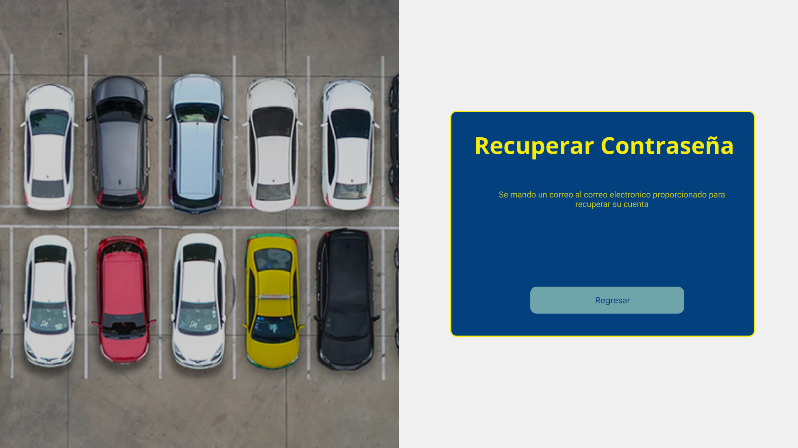

- Métodos de pago
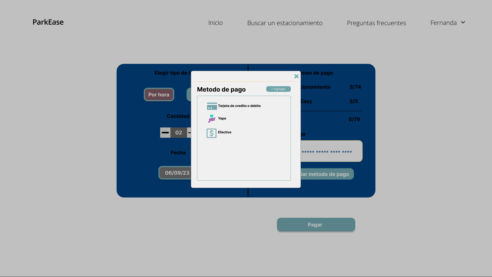

- Historial de pagos
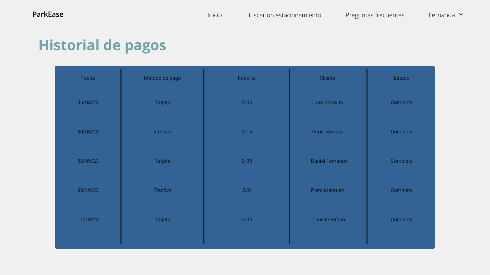

User goal: Funcionalidades de búsqueda de los usuarios.

- Búsqueda de un espacio de estacionamientos y filtrado de búsqueda.
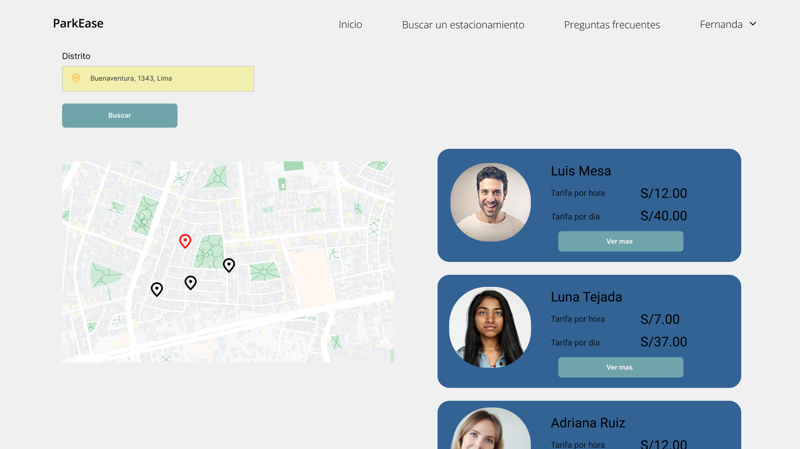

- Búsqueda de un espacio en la lista de favoritos.
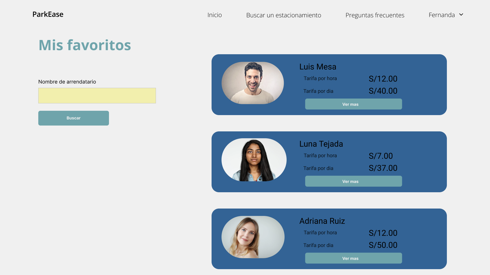

User goal: Mejora de soporte al cliente y experiencia de servicio

- Acceso a las preguntas frecuentes y contacto con servicio técnico.
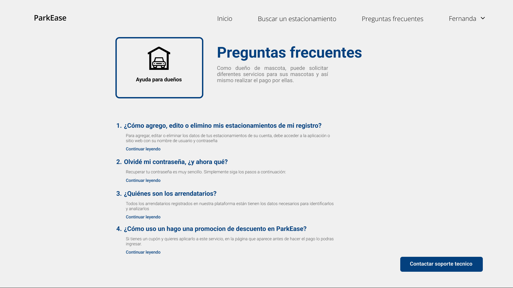

User goal: Funcionalidad de pagos

- Visualización y confirmación de pago.
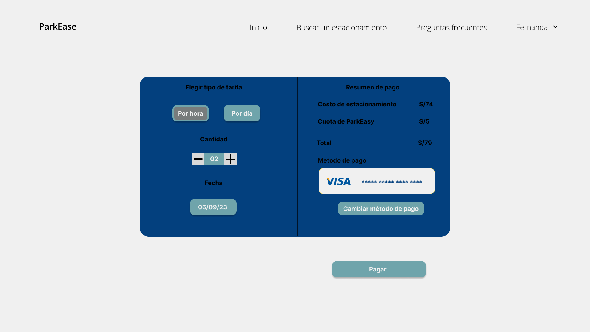

- Compra de suscripciones.
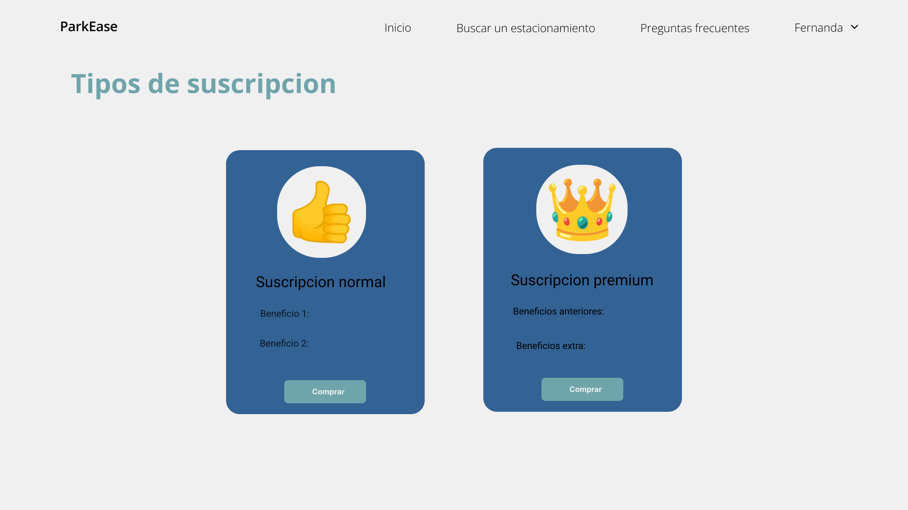

User goal: Preferencia y gestión de cuenta

- Editar información del perfil del usuario y actualizar métodos de pago.
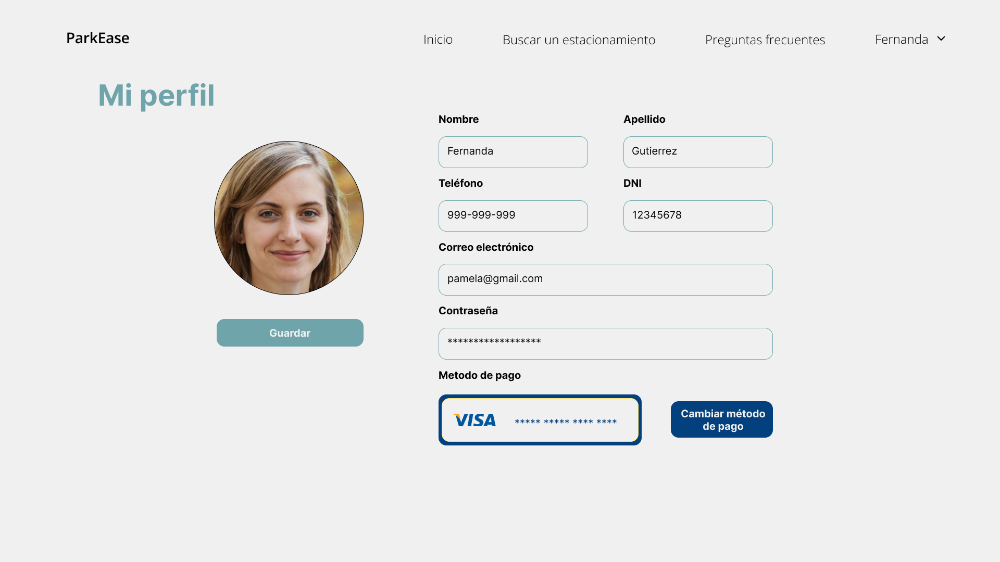

- Creación de listado de espacios de estacionamientos.
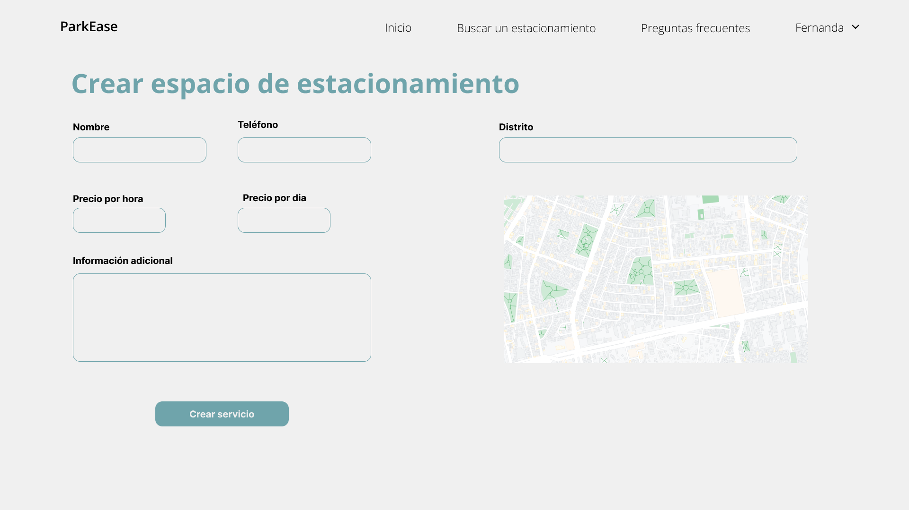

- Visualización, gestión y configuración de espacios de estacionamiento.
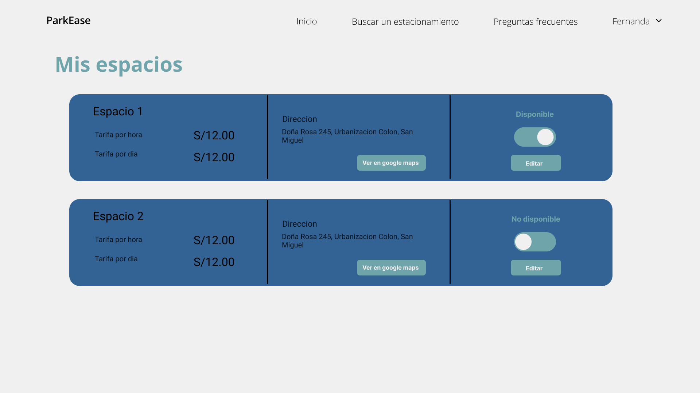