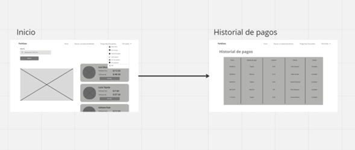
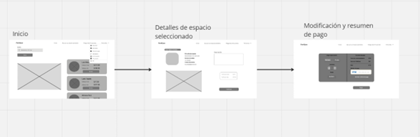

**4.4.2. Web Applications Wireflow Diagrams.**

**User goal:Usuario se registra, recupera la contraseña o inicia sesión en la aplicación web.**

**Descripción:**

Al estar en la pestaña de bienvenida, el usuario tiene dos opciones: registrarse de manera gratuita rellenando el formulario con sus datos personales e iniciar sesión rellenando el formulario con su correo y contraseña. Además, en la pestaña iniciar sesión puede darle a la opción de recuperar contraseña para recibir un correo con las instrucciones de recuperación.

**User goal: Seleccionar las preguntas frecuentes y soporte técnico**

**Descripción:**

Al entrar en la pestaña de inicio, el usuario puede seleccionar la opción de preguntas frecuentes. El usuario puede seleccionar entre las preguntas frecuentes de arrendatarios y arrendadores. Si no consigue resolver sus dudas, en la pestaña de preguntas frecuentes y soporte puede contactar con una persona de servicio técnico.

**User goal:Ver perfil y cambiar método de pago**

**Descripción:**

Al entrar en la pestaña de inicio, el usuario puede seleccionar la pestaña con el nombre del usuario y entrar a su perfil. Dentro de la pestaña de perfil de usuario, puede cambiar sus datos como su nombre, apellidos, número de celular, DNI, correo electrónico y además cambiar el método de pago.

**User goal: Visualización y búsqueda de estacionamientos favoritos**

**Descripción:**

Al entrar en la pestaña de inicio, el usuario puede seleccionar la pestaña con el nombre del usuario y entrar a mis favoritos. Dentro de la pestaña de espacios de estacionamientos favoritos, el usuario puede visualizar los estacionamientos que ha seleccionado como favoritos y además puede filtrar la búsqueda por nombre de arrendador.

**User goal: Visualización de historial de pagos de estacionamientos**

**Descripción:**

Al entrar en la pestaña de inicio, el usuario puede seleccionar la pestaña con el nombre del usuario y entrar a historial de pagos. Dentro de la pestaña historial de pagos, el usuario puede visualizar los pagos que ha hecho con su respectiva fecha, método de pago, importe, nombre de arrendador y estado.

**User goal:Información y pagos de las suscripciones**

**Descripción:**

Al entrar en la pestaña de inicio, el usuario puede seleccionar la pestaña con el nombre del usuario y entrar a mi suscripción. Dentro de la pestaña tipos de suscripción, el usuario puede seleccionar el tipo de suscripción que desea tener y proceder al pago de esta.

**User goal: Creación y visualización de espacio de estacionamiento**

**Descripción:**

Al entrar en la pestaña de inicio, el usuario puede seleccionar la pestaña con el nombre del usuario y entrar crear espacio. Dentro de la pestaña creación de espacio de estacionamiento, el usuario puede llenar el formulario con los datos de nombre, teléfono, precio por hora y día, información adicional y dirección. Al crear el nuevo estacionamiento, el usuario puede dirigirse a la pestaña de espacio de estacionamiento para visualizar y gestionar el nuevo espacio.

**User goal: Búsqueda y pago de espacio de estacionamiento**

**Descripción:**

Al entrar en la pestaña de inicio, el usuario puede buscar los espacios de estacionamientos más cercanos a la ubicación de interés. Luego el usuario podrá seleccionar el resultado de su agrado y visualizar a detalle la información del arrendador y del espacio para así poder proceder al pago. Dentro del pago podrá modificar los detalles y visualizar un resumen del pago.