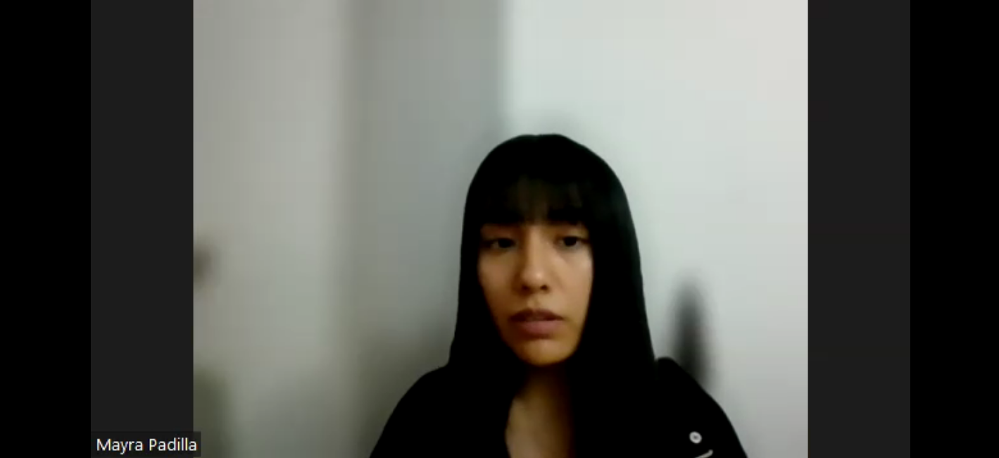
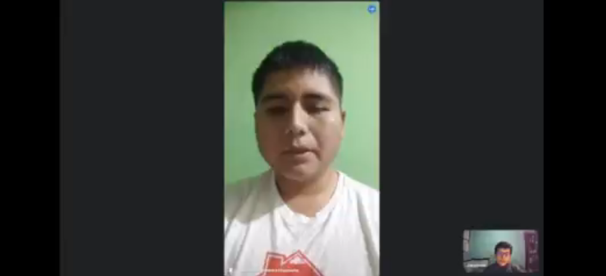
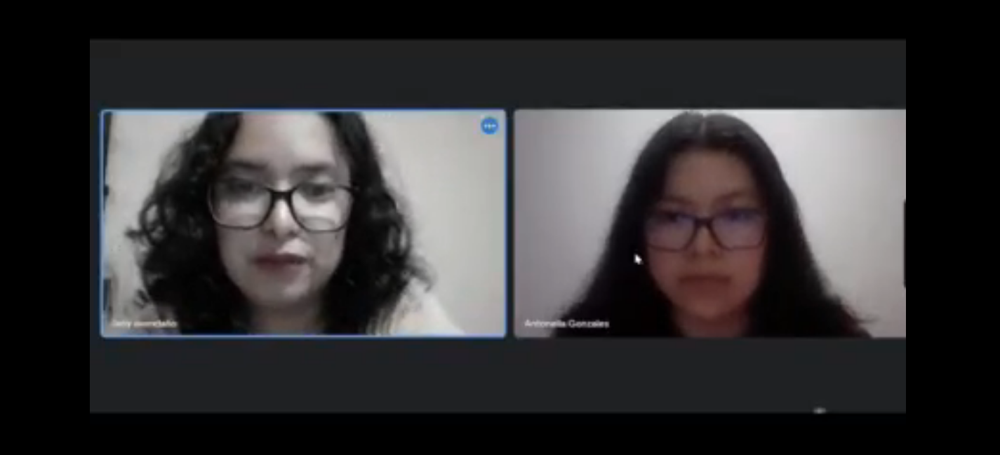

**2.2.2. Registro de entrevistas.**

**Segmento de Host**

**Registro de entrevista n.º1:** Piero Marquez (22 años - San Miguel) - 21/08/23

**Inicio y final de la entrevista:**  (00:00-06:52) 

**Link: <https://upcedupe-my.sharepoint.com/:v:/g/personal/u201923446_upc_edu_pe/ETBUjAOZMIdOprFQOfjbZKQBIiL-GoYtqCFcGzBsSPSUmA>**

**Resumen de entrevista:**

Piero, un estudiante universitario dedicado e interesado en buscar prácticas, nos habla sobre su interés en alquilar en un futuro su espacio de estacionamiento en su departamento debido a la adquisición de otro vehículo. Piero siente que, si no alquila ese espacio, sería una pérdida de dinero, ya que en la zona donde vive mucha gente busca dónde guardar su vehículo. La mayor preocupación de Piero al pensar en alquilar es la seguridad, debido a que su edificio no cuenta con los sistemas de seguridad suficientes para evitar un robo, y cree que lo mejor sería mejorarla. Lo que más motiva a Piero sobre alquilar su cochera es tener ingresos extras y estaría más que dispuesto a acceder a hacer promociones para atraer clientes. Lo que más le entusiasma de nuestra idea es poder visualizar la información de la persona a la cual alquilaría para sentirse más seguro y tener diferentes medios de pago para que no tenga miedo de ser estafado. Estamos emocionados por el interés de Piero en nuestra aplicación web y esperamos poder solucionar sus preocupaciones al alquilar su estacionamiento.

**Registro de entrevista n.º2:** Maryori Espinoza Espinoza (20 años - Santa Anita) - 21/08/23

**Inicio y final de la entrevista:** (00:00-06:31) 

**Link: <https://upcedupe-my.sharepoint.com/personal/u202117993_upc_edu_pe/_layouts/15/stream.aspx?id=%2Fpersonal%2Fu202117993%5Fupc%5Fedu%5Fpe%2FDocuments%2FEntrevista%20Orlando%2Emp4&nav=eyJyZWZlcnJhbEluZm8iOnsicmVmZXJyYWxBcHAiOiJTdHJlYW1XZWJBcHAiLCJyZWZlcnJhbFZpZXciOiJTaGFyZURpYWxvZyIsInJlZmVycmFsQXBwUGxhdGZvcm0iOiJXZWIiLCJyZWZlcnJhbE1vZGUiOiJ2aWV3In19&nav=eyJyZWZlcnJhbEluZm8iOnsicmVmZXJyYWxBcHAiOiJTdHJlYW1XZWJBcHAiLCJyZWZlcnJhbFZpZXciOiJTaGFyZURpYWxvZyIsInJlZmVycmFsQXBwUGxhdGZvcm0iOiJXZWIiLCJyZWZlcnJhbE1vZGUiOiJ2aWV3In19&ga=1>**

**Resumen de entrevista:**

Maryori, una estudiante universitaria capaz e interesada en alquilar el espacio de estacionamiento de su casa, nos comenta que ha pensado en hacerlo, pero no se ha decidido aún. Lo que influye en la decisión de Maryori es el sentimiento de miedo y preocupación por el posible mal uso de su espacio y su deterioro por parte de los arrendatarios. A Maryori le gusta la idea de que su cochera esté cuidada e implementar cámaras de seguridad para sentirse más segura. Su mayor motivación para alquilar es generar un ingreso extra, y estaría interesada en ofrecer descuentos para influir en los usuarios frecuentes. Maryori siente que lo que la motivaría a utilizar nuestra aplicación web es ver la identidad de la persona interesada y poder administrar las reservas de su espacio. Estamos emocionados de contar con el interés de Maryori y esperamos cumplir con sus expectativas respecto a nuestra aplicación web.

**Registro de entrevista n.º3:** Mayra (23 años - Santiago de Surco) - 21/08/23

**Inicio y final de la entrevista:** (00:00-05:53) 

**Link: <https://upcedupe-my.sharepoint.com/personal/u202117993_upc_edu_pe/_layouts/15/stream.aspx?id=%2Fpersonal%2Fu202117993%5Fupc%5Fedu%5Fpe%2FDocuments%2Fvideo1383565187%2Emp4&nav=eyJyZWZlcnJhbEluZm8iOnsicmVmZXJyYWxBcHAiOiJTdHJlYW1XZWJBcHAiLCJyZWZlcnJhbFZpZXciOiJTaGFyZURpYWxvZyIsInJlZmVycmFsQXBwUGxhdGZvcm0iOiJXZWIiLCJyZWZlcnJhbE1vZGUiOiJ2aWV3In19&nav=eyJyZWZlcnJhbEluZm8iOnsicmVmZXJyYWxBcHAiOiJTdHJlYW1XZWJBcHAiLCJyZWZlcnJhbFZpZXciOiJTaGFyZURpYWxvZyIsInJlZmVycmFsQXBwUGxhdGZvcm0iOiJXZWIiLCJyZWZlcnJhbE1vZGUiOiJ2aWV3In19&ga=1>**

**Resumen de entrevista:**

Mayra, una economista profesional, ha estado considerando alquilar uno de los espacios de estacionamiento de su casa. Su principal preocupación, que es el factor principal para no haber tomado la decisión, es la confiabilidad de las personas que entrarían a su cochera y la exposición que tendría su familia a estas. En ese sentido, siente que sería necesario instalar cámaras de seguridad y vigilancia para sentirse más segura. La mayor motivación de Mayra al pensar en alquilar es recibir ingresos pasivos y reducir el tráfico en su zona. Además, le parece una buena idea ofrecer descuentos a sus clientes más confiables. Su mayor interés al considerar utilizar nuestra aplicación es la protección de su privacidad y la posibilidad de verificar la información completa del arrendatario. Estamos agradecidos por el interés que tiene Mayra en nuestra aplicación y esperamos satisfacer sus necesidades al alquilar un estacionamiento.

**Segmento Guest**

**Registro de entrevista n.º1:** Kevin Tumbalobos Cubas (22 años – San Miguel) - 23/08/23

**Inicio y final de la entrevista:** (00:00-06:52) 

**Link: <https://upcedupe-my.sharepoint.com/:v:/g/personal/u201923446_upc_edu_pe/EdH96A_5XlZBsTJuQQUKJSwBF2mAhjkuNH21uVoEP9EQEQ?e=J2OLUb&nav=eyJyZWZlcnJhbEluZm8iOnsicmVmZXJyYWxBcHAiOiJTdHJlYW1XZWJBcHAiLCJyZWZlcnJhbFZpZXciOiJTaGFyZURpYWxvZyIsInJlZmVycmFsQXBwUGxhdGZvcm0iOiJXZWIiLCJyZWZlcnJhbE1vZGUiOiJ2aWV3In0sInBsYXliYWNrT3B0aW9ucyI6eyJzdGFydFRpbWVJblNlY29uZHMiOjEuMDR9fQ%3D%3D>**

**Resumen de entrevista:**

Kevin, un especialista junior de Cloud Services, ha tenido dificultades al buscar estacionamientos. Durante la entrevista, nos comentó que experimenta frecuentemente el sentimiento de frustración al no encontrar estacionamientos disponibles en los lugares que visita con su vehículo. Él nos expresó que encuentra nuestra idea novedosa, ya que no había utilizado una aplicación web similar. Lo que más le atrae a Kevin de la aplicación es encontrar estacionamientos seguros y disponibles cerca de los lugares que frecuenta. Reconoce el valor de este servicio, por lo que estaría dispuesto a pagar la reserva del espacio de estacionamiento. Por último, Kevin ve como una motivación el poder ofrecer descuentos a los usuarios frecuentes y estaría dispuesto a serlo.

**Registro de entrevista n.º2:** Leonardo (21 años - Los olivos) - 23/08/23

**Inicio y final de la entrevista:** (00:00-06:37) 

**Link: <https://upcedupe-my.sharepoint.com/personal/u202124162_upc_edu_pe/_layouts/15/stream.aspx?id=%2Fpersonal%2Fu202124162%5Fupc%5Fedu%5Fpe%2FDocuments%2FAplicaciones%20Web%2FEntrevista%20Usuario%201%2Emkv&ga=1>**

**Resumen de entrevista:**

Leonardo, un estudiante universitario serio y franco, nos transmitió su experiencia temprana al encontrar estacionamiento. Siendo un novato en la conducción, solo conoce un lugar en donde tiene la confianza de estacionarse en la calle, y las pocas veces que ha conducido ha sentido incomodidad, nerviosismo y frustración al ver ese espacio ocupado. También nos comentó que no ha escuchado una idea similar a nuestra aplicación web y que lo que más valoraría es que sea de fácil manejo, esté actualizada para que no tenga errores y que ofrezca estacionamientos en lugares frecuentados. Leonardo reconoce el potencial de la aplicación y estaría interesado en ser un posible usuario si cumple con sus necesidades y ofrece motivaciones de uso, como descuentos o promociones.

**Registro de entrevista n.º3:** Jany Aventadaño (22 años – San Miguel) - 23/08/23

**Inicio y final de la entrevista:** (00:00-07:48) 

**Link: <https://upcedupe-my.sharepoint.com/personal/u20211c403_upc_edu_pe/_layouts/15/stream.aspx?id=%2Fpersonal%2Fu20211c403%5Fupc%5Fedu%5Fpe%2FDocuments%2FEntrevista%20usuario%201%2Emp4&nav=eyJyZWZlcnJhbEluZm8iOnsicmVmZXJyYWxBcHAiOiJTdHJlYW1XZWJBcHAiLCJyZWZlcnJhbFZpZXciOiJTaGFyZURpYWxvZyIsInJlZmVycmFsQXBwUGxhdGZvcm0iOiJXZWIiLCJyZWZlcnJhbE1vZGUiOiJ2aWV3In19&nav=eyJyZWZlcnJhbEluZm8iOnsicmVmZXJyYWxBcHAiOiJTdHJlYW1XZWJBcHAiLCJyZWZlcnJhbFZpZXciOiJTaGFyZURpYWxvZyIsInJlZmVycmFsQXBwUGxhdGZvcm0iOiJXZWIiLCJyZWZlcnJhbE1vZGUiOiJ2aWV3In19&ga=1>**

**Resumen de entrevista:**

Jany, una estudiante universitaria y practicante en una empresa, compartió su experiencia al buscar estacionamiento en zonas urbanas. Debido a que se ha mudado recientemente a la ciudad y no está familiarizada con ella, Jany ha experimentado frustración al buscar estacionamiento debido a la pérdida de tiempo y el cansancio. Estos sentimientos los experimenta cada semana y está considerando utilizar alguna herramienta que resuelva este problema. Jany percibe como características importantes que la aplicación sea fácil de usar, intuitiva y muestre información clara sobre los espacios de estacionamiento más cercanos a los lugares que frecuenta. Se muestra interesada en el alquiler y en el pago para reservar un estacionamiento, y ve como un gran incentivo un programa de recompensas por el uso continuo de la aplicación.